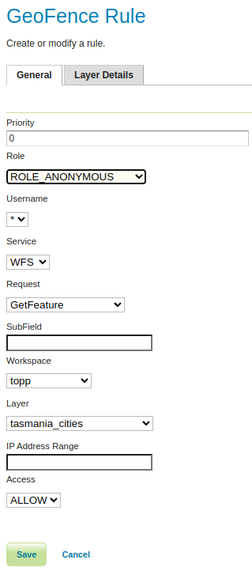
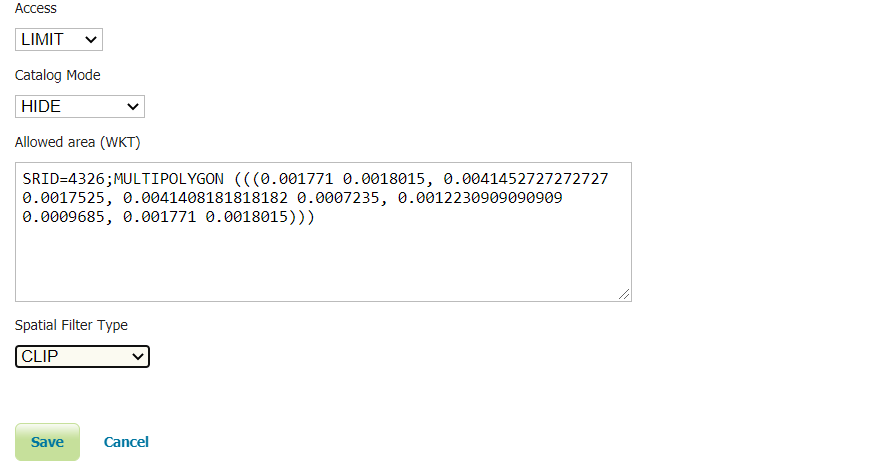
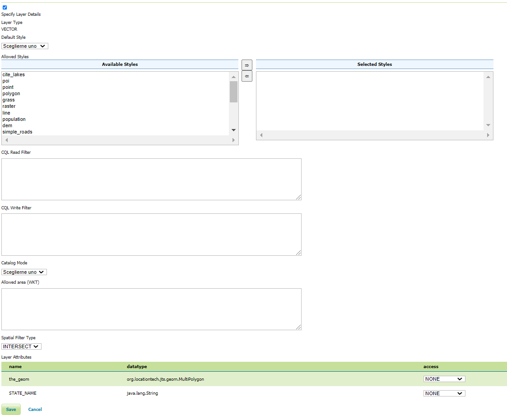

# GeoFence Server GUI

The GeoFence user interface is a component of the GeoServer web interface. You can access it from the GeoServer web interface by clicking the **GeoFence Data Rules** link, found on the left side of the screen after logging in.

## Rules page

An overview of all rules is provided with priority, the rule's scope specifications (role, user, service, request, workspace and layer) and its access behaviour. The '*' symbol means that the rule applies to all possible values of that specification. Rules are always ordered by priority, but the order can be reversed by pressing the 'P' priority column header.

A new rule can be added with the "Add new rule" link. Any number of rules can be deleted by selecting them and then clicking on the "Remove selected rules" link.

Rule priority order can be easily on this page through the up and down arrows on the right side. Rules can be modified using the pencil symbol, which opens the rule page.

## Rule page

This page is displayed both when creating a new rule and modifying an existing rule.

Priority can be changed manually by specifying a priority number. If this priority number is already occupied by another rule, this will cause that rule and all rules after it to shift one place to a lower priority.

If using the IP Address range to limit access then on Linux (and other systems with IPv6 enabled) add the `-Djava.net.preferIPv4Stack=true` flag to the GeoServer startup options to make sure that the IP range matching works with IPv4 style addresses. Currently, IPv6 style address ranges are not supported by GeoFence.

When Access type LIMIT is selected, additional options are displayed that allows the user to select the Catalog Mode and the Allowed Area (WKT) associated with this rule. The Spatial Filter Type parameter allows to define whether apply the Allowed Area filter to vector data as an Intersects or a Clip filter.

When Access type ACCESS is selected as well as a specific layer, it becomes possible to specify the "layer details" in a separate tab. These make it possible to add additional filters to the layer for the rule in question. For example, the rule can alter the default style of the layer, specify which styles are available at all, which attributes are accessible for reading and/or writing, specify CQL filters for both reading and writing, specify a catalog mode, and an allowed area (WKT) filter.

A CQL Read Filter can be setup to allow users to only access a subset of the available data.

For example, having a daily time series layer (a Layer with time attribute/dimension), it's possible to restrict access to a given time range.

A CQL filter to limit access to the whole 2020 year (static time range) would look as follows:

    time between 2020-01-01 and 2020-12-31

A CQL filter limiting access to data older than a week (dynamic time range) would look like this instead:

    dateDifference(now(), time, 'd') > 7

(see [temporal-functions](../../filter/function_reference.md#temporal-functions) for more details on the date difference function)

Allowed area can be defined in whatever SRID. Geoserver will automatically reproject it to the resource CRS when needed.

### Layer groups

Layer groups are also supported. If no workspace has been specified, the layer dropdown will show global layer groups, while if a workspace is selected the workspace's layergroup will be showed together with the layers.

The read and write filters text areas as well as the style palette in the layer details tab are disabled when the layer group is being configured.

When a LayerGroup is request the contained resource will be handled in the following way:

-   a limit applied to the layer groups (allowed area or grant type) will be applied to all the contained layers.
-   if the access rule a contained layer is denying the access to the layer for the user requesting group, the layer will not be present in the output.
-   if the access rule of the layer has limits on its own, they will be merged in a restrictive way (intersection) with the one of the layer group if both the limits have been defined for the same role.
-   if the access rule of the layer has limits on its own, they will be merged in a permissive way (union) with the one of the layer group if both the limits have been defined for the different roles.

When a layer contained in one or more layer group is directly accessed in the context of a WMS request, the following rules apply:

-   If any of the layer groups containing the requested resource has mode **SINGLE** no limits eventually defined for any of the layer groups will be applied.
-   If all the layer groups containing the requested resource have mode **OPAQUE**, the layer will not be visible.
-   If all the layer groups containing the resource has mode different from **SINGLE** and **OPAQUE**, the layer groups limits will be applied and merged with the one defined for the resource if present. For each layer group, the limits will be merged in a restrictive way with the ones defined for the resource if the rule was defined for the same role. On the contrary the limits will be merged with an enlargement logic, if coming from rules defined for different roles.
