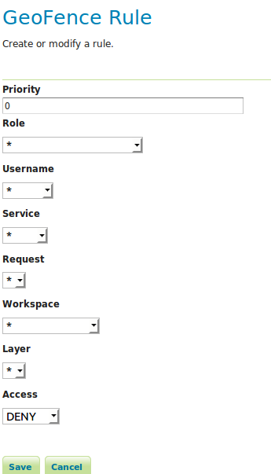
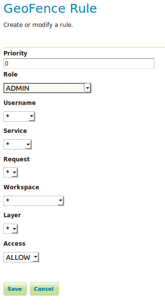

# Using the Internal GeoFence server (Tutorial)

## Introduction

This tutorial shows how to install and configure the [Geofence Internal Server](index.md) plug-in. It shows how to create rules in two ways: using the GUI and REST methods.

The tutorial assumes:

-   GeoServer is running on <http://localhost:8080/geoserver>

-   You have a user/group service called "default" that allows the creation of new users. If your primary user/group service is not called "default", you must start geoserver with the following java system property present:

        org.geoserver.rest.DefaultUserGroupServiceName=<name_of_usergroupservice>

with <name_of_usergroupservice> a user/group service that allows the creation of new users.

## Getting Started

Install the plugin-in, see [Installing the GeoServer GeoFence Server extension](installing.md). Configure the user/group service as described above if necessary.

Restart GeoServer.

> ::: note
> ::: title
> Note
> :::
>
> Since we defined no rules yet, the default behavior of GeoFence is to deny access to all resources.
> :::

There should now be a **GeoFence Data Rules** link on the left side of the screen after logging in. Click on it. This is the configuration page of your internal GeoFence.

## Creating new Rules with the GUI

1.  Click on the "Add new rule" link. Change only "Access" to "DENY".

Click on "Save".

We have now expressed that the first rule (with lowest priority) disallows everyone from everything. The following more specific rules we make will provide the exceptions to that general rule. It is also possible to do it the other way (allow everyone to anything as most general rule and specify exceptions to that.)

2.  As a next step, we will grant the administrator access to everything. Click on "Add new rule" again. Change "Role" to "ADMIN" and click "Save".

You now have a working, basic security configuration.

## Creating rules with the REST API

1\. Open a new tab with your browser and go to the following URL: <http://localhost:8080/geoserver/geofence/rest/rules>. You should get an XML representation of your rules:

    <?xml version="1.0" encoding="UTF-8" standalone="yes"?>
    <Rules count="2">
      <Rule id="2">
          <access>ALLOW</access>
          <priority>0</priority>
          <roleName>ADMIN</roleName>
      </Rule>
      <Rule id="1">
          <access>DENY</access>
          <priority>1</priority>
      </Rule>
    </Rules>

2\. Let us first create a new user. Do this by sending a POST request to the following URL <http://localhost:8080/geoserver/rest/security/usergroup/users> with the following content:

    <user>
          <userName>michaeljfox</userName>
          <password>back2$future</password>
          <enabled>true</enabled>
    </user>

You should receive a `201 Created` HTTP Response.

3\. Now we will create an access rule for this user. Do this by sending a POST request to the following URL: <http://localhost:8080/geoserver/geofence/rest/rules> with the following content:

    <Rule>
          <userName>michaeljfox</userName>
          <workspace>topp</workspace>
          <layer>states</layer>
          <service>WMS</service>
          <request>GetMap</request>
          <access>ALLOW</access>
    </Rule>

Again, you should receive a `201 Created` HTTP Response. When browsing to the URL <http://localhost:8080/geoserver/geofence/rest/rules> we should now see the following information:

    <?xml version="1.0" encoding="UTF-8" standalone="yes"?>
    <Rules count="2">
      <Rule id="3">
          <access>ALLOW</access>
          <layer>states</layer
          <priority>0</priority>
          <request>GETMAP</request>
          <service>WMS</service>
          <userName>michaeljfox</userName>
          <workspace>topp</workspace>
      </Rule>
      <Rule id="2">
          <access>ALLOW</access>
          <priority>0</priority>
          <roleName>ADMIN</roleName>
      </Rule>
      <Rule id="1">
          <access>DENY</access>
          <priority>1</priority>
      </Rule>
    </Rules>

4.  It should now be possible to log on with username `michaeljfox` and password `back2$future` and perform a `GetMap` on the layer `topp:states`, but nothing else.
