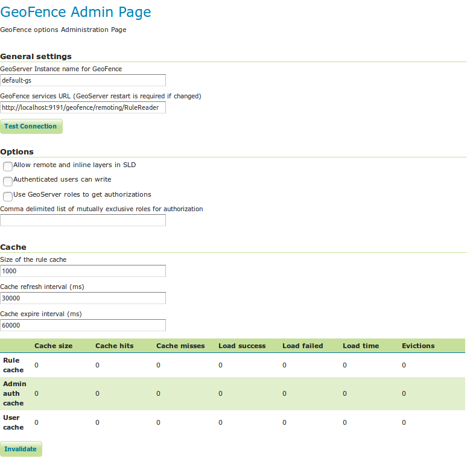
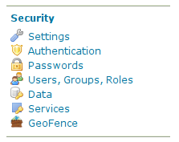
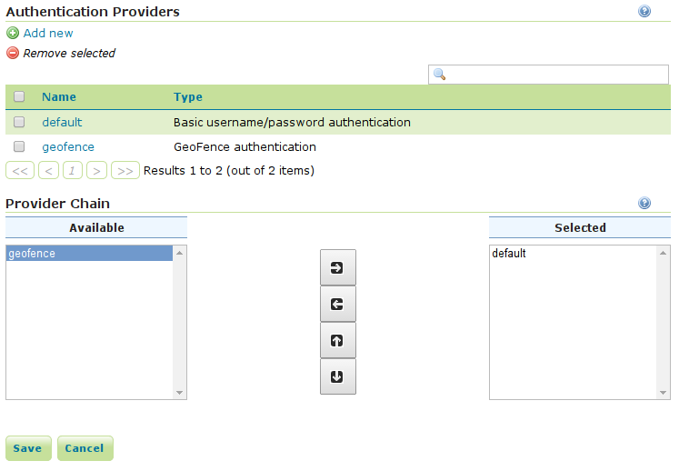
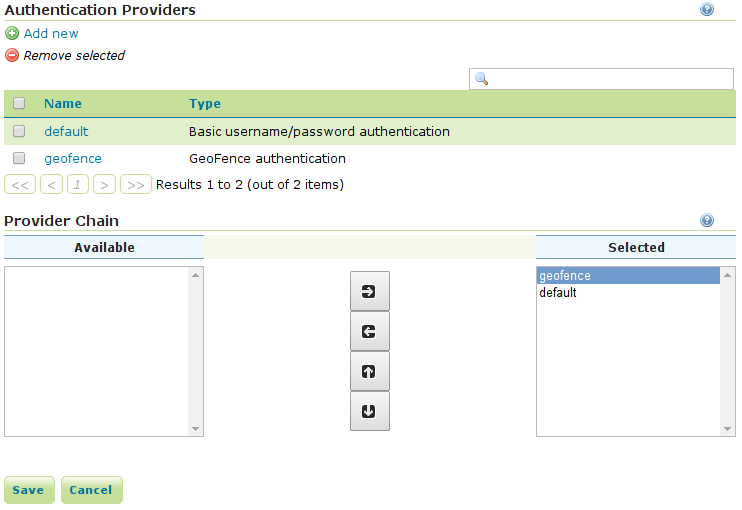
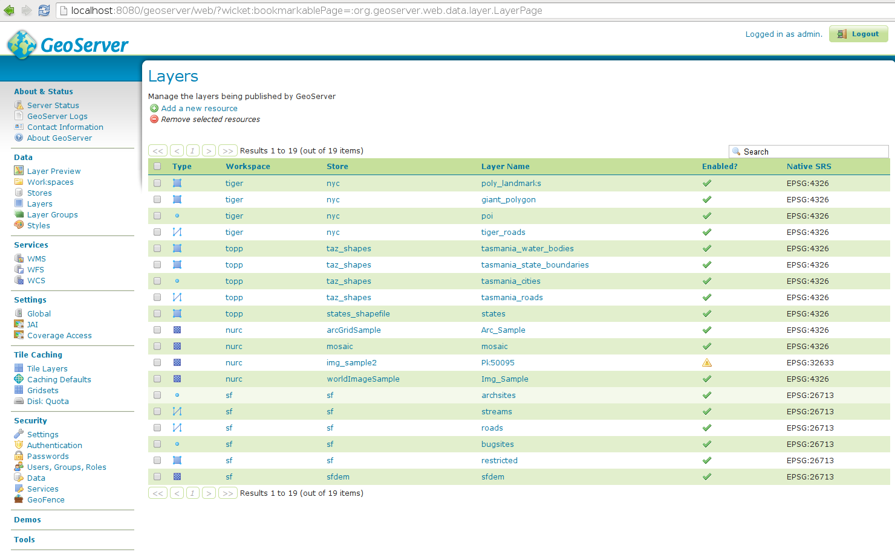
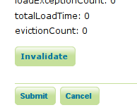
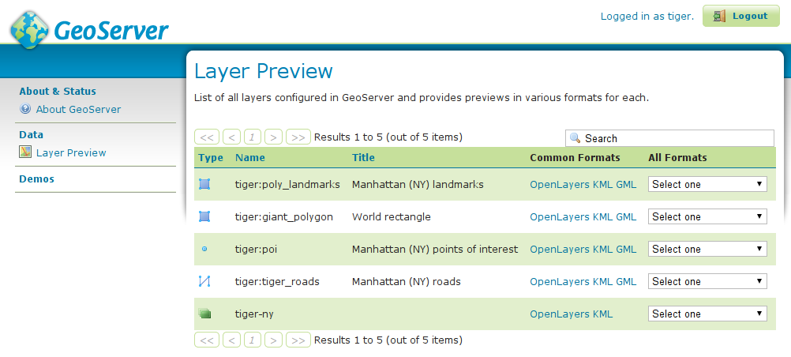

# GeoFence Admin GUI

The GeoFence Admin Page is a component of the GeoServer web interface. You can access it from the GeoServer web interface by clicking the **GeoFence** link, found on the left side of the screen after logging in.

## General Settings

Configure the following settings here:

-   Geoserver instance name: the name under which this geoserver is known by the geofence server. This useful for when you use an external geofence server with multiple geoserver servers.
-   GeoServer services URL: this is how geoserver knows how to connect to the external geofence server. When using an internal geofence server, this is not configurable. For example "<http://localhost:9191/geofence/remoting/RuleReader>" for an external geofence server on localhost.

## Options

Configure the following settings here:

-   Allow remote and inline layers in SLD

-   Authenticated users can write

-   Use GeoServer roles to get authorizations

    > -   
    >
    >     Disabled: For each authorization request, GeoServer sends only the user info to GeoFence.
    >
    >     :   GeoFence will retrieve all the roles associated to the user, and will merge the permissions granted for each role.
    >
    > -   
    >
    >     Enabled: For each authorization request, GeoServer sends to GeoFence the user info AND the roles assigned in the current request session.
    >
    >     :   GeoFence will retrieve all the roles associated to the user, and will only consider the requested roles that are really associated to the user.

-   Comma delimited list of mutually exclusive roles for authorization

    > -   
    >
    >     This field is mandatory when the previous option is enabled.
    >
    >     :   GeoServer will send to GeoFence the roles in the current request session which match the entries in this list. You can use the '*' symbol to match any session role. When using "*", you can use the format "``-ROLENAME``" to exclude one or more roles from the the session roles list.

## Cache

Configure the following settings here:

-   Size of the rule cache (amount of entries)
-   Cache refresh interval (ms)
-   Cache expire interval (ms)

Collected data about the cache can be retrieved here. Per cache (rules, admin rules and users) we retrieve the cache size, hits, misses, load successes, load failures, load times and evictions. The cache can be manually invalidated (cleared).

## Basic GeoServer configuration

-   Login with the default administrative credentials `admin / geoserver` (or whatever you have configured before).

-   In the security panel you'll find the GeoFence link to the GeoFence security admin page

-   Open the GeoFence admin page; you'll get to this page:

    > You can notice here the information that allow the GeoFence probe inside GeoServer to communicate with the GeoFence engine:
    >
    > -   the URL that the probe shall use to communicate with GeoFence;
    > -   the name (default is ``default-gs``) this instance will use to identify itself to GeoFence. This instance name should be equal to the one we set into GeoFence.

-   Testing connection to GeoFence.

    > We already performed a connection test from GeoFence to GeoServer. Using the button **Test connection** we can also test that GeoServer can communicate to GeoFence. If everything is ok, you'll get this message:
    >
    > 

-   Open the **Authentication** page under the **Security** settings:

-   Add the GeoFence authenticator and **put it as the first in the list** otherwise you will not be able to login as `admin/admin`:

-   Now that we added GeoFence as authentication provider, we'll be able to log into GeoServer using the credentials we added in GeoFence (user `admin` and user ``tiger``). Try and log in using user `tiger`.

## Testing authorization

-   Logging into GeoServer as admin you will be able to see all the defined layers:

-   Logging into GeoServer as a non-admin user, the defined rules will be examined; since we defined no rules yet, the default behaviour is to deny access to all resources:

-   Get back to GeoFence, and add a rule which allows all layers in workspace tiger for user `tiger`; create a rule defining:

    > -   user `tiger`
    > -   instance `default-gs`
    > -   workspace `tiger` (you will get a dropdown menu containing all the workspaces available in the selected instance)
    > -   grant type: `allow` You'll get a line like this one:
    >
    > 

-   Verify the new authorizations.

    > Since the probe caches the GeoFence responses, you may need to login again as administrator (or you may keep an admin session open in another browser) and clear the probe cache. You can do it by pressing the "Invalidate" button in the bottom of the GeoFence admin page:
    >
    > 

-   Login again in GeoServer as user tiger and you will see in **layer preview** all the layers in the `tiger` workspace:

