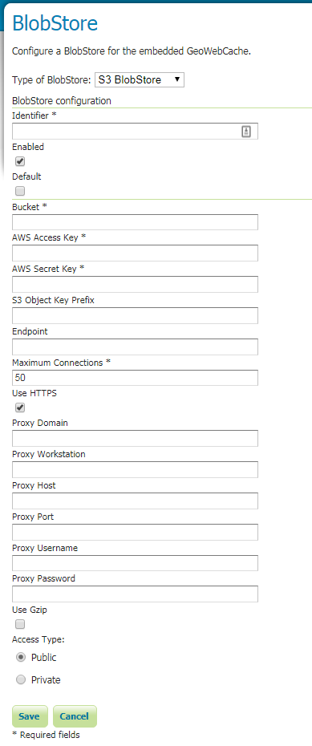

# Configuring the S3 BlobStore plugin {: #gwc_s3_configuration }

Once the plugin has been installed, one or more S3 BlobStores may be configured through [BlobStores](../../geowebcache/webadmin/blobstores.md). Afterwards, cached layers can be explicitly assigned to it or one blobstore could be marked as 'default' to use it for all unassigned layers.

## Bucket

The name of the AWS S3 bucket where the tiles are stored.

## AWS Access Key

The AWS Access Key ID. If AWS Access Key and AWS Secret Access Key are left blank, [AWS Default Credential Chain](https://docs.aws.amazon.com/sdk-for-java/v1/developer-guide/credentials.html) will be used.

## AWS Secret Key

AWS Secret Access Key.

## S3 Object Key Prefix

A prefix path to use as the root to store tiles under the bucket (optional).

## Maximum Connections

The maximum number of allowed open HTTP connections.

## Use HTTPS

When enabled, a HTTPS connection will be used. When disabled, a regular HTTP connection will be used.

## Proxy Domain

A Windows domain name for configuring NTLM proxy support (optional).

## Proxy Workstation

A Windows workstation name for configuring NTLM proxy support (optional).

## Proxy Host

Proxy host the client will connect through (optional).

## Proxy Port

Proxy port the client will connect through (optional).

## Proxy Username

User name the client will use if connecting through a proxy (optional).

## Proxy Password

Password the client will use if connecting through a proxy (optional).

## Use Gzip

When enabled, the stored tiles will be GZIP compressed.

## Access Type

Stored tiles will be created either as Public (readable and writable by any user that can access the S3 bucket), or Private (readable and writable only by the user identified by the AWS credentials specified above). **Important**: if the bucket itself is setup to block all public access, then the blobstore needs to be setup to Private as well, or AWS will return a 403 when attempting to store tiles.
