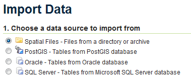
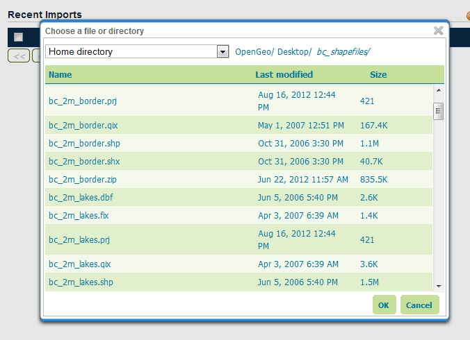
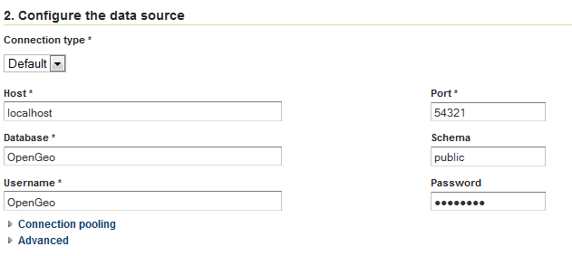
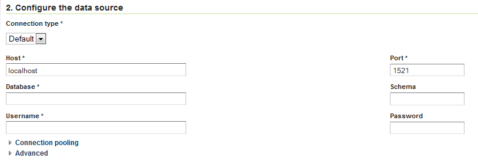
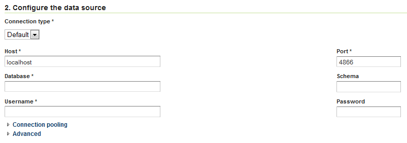
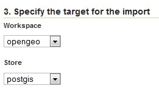
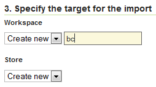
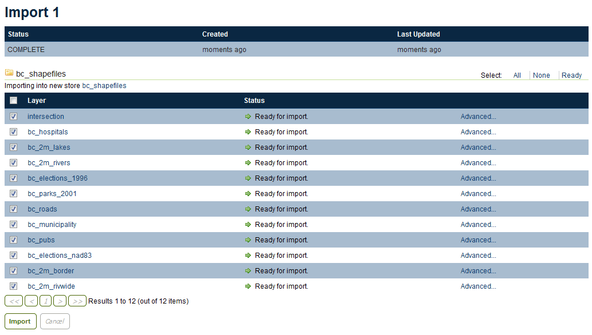
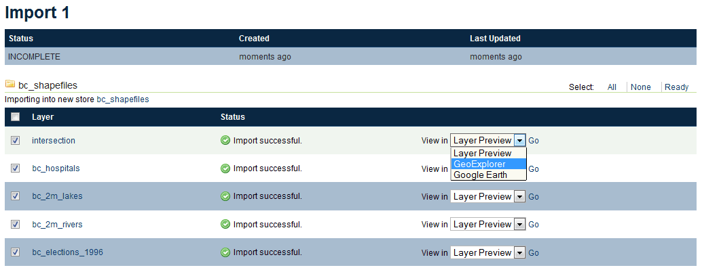
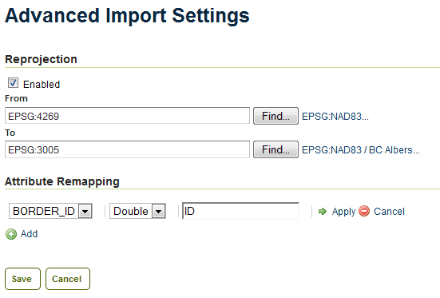

# Importer interface reference {: #extensions_importer_guireference }

The Layer Importer user interface is a component of the GeoServer web interface. You can access it from the GeoServer web interface by clicking the **Import Data** link, found on the left side of the screen after logging in.

## Data sources page

The front page of the Layer Importer is where the data source and format are set. The following options are displayed:

### Choose a data source to import from

Select one of the following data sources to use for the import:

-   **Spatial Files** (see [Supported data formats](formats.md) for more details)
-   **PostGIS** database
-   **Oracle** database
-   **SQL Server** database

*Choose a data source*

The contents of the next section is dependent on the data source chosen here.

### Configure the data source: Spatial Files

There is a single box for selecting a file or directory. Click the **Browse** link to bring up a file chooser. To select a file, click on it. To select a directory, click on a directory name to open it and then click **OK**.

*Spatial file data source*

*File chooser for selecting spatial files*

### Configure the data source: PostGIS

Fill out fields for **Connection type** (Default or JNDI) **Host**, **Port**, **Database** name, **Schema**, **Username** to connect with, and **Password**.

There are also advanced connection options, which are common to the standard PostGIS store loading procedure. (See the [PostGIS data store](../../data/database/postgis.md) page in the GeoServer reference documentation.)

*PostGIS data source connection*

### Configure the data source: Oracle

The parameter fields for the Oracle import are identical to that of PostGIS. The fields aren't populated with default credentials with the exception of the port, which is set to **1521** by default.

!!! note

    This option is only enabled if the [Oracle](../../data/database/oracle.md) extension is installed.

*Oracle data source connection*

### Configure the data source: SQL Server

The parameter fields for the SQL Server import are identical to that of PostGIS. The fields aren't populated with default credentials with the exception of the port, which is set to **4866** by default.

!!! note

    This option is only enabled if the [SQL Server](../../data/database/sqlserver.md) extension is installed.

*SQL Server data source connection*

### Specify the target for the import

This area specifies where in the GeoServer catalog the new data source will be stored. This does not affect file placement.

Select the name of an existing workspace and store.

*Target workspace and store in GeoServer*

Alternately, select **Create New** and type in a names for a new workspace or store. During the import process, these will be created.

*Creating a new workspace and store*

### Recent imports

This section will list previous imports, and whether they were successful or not. Items can be removed from this list with the **Remove** button, but otherwise cannot be edited.

*Recent imports*

When ready to continue to the next page, click **Next**.

## Layer listing page

On the next page will be a list of layers found by the Layer Importer. The layers will be named according to the source content's name (file name of database table name). For each entry there will be a **Status** showing if the source is ready to be imported.

All layers will be selected for import by default, but can be deselected here by unchecking the box next to each entry.

*List of layers to be imported*

A common issue during the import process is when a CRS cannot be determined for a given layer. In this case, a dialog box will display where the CRS can be declared explicitly. Enter the CRS and Click **Apply**.

*Declaring a CRS*

When ready to perform the import, click **Import**.

Each selected layer will be added to the GeoServer catalog inside a new or existing store, and published as a layer.

After the import is complete the status area will refresh showing if the import was successful for each layer. If successful, a dialog box for previewing the layer will be displayed, with options for **Layer Preview** (OpenLayers), **Google Earth**, and **GeoExplorer**.

*Layers successfully imported*

## Advanced import settings page

The **Advanced** link next to each layer will lead to the Advanced import settings page.

On this page, data can be set to be reprojected from one CRS to another during the import process. To enable reprojection, select the **Reprojection** box, and enter the source and target CRS.

In addition, on this page attributes can be renamed and their type changed. Click on the **Add** link under **Attribute Remapping** to select the attribute to alter, its type, and its new name. Click **Apply** when done.

Click **Save** when finished.

*Advanced layer list page*
