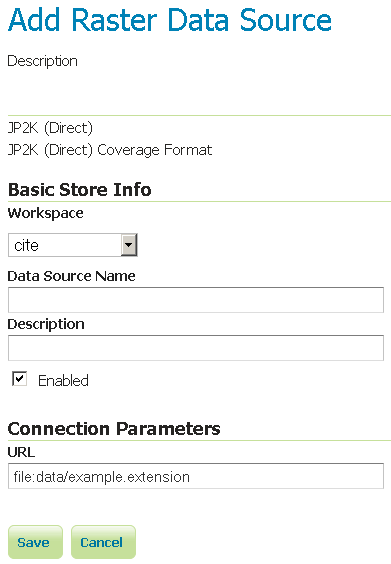

# JP2K Plugin

GeoServer can leverage the JP2K Geotools plugin to read JP2K coverage formats. In case you have a Kakadu license and you have built your set of native libraries, you will be able to access the JP2K data with higher performances leveraging on it. Otherwise you will use the standard SUN's JP2K. See [GeoTools JP2K Plugin](https://docs.geotools.org/latest/userguide/library/coverage/jp2k.html) for further information.

## Installing Kakadu

In order for GeoServer to leverage on the Kakadu libraries, the Kakadu binaries must be installed through your host system's OS.

If you are on Windows, make sure that the Kakadu DLL files are on your PATH. If you are on Linux, be sure to set the LD_LIBRARY_PATH environment variable to be the folder where the SOs are extracted.

Once these steps have been completed, restart GeoServer. If done correctly, new data formats will be in the Raster Data Sources list when creating a new data store:

*Raster Data Source*

*Configuring a JP2K data store*
