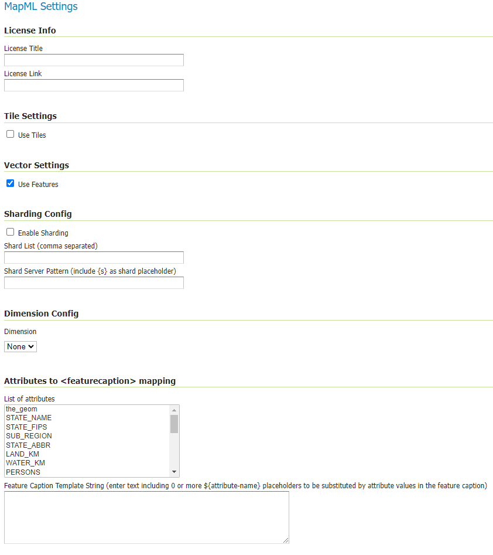
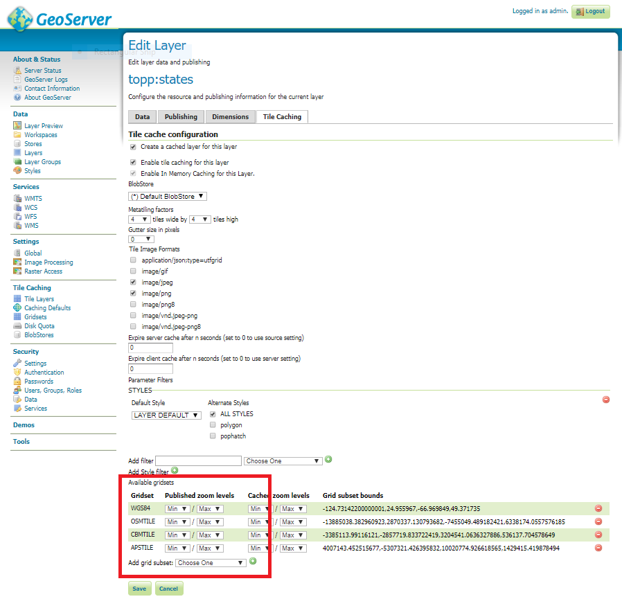
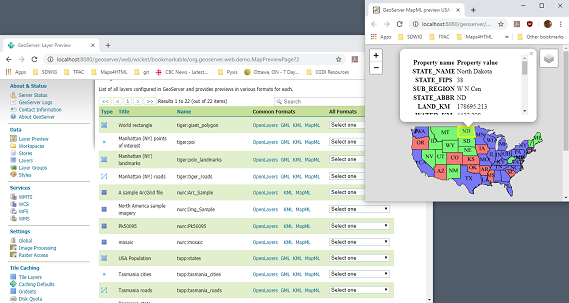

# MapML

Map Markup Language (MapML) is a text-based format which allows map authors to encode map information as hypertext documents exchanged over the Uniform Interface of the Web. The format definition is still a work-in-progress by the Maps for HTML W3C Community Group, but various tools to work with the format already exist, including a Leaflet-based map viewer. For more information on MapML refer to the ``Maps for HTML Community Group <https://maps4html.org/>``.

The MapML module for GeoServer adds new MapML resources to access WMS and WFS services configured in Geoserver. The MapML modules includes support for styles, tiling, querying, sharding, and dimensions options for WMS layers, and also provides a MapML outputFormat for WMS GetFeatureInfo and WFS GetFeatures requests. See below for information on installing and configuring the MapML module.

> ::: warning
> ::: title
> Warning
> :::
>
> The MapML extension performance is negatively affected by a recent upgrade to Spring in the GeoServer project. This affects all versions since 2.22.0. To avoid serious performance penalty, please remove "text/.*" from the gzip filter <param-value> in your web.xml servlet configuration.
> :::
>
> ::: warning
> ::: title
> Warning
> :::
>
> MapML is an experimental proposed extension of HTML for the Web. The objective of the format is to standardize map, layer and feature semantics in HTML. As the format progresses towards a Web standard, it may change. Always use the latest version of this extension, and follow the project's progress at <https://maps4html.org>.
> :::

## Installation

1.  Visit the [website download](https://geoserver.org/download) page, locate your release, and download: `mapml`{.interpreted-text role="download_extension"}

    !!! warning

        Make sure to match the version of the extension (for example {{ release }} above) to the version of the GeoServer instance!

2.  Extract the contents of the archive into the **`WEB-INF/lib`** directory of the GeoServer installation.

3.  Restart GeoServer.

## Configuration

Configuration can be done using the Geoserver administrator GUI. The MapML configuration is accessible in the *MapML Settings* section under the *Publishing* tab of the Layer or Layer Group Configuration page for the layer or layer group being configured. Here is the MapML Settings section, with some example values filled in:



### License Info

Together these two attributes allow the administrator to define the contents of the `<link rel=license>` element in the MapML header. Here is an example of the resulting XML:

> <link href="<https://creativecommons.org/licenses/by/4.0/>" rel="license" title="Attribution 4.0 International (CC BY 4.0)"/>

**License Title**

:   The License Title will be included as the value of `title` attribute of the `<link rel=license>` element in the MapML header.

**License Link**

:   The License Link will be included as the value of `href` attribute of the `<link rel=license>` element in the MapML header, and should be a valid URL referencing the license document.

### Tile Settings

Using tiles to access the layer can increase the performance of your web map. This is especially true if there is a tile cache mechanism in use between GeoServer and the browser client.

**Use Tiles**

:   If the "Use Tiles" checkbox is checked, by default the output MapML will define a tile-based reference to the WMS server. Otherwise, an image-based reference will be used. If one or more of the MapML-defined GridSets is referenced by the layer or layer group in its "Tile Caching" profile, GeoServer will generate tile references instead of generating WMS GetMap URLs in the MapML document body.

### Tile Caching

In the Tile Caching tab panel of the Edit Layer or Edit Layer Group page, at the bottom of the page you will see the table of GridSets that are assigned to the layer or layer group. The values "WGS84" and "OSMTILE" are equivalent to the EPSG:4326 and EPSG:900913 built in GeoWebCache GridSets. However, for the MapML module to recognize these GridSets, you must select and use the MapML names. For new layers or layer groups, or newly created grid subsets for a layer or layer group, the MapML values are selected by default. For existing layers that you wish to enable the use of cached tile references by the MapML service, you will have to select and add those values you wish to support from the dropdown of available GridSets. The set of recognized values for MapML is "WGS84" (equivalent to EPSG:4326), "OSMTILE" (equivalent to EPSG:900913), "CBMTILE" (Canada Base Map) and "APSTILE" (Alaska Polar Stereographic).



### Sharding Config

The Sharding Config options are intended to allow for parallel access to tiles via different server names. The actual server names must be configured in the DNS to refer to either the same server or different servers with the same GeSserver layer configuration. In the example above, the mapML client would alternate between the servers a.geoserver.org, b.geoserver.org, and c.geoserver.org to access the map images. The values in the example above would result in the following MapML:

``` html
<input name="s" type="hidden" shard="true" list="servers" min="0.0" max="0.0"/>
<datalist id="servers">
    <option value="a"/>
    <option value="b"/>
    <option value="c"/>
</datalist>
<link tref="http://{s}.geoserver.org:8080/geoserver/test/wms?version=1.3.0&amp;service=WMS&amp;request=GetMap&amp;crs=EPSG:3857&amp;layers=cntry00&amp;styles=&amp;bbox={xmin},{ymin},{xmax},{ymax}&amp;format=image/png&amp;transparent=false&amp;width={w}&amp;height={h}" rel="image"/>
```

**Enable Sharding**

:   If Enable Sharding is checked, and values are provided for the Shard List and Shard Server Pattern fields, then a hidden shard list input will be included in the MapML.

**Shard List**

:   If Enable Sharding is checked, the Shard List should be populated with a comma-separated list of shard names which will be used to populate the shard data list element.

**Shard Server Pattern**

:   The Shard Server Pattern should be a valid DNS name including the special placeholder string {s} which will be replace with the Shard Names from the Shard List in requests to the server. This pattern should not include any slashes, the protocol string (<http://>) or the port number (:80), as these are all determined automatically from the URL used to access the MapML resource.

### Dimension Config

**Dimension**

:   The selected dimension (if any) is advertised in the mapml as an input with the appropriate value options or ranges, as configured in the *Dimension* tab of the Layer Configuration page. Only dimensions enabled in the *Dimension* tab are available as options.

### Attribute to <featurecaption> mapping

**List of attributes** The list allows you to read the names of the layer attributes, it doesn't really do more than that.

**Feature Caption Template String**

To cause an attribute to be serialized in MapML vector content as the <featurecaption> element value, you must enter its name as a \${placeholder} in the text box immediately below the attributes list. You can also add (a small amount of) plain text that will be copied verbatim into the <featurecaption> content. <featurecaption> is used as the accessible name of features by screen reader software, which will often read out this value without the user having to expand a popup; in other words, it will be used as a visual and audible tooltip when the feature is focused.

## MapML Resources

MapML resources will be published for any published WMS layers. The MapML resources will be available at:

    http://{serverName}/geoserver/mapml/{layerName}/{projectionName}?style={styleName}&transparent={true|false}&format={wmsFormat}

The `{layerName}` is the WMS layer name, and the `{serverName}` is the name or IP address of the server on which Geoserver is running. The `{projectionName}` must be one of the projections supported by MapML:

-   OSMTILE
-   CBMTILE
-   APSTILE
-   WGS84

Each of the URL query string parameters are optional, but if provided they are effectively passed-through to the underlying WMS service call. Here are some details on the parameters:

**style**

:   If provided, the specified `{styleName}` must correspond to an available WMS style to use for the layer.

**transparent**

:   If provided, must be either `true` or `false`. The same value is passed through to the underlying WMS service. If not provided, it defaults to the inverse of the "opaque" WMS publishing layer setting.

**format**

:   If provided, must be a valid WMS format specifier. If not provided, it defaults to `image/png`.

## MapML Visualization

With the MapML Community Module installed, the GeoServer Layer Preview page is modified to add a link to the MapML resources for each layer and layer group. The MapML link in the Layer Preview table intercepted by the MapML module, and an HTML Web map page is created on the fly which refers to the MapML resource:



You can add layers to the map as you like, by dragging the link URL from the Layer Preview table and dropping it onto another layer's MapML preview. If all goes well, you should see the layers stacked on the map and in the layer control.

MapML visualization is supported by the Web-Map-Custom-Element project. The MapML viewer is built into the GeoServer layer and layer group preview facility. You can find out more about the Web-Map-Custom-Element at the project ``website <https://maps4html.org/web-map-doc/>``. Here is a simple, self-contained example of an HTML page that uses the <mapml-viewer> and <layer-> elements:

``` html
<!DOCTYPE html>
<html lang="en">
  <head>
    <meta charset="utf-8" >
    <title>MapML Test Map</title>
    <meta name="viewport" content="width=device-width, initial-scale=1">
    <script type="module" src="http://localhost:8080/geoserver/mapml/viewer/widget/mapml-viewer.js"></script>
    <style>
      html, body { height: 100%; }
      * { margin: 0; padding: 0; }
      mapml-viewer:defined { max-width: 100%; width: 100%; height: 100%; }
      mapml-viewer:not(:defined) > * { display: none; } layer- { display: none; }
    </style>
  </head>
  <body>
    <mapml-viewer projection="osmtile" zoom="2" lat="61.209125" lon="-90.850837" controls>
      <layer- label="US States" src="http://localhost:8080/geoserver/mapml/topp:states/osmtile?style=population" checked></layer->
    </mapml-viewer>
  </body>
</html>
```

In the above example, the place-holders `topp:states`, `localhost:8080`, `osmtile`, and `population` would need to be replaced with the appropriate values, and/or the `style` parameter could be removed entirely from the URL if not needed. You may also like to "View Source" on the preview page to see what the markup looks like for any layer. This code can be copied and pasted without harm, and you should try it and see what works and what the limitations are. For further information about MapML, and the Maps for HTML Community Group, please visit <http://maps4html.org>.
