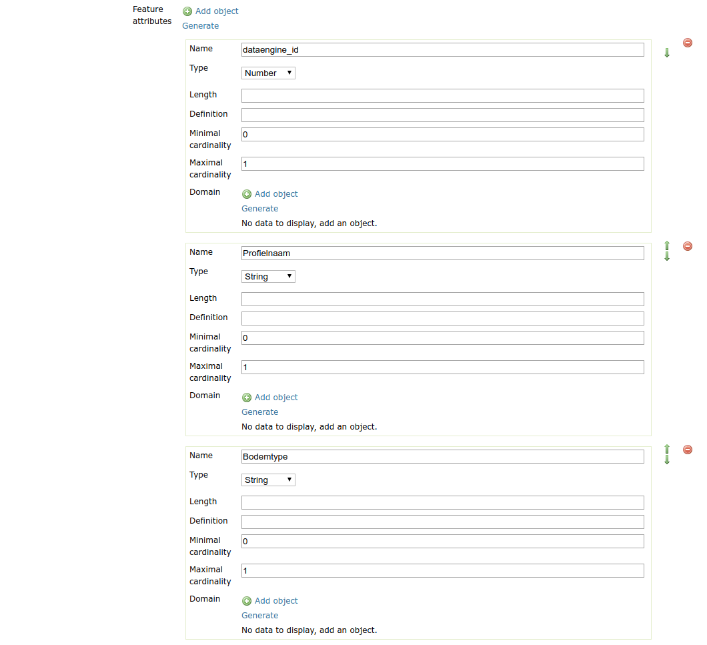
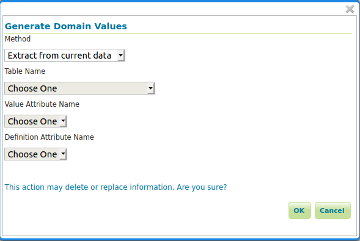
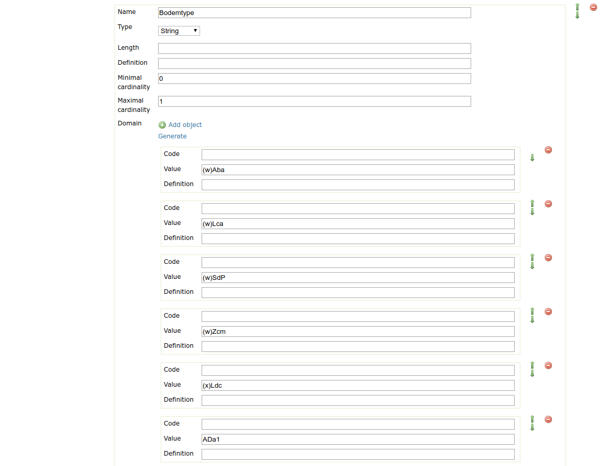

# Fields configuration

The ui for the metadata tab is made from a list of field components. The type of the field component and how they behave can be configured in the yaml file. All fields should be configured as a list which has the parent key `attributes`.

## Field options

A field is defined in the yaml following key-value pairs:

> -   [key](#key)
> -   [fieldType](#fieldtype)
> -   [label](#label)
> -   [occurrence](#occurrence)
> -   [condition](#condition)
> -   [tab](#tab)
> -   [values](#values) (specific field types)
> -   [derivedFrom](#derivedfrom) (specific field types)
> -   [typename](#typename) (specific field types)

### key

The key is the identifier for the field and should therefore be unique. Other configurations can refer the field by using this identifier. E.g the geonetwork mapping, internationalization.

+-------+----------+-------------------+
| Key   | Required | Value             |
+=======+==========+===================+
| > key | > yes    | > a unique string |
+-------+----------+-------------------+

### fieldType

Chooses the type of input widget for the field. A detailed description for each type can be found in the [Field Types](#field-types) section.

+-------------+----------+------------------+
| Key         | Required | Value            |
+=============+==========+==================+
| > fieldType | > yes    | > -   COMPLEX    |
|             |          | > -   TEXT       |
|             |          | > -   NUMBER     |
|             |          | > -   TEXT_AREA  |
|             |          | > -   DATE       |
|             |          | > -   DATETIME   |
|             |          | > -   BOOLEAN    |
|             |          | > -   UUID       |
|             |          | > -   DROPDOWN   |
|             |          | > -   SUGGESTBOX |
|             |          | > -   REQUIREBOX |
|             |          | > -   DERIVED    |
+-------------+----------+------------------+

### label

If present this value will be used as the label for the field. When the label is not present in the yaml configuration the key will be used as label. Note: when the key is present in the internationalization (i18n) file see [Internationalization support](#internationalization-support) than the value from that file will be used as the label.

+---------+----------+--------------+
| Key     | Required | Value        |
+=========+==========+==============+
| > label | > no     | > any string |
+---------+----------+--------------+

### occurrence

The value for `occurrence` determines whether or not the field should displayed as a table or as a single input field. `SINGLE` will result in one input field.

> 
> *e.g. single value input field of fieldType ``TEXT``.*

Choosing `REPEAT` will render the field in a table allowing the user to input multiple values.

> 
> *e.g. field of fieldType ``TEXT`` rendered as a table.*

The data in table can be sorted using the green arrow buttons.

+--------------+----------+------------------------+
| Key          | Required | Value                  |
+==============+==========+========================+
| > occurrence | > no     | > -   SINGLE (Default) |
|              |          | > -   REPEAT           |
+--------------+----------+------------------------+

### condition

Conditional attributes are attributes that are only visible for some layers. A typical example are attributes only present for raster or vector layers. The condition is specified in [CQL](../../tutorials/cql/cql_tutorial.md) which is evaluated against the layer's [ResourceInfo](../../services/csw/features.md) object.

For example:

``` YAML
condition: equalTo(typeOf("."), 'FeatureTypeInfo')
```

### tab

Optionally, attributes may be displayed on separate tabs. All tabs must be listed under ``tabs`` in the main configuration. Then this property is used to assign each attribute to one or more tab (separated by comma), so that the custom metadata panel is divided in tabs:

> 

### values

The choices in a [DROPDOWN](#dropdown), [SUGGESTBOX](#suggestbox) or [REQUIREBOX](#requirebox) can be set using the `values` attribute in the yaml. This is useful for small list, for larger list it can be better to list the choices in a separate .csv file.

### derivedFrom

Only used in the [DERIVED](#derived) field. The attribute `derivedFrom` contains the key for the parent on which the [DERIVED](#derived) field depends. Follow the link for more information on the [DERIVED](#derived) field.

### typename

The `typename` is a required attribute for [COMPLEX](#complex) fields. It contains the key pointing to the definition of the [COMPLEX](#complex) field. A special `typename` ``featureAttribute`` is reserved for the [Feature Catalog Generation](#feature-catalog-generation) and should not be used.

## Field Types

> -   [TEXT](#text)
> -   [TEXT_AREA](#text_area)
> -   [UUID](#uuid)
> -   [NUMBER](#number)
> -   [BOOLEAN](#boolean)
> -   [DATE](#date)
> -   [DATETIME](#datetime)
> -   [DROPDOWN](#dropdown)
> -   [SUGGESTBOX](#suggestbox)
> -   [REQUIREBOX](#requirebox)
> -   [DERIVED](#derived)
> -   [COMPLEX](#complex)

### TEXT

Input field that allows any text.

> 
>
> ::: note
> ::: title
> Note
> :::
> :::

``` YAML
attributes:
  - key: text-field
    fieldType: TEXT
```

### TEXT_AREA

A multiline input.

> 
>
> ::: note
> ::: title
> Note
> :::
> :::

``` YAML
attributes:
  - key: text-area-field
      fieldType: TEXT_AREA
```

### UUID

Input field for a UUID, it allows any text input or the user can generate a UUID.

> 
>
> ::: note
> ::: title
> Note
> :::
> :::

``` YAML
attributes:
  - key: uuid-field
    fieldType: UUID
```

### NUMBER

Only numbers are accepted as valid input.

> 
>
> ::: note
> ::: title
> Note
> :::
> :::

``` YAML
attributes:
  - key: number-field
    fieldType: NUMBER
```

### BOOLEAN

Input field with checkbox.

> 
>
> ::: note
> ::: title
> Note
> :::
> :::

``` YAML
attributes:
  - key: boolean-field
    fieldType: BOOLEAN
```

### DATE

Date selection without time information.

> 
>
> ::: note
> ::: title
> Note
> :::
> :::

``` YAML
attributes:
  - key: date-field
    fieldType: DATE
```

### DATETIME

Selection date with time information.

> 
>
> ::: note
> ::: title
> Note
> :::
> :::

``` YAML
attributes:
  - key: datetime-field
    fieldType: DATETIME
```

### DROPDOWN

A field for selecting a value from a dropdown. The values can be configured with the `values` attribute in the yaml or they can be configured in an other .csv file which is used for dropdowns with a lot of choices.

> 

Configuration in the yaml file.

``` YAML
attributes:
  - key: dropdown-field
    fieldType: DROPDOWN
    values:
          - first
          - second
          - third
```

To configure the values in a separate file add a yaml key `csvImports` on the same level as `attributes` and add the list of CSV files under this key. The first line in each CSV file should contain the key of the dropdown field for which you want to add the choices.

`metadata-ui.yaml`

``` YAML
attributes:
  - key: dropdown-field
    fieldType: DROPDOWN
 csvImports:
  - dropdowncontent.csv   
```

`dropdowncontent.csv`

``` 
dropdown-field
first
second
third
```

### SUGGESTBOX

A field for selecting a value from a suggestbox. Suggestions will be given for the values where the input matches the beginning of the possible values. The values can be put in a separate CSV file in the same way as for the DROPDOWN field.


``` YAML
attributes:
  - key: suggestbox-field
    fieldType: SUGGESTBOX
    values:
          - first
          - second
          - third
```

### REQUIREBOX

This type is identical to suggestbox, except that the user is not allowed to fill in a custom value but enforced to choose a suggested value. This can be handy when an field value must be an element from a list, but this list is too long for a dropdown to be practical.

### DERIVED

A derived field is a hidden field whose value depends on an other field. The yaml key `derivedFrom` should contain the key of the field it depends on. When a value is selected in the parent field a matching value for the derived field is searched in csv file or the value with the same index is picked from the values list.

The CSV file should have at least two columns and start with the key of the parent field in the first column followed by the values for the parent field, the other columns should contain the key(s) of the derived field(s) in the first row followed by the matching values.

Example derived field with config in a CSV file:


`metadata-ui.yaml`

``` YAML
attributes:
  - key: derived-parent-field
    fieldType: DROPDOWN
  - key: hidden-field
    fieldType: DERIVED
    derivedFrom: derived-parent-field
csvImports:
  - derived-mapping.csv
```

`derivedmapping.csv`

``` 
derived-parent-field;hidden-field
parent-value01;hidden-value01
parent-value02;hidden-value02
parent-value03;hidden-value03
```

Example derived field with values lists:

`metadata-ui.yaml`

``` YAML
attributes:
  - key: derived-parent-field
    fieldType: DROPDOWN
    values:
        - parent-value01
        - parent-value02
        - parent-value03
  - key: hidden-field
    fieldType: DERIVED
    derivedFrom: derived-parent-field
    values:
        - hidden-value01
        - hidden-value02
        - hidden-value03
```

### COMPLEX

A complex field is composed of multiple other fields. The yaml key `typename` is added to the field configuration. On the root level the yaml key `types` indicates the beginning of all complex type definition. A type definition should contain the `typename` followed by the key `attributes` which contains the configuration for the subfields.


``` YAML
attributes:
  - key: complex-type
    fieldType: COMPLEX
    typename: complex-field

types:
   - typename: complex-field
     attributes:
          - key: object-text
            fieldType: TEXT
          - key: object-numer
            fieldType: NUMBER
```

## Feature Catalog Generation

To create a feature catalog for a vector layer, a complex structure is needed to describe all the attributes. A lot of this information is already present in the GeoServer feature type or the database. Metadata supports automatically generating a new structure in the metadata from the information at hands that can be customised afterwards. To create support for this feature in your configuration, define a repeatable [COMPLEX](#complex) field with built-in `fieldType` ``featureAttribute`` .

In the example the featureCatalog object has two attributes. A unique identifier of the type [UUID](#uuid) and the feature attribute field.


*e.g. Empty Feature attribute field*

``` YAML
- typename: featureCatalog
  attributes:
      - label: Unique identifier
        key: feature-catalog-identifier
        fieldType: UUID
      - label: Feature attribute
        key: feature-attribute
        fieldType: COMPLEX
        typename: featureAttribute
        occurrence: REPEAT
```

The `Generate` action will check the database metadata for that layer and generate a feature attribute for each column in the table.


*e.g. Feature attribute with generate feature types*

Whitin each feature attribute there is another `Generate` action that will generate the domain.


*e.g. Generate domain dialog*

There are two options to do this:

:   -   Using the existing data in the database for this attribute.
    -   Using data from a look-up table in the same database. In this case you must specify the table, an attribute from which to take values and an attribute from which to take definitions.


*e.g. Feature attribute with generate domain*

## Internationalization support

All metadata field labels that appear in the **Metadata fields** can be internationalized. This is performed by creating an internationalization (i18n) file named metadata.properties. Create an entry for each key in the gui configuration following this pattern: ``PREFIX.attribute-key``

e.g.

`metadata.properties`

``` 
metadata.generated.form.metadata-identifier=Unique identifier for the metadata
```

`metadata_nl.properties`

``` 
metadata.generated.form.metadata-identifier=Metadata identificator
```

Drop-down labels can be translated too, in the same properties file, using the key `metadata.generated.form.[attributeKey].[value]=[label]`. The value that will be internally stored for this field stays the same.

## Hidden Fields {: #community_metadata_uiconfiguration_hidden_fields }

Hidden fields are not visible in the GUI and do not need to be configured. They are updated automatically.

> -   `_timestamp`: date and time of the last metadata update.
