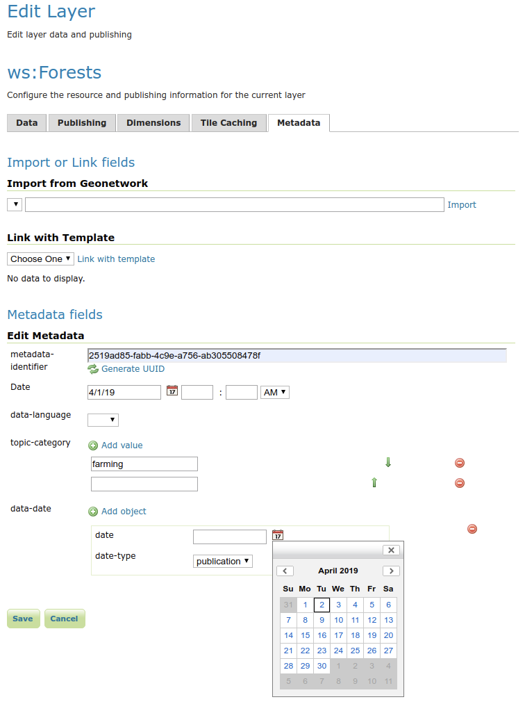
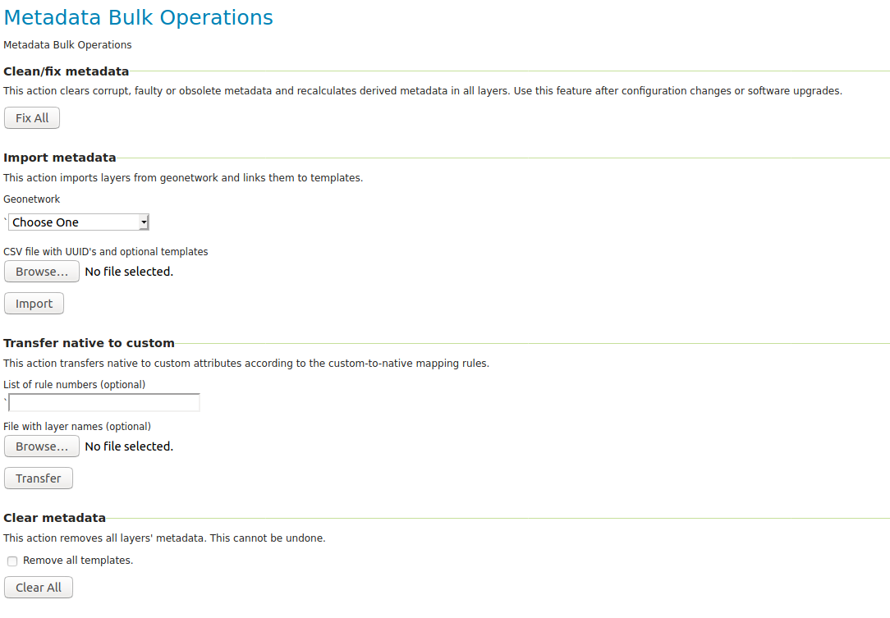

# User Guide

To add metadata to a layer follow the steps in [Adding metadata to Layer](#adding-metadata-to-layer) . When the metadata is repeated in multiple layers it is easier to create a template and reuse the data in the template for all the layers. See [Templates](#templates) .

## Adding metadata to Layer

### Manually adding metadata

Open the layer: navigate to **Layers --> Choose the layer --> Metadata tab**.

The metadata fields are available in the panel **Metadata fields**.

### Import from geonetwork

See [Advanced Configuration](advanced.md). Choose a geonetwork from the drop downbox, add the UUID from the metadata record and click ``Import``. All the content of the fields that are mapped in the geonetwork mapping configuration will be deleted. All templates will be unlinked. The content will be replaced with the content from geonetwork.

### Link with metadata template

A metadata template can contain the content for metadata fields used in multiple layers. By defining these fields in a template you create one source for the content making it easier to maintain.

To link a layer with template navigate to **Layers --> Choose the layer --> Metadata tab** in the **Link with Template** panel choose a template from the dropdown and click ``Link with template``

The values from the template will added to the metadata of the layer. How this is done depents on the type of the field.

The field is not a list

:   When the field is not a list the value will be replaced with the value from the template and the field will be read only. This will only happen for fields that are not empty in the template.

The Field is a list

:   For Fields that are a list the values from the template will be added as read only fields. The duplicate values in list will be removed if there are any.

When multiple templates are linked with a layer the priority of the template will determine which values are added. If a field is present in both templates the value of the template with the highest priority will be picked. The priority is determined by the [template order](#template-order)

### Copy from other Layer

Choose another layer from the drop downbox click ``Copy``. Content will be replaced with any metadata content from the other layer, except for UUID's, which will be ignored.

## Templates

Templates can be created, edited, deleted and ordered in **Metadata --> Templates** . All changes to the templates will also update the linked layers when the templates are saved by clicking the ``Save`` button in the overview page. Templates that are linked to a layer cannot be removed and a warning message will appear.

### Create template

Use the ``Add new`` action to create a new template and choose a name for the template. The name is required and must be unique.

### Edit template

Click on a template name to open the template and edit the values. Click ``Save`` to go back to the overview page, this will also recalculate the values in all linked layers.

### Delete template

Select the templates that needs to be removed and click delete, the selected rows will be removed from the table. Save the changes by clicking the ``Save`` button.

### Template order

The templates have an order. The templates at the top of the list have a higher priority than the templates at the bottom. When a field has a value in multiple templates and the layer is linked with those templates the priority will determine which value is displayed in the metadata UI. The value defined in the template with the highest priority will be displayed.

Change the order of the templates with the arrow keys in the priority column and save the changes by clicking ``Save`` button, this will also recalculate the values in all linked layers that may be affected.

## Bulk Operations

This page provides a number of bulk operations mostly used for maintenance and migrations.

### Clean / fix all

This operation will go through all layers and perform a series of different actions on each of them to clean and repair any obsolete, corrupt or inconsistent data. This operation is useful after changing the metadata attribute configuration, bug fixes or other software updates, or exceptionally, unexpected failures.

The actions performed are:

:   -   remove any existing metadata that is not according to the configuration
    -   check the internal data structure and fix it if necessary
    -   recalculate derived metadata fields
    -   recalculate [Custom to Native Mapping](advanced.md#community_metadata_advanced_configuration_custom_native)
    -   [Timestamp](uiconfiguration.md#community_metadata_uiconfiguration_hidden_fields)

### Import metadata

This option allows bulk import of metadata from GeoNetwork (see [Advanced Configuration](advanced.md)) and/or linking layers to templates. The layers that should be imported or linked are specified in a CSV file. You may specify a GeoNetwork to import from.

The CSV file should use semicolumn as separator. The first column of your CSV files should be the layer name, the second column should be the geonetwork UUID (or left empty if you do not want to import from geonetwork), and any number of templates may be specified afterwards in the following columns.

### Transfer Native To Custom

This operation will attempt to do the exact reverse of the [Custom to Native Mapping](advanced.md#community_metadata_advanced_configuration_custom_native) that happens usually each time you save a layer. This will work in so far as the native attributes follow the patterns configured in your custom-to-native mapping configuration, or your configuration is basic enough. This operation is useful when you are migrating layers that were previously configured without the metadata module.

You may optionally specify a selected list of rules if you do not wish to apply all them (by number, in the order of which they appear in the configuration), and a text file with layer names if you do not wish to go through all of them.

### Clear metadata

Removes all existing metadata from all layers. Optionally, remove all existing templates as well. This cannot be undone.
