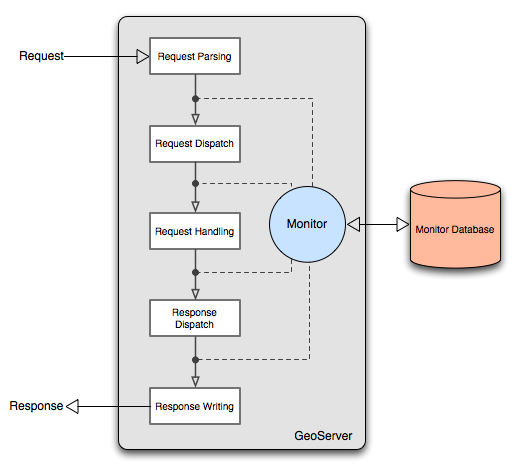

# Monitoring Overview

The following diagram outlines the architecture of the monitor extension:

> 
> *Monitor extension architecture*

As a request is processed the monitor inserts itself at particular points in the request life cycle to capture various information about the request. Such information includes:

-   Timestamp of the origin of the request
-   Total time it took for the request to complete
-   Origin of the request
-   HTTP information such as the body content type, header information, etc\...

And more. See the [Data Reference](reference.md) section for a complete list.

In addition to capturing request data the monitor extension is also capable of persisting it. Two options are provided out of the box:

-   Persisting to a relational database, see [Database Persistence](../../community/monitor-hibernate/db.md) for more details
-   Piping to a log file, see [Audit Logging](audit.md) for more details

By default the extension will do neither and simply maintain data for only the most recent requests. The data is stored in memory meaning that if the server is restarted or shutdown this information is lost.The [Monitor Configuration](configuration.md) section provides a comprehensive guide to configuring the monitor extension.

Stored request information is made available through a simple [query api](query.md) that allows clients to access request data through a HTTP interface.
