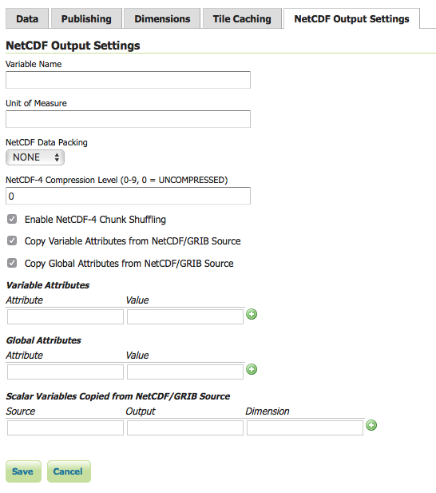
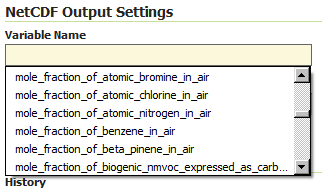

# NetCDF Output Format {: #netcdf-out }

This plugin adds the ability to encode WCS 2.0.1 multidimensional output as a NetCDF file using the Unidata NetCDF Java library.

## Getting a NetCDF output file

Request NetCDF output by specifying `format=application/x-netcdf` in a `GetCoverage` request:

    http://localhost:8080/geoserver/wcs?service=WCS&version=2.0.1&request=GetCoverage&coverageid=it.geosolutions__V&format=application/x-netcdf...

## Current limitations

-   Input coverages/slices should share the same bounding box (lon/lat coordinates are the same for the whole ND cube).
-   NetCDF output will be produced only when input coverages come from a StructuredGridCoverage2D reader (this allows to query the GranuleSource to get the list of granules in order to setup dimensions slices for each sub-coverage).

## NetCDF-4

NetCDF-4 output is supported but requires native libraries (see [Installing required NetCDF-4 Native libraries](nc4.md)). NetCDF-4 adds support for compression. Use `format=application/x-netcdf4` to request NetCDF-4 output.

## Settings

NetCDF output settings can be configured for each raster layer. The similar section in the *Global Settings* page configures the default settings used for newly created raster layers.

-   

    Variable Name (optional)

    :   -   Sets the NetCDF variable name.
        -   Does not change the layer name, which can be configured in the Data tab.

-   

    Variable Unit of Measure (optional)

    :   -   Sets the NetCDF `uom` attribute.

-   

    Data Packing

    :   -   Lossy compression by storing data in reduced precision.
        -   One of *NONE*, *BYTE*, *SHORT*, or *INT*.

-   

    NetCDF-4 Compression Level

    :   -   Lossless compression.
        -   Level is an integer from 0 (no compression, fastest) to 9 (most compression, slowest).

-   

    NetCDF-4 Chunk Shuffling

    :   -   Lossless byte reordering to improve compression.

-   

    Copy Variable Attributes from NetCDF/GRIB Source

    :   -   Most attributes are copied from the source NetCDF/GRIB variable.
        -   Some attributes such as `coordinates` and `missing_value` are skipped as these may no longer be valid.
        -   For an ImageMosaic, one granule is chosen as the source.

-   

    Copy Global Attributes from NetCDF/GRIB Source

    :   -   Attributes are copied from the source NetCDF/GRIB global attributes.
        -   For an ImageMosaic, one granule is chosen as the source.

-   

    Variable Attributes

    :   -   Values are encoded as integers or doubles if possible, otherwise strings.
        -   Values set here overwrite attributes set elsewhere, such as those copied from a source NetCDF/GRIB variable.

-   

    Global Attributes

    :   -   Values are encoded as integers or doubles if possible, otherwise strings.

-   

    Scalar Variables Copied from NetCDF/GRIB Source

    :   -   Source specifies the name of the source variable in a NetCDF file or the `toolsUI` view of a GRIB file; only scalar source variables are supported.
        -   Output specifies the name of the variable in the output NetCDF file.
        -   If only one of Source or Output is given, the other is taken as the same.
        -   Dimension is either blank to simply copy the source scalar from one granule, or the name of one output NetCDF dimension to cause values to be copied from multiple granules (such as those from an ImageMosaic over a non-spatial dimension) into a one-dimensional variable. The example above copies a single value from multiple `reftime` scalars into `forecast_reference_time` dimensioned by `time` in an ImageMosaic over time.
        -   For an ImageMosaic, one granule is chosen as the source for variable attributes.

## CF Standard names support

Note that the output name can also be chosen from the list of CF Standard names. Check [CF standard names](http://cfconventions.org/standard-names.html) page for more info on it.

Once you click on the dropdown, you may choose from the set of available standard names.

*NetCDF CF Standard names list*

Note that once you specify the standard name, the unit will be automatically configured, using the canonical unit associated with that standard name.

*NetCDF CF Standard names and canonical unit*

The list of standard names is populated by taking the entries from a standard name table xml. At time of writing, a valid example is available [Here](http://cfconventions.org/Data/cf-standard-names/27/src/cf-standard-name-table.xml)

You have three ways to provide it to GeoServer.

1.  Add a `-DNETCDF_STANDARD_TABLE=/path/to/the/table/tablename.xml` property to the startup script.
2.  Put that xml file within the `NETCDF_DATA_DIR` which is the folder where all NetCDF auxiliary files are located. ([More info](http://geoserver.geo-solutions.it/multidim/en/mosaic_config/netcdf_mosaic.html#customizing-netcdf-ancillary-files-location))
3.  Put that xml file within the `GEOSERVER_DATA_DIR`.

!!! note

    Note that for the 2nd and 3rd case, file name must be **cf-standard-name-table.xml**.
