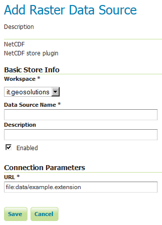
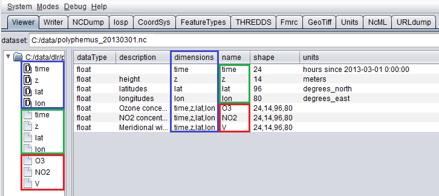
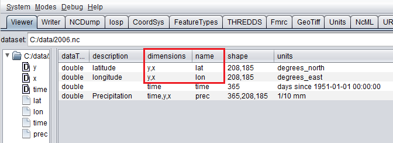
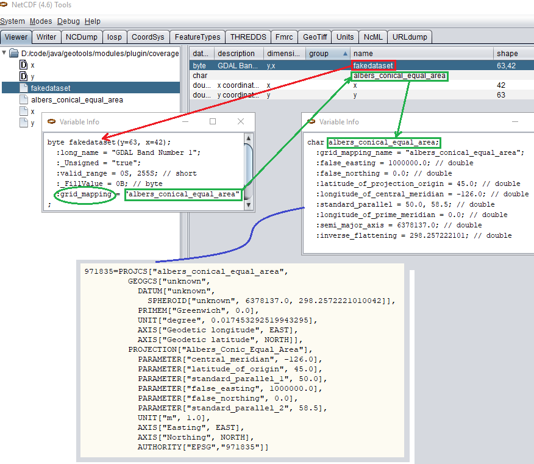

# NetCDF

## Adding a NetCDF data store

To add a NetCDF data store the user must go to **Stores --> Add New Store --> NetCDF**.


*NetCDF in the list of raster data stores*

## Configuring a NetCDF data store


*Configuring a NetCDF data store*

|                    |                 |
|--------------------|-----------------|
| **Option**         | **Description** |
| `Workspace`        |                 |
| `Data Source Name` |                 |
| `Description`      |                 |
| `Enabled`          |                 |
| `URL`              |                 |

## Notes on supported NetCDFs

The NetCDF plugin for GeoServer supports gridded NetCDF files having dimensions following the COARDS convention (custom, Time, Elevation, Lat, Lon). The NetCDF plugin supports plain NetCDF datasets (.nc files) as well .ncml files (which aggregate and/or modify one or more datasets) and Feature Collections. It supports Forecast Model Run Collection Aggregations (FMRC) either through the NCML or Feature Collection syntax. It supports an unlimited amount of custom dimensions, including runtime.

[ToolsUI](ftp://ftp.unidata.ucar.edu/pub/netcdf-java/v4.6/toolsUI-4.6.jar) is an useful java tool developed by UCAR which can be useful for a preliminary check on your dataset. Opening a sample NetCDF using that tool will show an output like this in the Viewer tab:


*NetCDF viewer in ToolsUI*

-   This dataset has 4 dimensions (time, z, lat, lon, marked by the D icon in the left side of the GUI. They have been marked by a blue rectangle in the screenshot).
-   Each dimension has an associated independent coordinate variable (marked by the green rectangle).
-   Finally, the dataset has 3 geophysical variables, marked by a red rectangle, each having 4 dimensions.

The NetCDF plugin fully supports datasets where each variable's axis is identified by an independent coordinate variable, as shown in the previous example. There is limited support for coordinate variables with two dimensions (see [Two-Dimensional Coordinate Variables](netcdf.md#netcdf_multidim)), as part of the result of an aggregation (such as time,runtime - in the case of a runtime aggregation). Two dimensional non-independent latitude-longitude coordinate variables aren't currently supported. A similar dataset will look like this in ToolsUI. Look at the red marked latitude and longitude coordinate variables, each one identified by a y,x 2D matrix.


*NetCDF viewer in ToolsUI for 2D coordinate variables*

## Two-Dimensional Coordinate Variables {: #netcdf_multidim }

Two-dimension coordinate variables are exposed in GeoServer as single dimensions. Their domain is exposed in GetCapabilities as a flat list of possible values. However, they imply an interdependence between the different dimensions, where some combinations of values exist (have data) and other combinations do not. For example:

| > Runtime |          | > Time   |          |          |
| --------- | -------- | -------- | -------- | -------- |
|           |          | > 0      | > 1      | > 2      |
| 0         | 1/1/2017 | 1/1/2017 | 1/2/2017 | 1/4/2017 |
| 1         | 1/2/2017 | 1/2/2017 | 1/3/2017 | > XXXX   |
| 2         | 1/3/2017 | 1/3/2017 | > XXXX   | > XXXX   |

The time dimension would thus be exposed in GeoServer as {1/1/2017, 1/2/2017, 1/3/2017, 1/4/2017}. However, the combinations (runtime=1/1/2017, time=1/3/2017), (runtime=1/2/2017, time=1/1/2017), (runtime=1/2/2017, time=1/4/2017) , (runtime=1/3/2017, time=1/1/2017), (runtime=1/3/2017, time=1/2/2017) and (runtime=1/3/2017, time=1/4/2017) do not exist.

Some additional functionality was introduced to maximally exploit two-dimensional coordinate variables:

> -   With requests that do not specify certain dimension values, we want to select default values that makes sense with regards to the dimensions values that *were* specified in the request. More specifically we want the maximum or minimum of the domain that matches the specified request's other dimension values; rather than the maximum or minimum of the entire domain.
> -   The user may want to query which combination of dimension values do exist and which don't. This can be done through an Auxiliary Vector Store that publishes the entire index.

A number of system properties allow us to configure this behavior:

> -   
>
>     `org.geotools.coverage.io.netcdf.param.max`
>
>     :   A comma separated list of dimensions that must be maximised when their value is absent in the request. In the layer configuration, the default value of these dimensions must be set to 'Built-in'.
>
> -   
>
>     `org.geotools.coverage.io.netcdf.param.min`
>
>     :   A comma separated list of dimensions that must be minimised when their value is absent in the request. In the layer configuration, the default value of these dimensions must be set to 'Built-in'.
>
> -   
>
>     `org.geotools.coverage.io.netcdf.auxiliary.store`
>
>     :   Set to TRUE to display the 'NetCDF Auxiliary Store' option in Geoserver. A NetCDF Auxiliary Store must be published *after* publishing the actual NetCDF store.

The NetCDF Auxiliary Store returns a WFS record like this for each possible combination of dimension values that do not include the two prime spatial dimensions:

    <topp:my-aux-store gml:id="1">
     <topp:the_geom>
      <gml:Polygon srsName="http://www.opengis.net/gml/srs/epsg.xml#4326" srsDimension="2">
       <gml:exterior><gml:LinearRing>
       <gml:posList>259.96003054 -0.04 259.96003054 70.04 310.03999998 70.04 310.03999998 -0.04 259.96003054   -0.04</gml:posList>
       </gml:LinearRing></gml:exterior>
      </gml:Polygon>
     </topp:the_geom>
     <topp:imageindex>160</topp:imageindex>
     <topp:depth>0.0</topp:depth>
     <topp:time>2017-01-01T00:00:00Z</topp:time>
     <topp:runtime>2017-01-02T00:00:00Z</topp:runtime>
    </topp:my-aux-store>

## Supporting Custom NetCDF Coordinate Reference Systems

### Grid Mapping attributes

Starting with GeoServer 2.8.x, NetCDF related modules (both NetCDF/GRIB store, imageMosaic store based on NetCDF/GRIB dataset and NetCDF output format) allow to support custom Coordinate Reference Systems and Projections. As reported in the [NetCDF CF documentation, Grid mappings section](http://cfconventions.org/Data/cf-conventions/cf-conventions-1.6/build/cf-conventions.html#appendix-grid-mappings) a NetCDF CF file may expose gridmapping attributes to describe the underlying projection. A *grid_mapping* attribute in the variable refers to the name of a variable containing the grid mapping definition.

The GeoTools NetCDF machinery will parse the attributes (if any) contained in the underlying NetCDF dataset to setup an OGC CoordinateReferenceSystem object. Once created, a CRS lookup will be made to identify a custom EPSG (if any) defined by the user to match that Projection. In case the NetCDF gridMapping is basically the same of the one exposed as EPSG entry but the matching doesn't happen, you may consider tuning the comparison tolerance: See [Coordinate Reference System Configuration](../../configuration/crshandling/configurecrs.md), *Increase Comparison Tolerance section*.


*Grid Mapping and related custom EPSG definition*

User defined NetCDF Coordinate Reference Systems with their custom EPSG need to be provided in **`user_projections\netcdf.projections.properties`** file inside your data directory (you have to create that file if missing).

A sample entry in that property file could look like this:

> 971835=PROJCS["albers_conical_equal_area", GEOGCS["unknown", DATUM["unknown", SPHEROID["unknown", 6378137.0, 298.2572221010042]], PRIMEM["Greenwich", 0.0], UNIT["degree", 0.017453292519943295], AXIS["Geodetic longitude", EAST], AXIS["Geodetic latitude", NORTH]], PROJECTION["Albers_Conic_Equal_Area"], PARAMETER["central_meridian", -126.0], PARAMETER["latitude_of_origin", 45.0], PARAMETER["standard_parallel_1", 50.0], PARAMETER["false_easting", 1000000.0], PARAMETER["false_northing", 0.0], PARAMETER["standard_parallel_2", 58.5], UNIT["m", 1.0], AXIS["Easting", EAST], AXIS["Northing", NORTH], AUTHORITY["EPSG","971835"]]

!!! note

    Note the "unknown" names for GEOGCS, DATUM and SPHEROID elements. This is how the underlying NetCDF machinery will name custom elements.

!!! note

    Note the number that precedes the WKT. This will determine the EPSG code. So in this example, the EPSG code is 971835.

!!! note

    When dealing with records indexing based on PostGIS, make sure the custom code isn't greater than 998999. (It took us a while to understand why we had some issues with custom codes using PostGIS as granules index. Some more details, [here](http://gis.stackexchange.com/questions/145017/why-is-there-an-upper-limit-to-the-srid-value-in-the-spatial-ref-sys-table-in-po))

!!! note

    If a parameter like "central_meridian" or "longitude_of_origin" or other longitude related value is outside the range [-180,180], make sure you adjust this value to belong to the standard range. As an instance a Central Meridian of 265 should be set as -95.

You may specify further custom NetCDF EPSG references by adding more lines to that file.

1.  Insert the code WKT for the projection at the end of the file (on a single line or with backslash characters):

        971835=PROJCS["albers_conical_equal_area", \
          GEOGCS["unknown", \
            DATUM["unknown", \
              SPHEROID["unknown", 6378137.0, 298.2572221010042]],  \
            PRIMEM["Greenwich", 0.0], \
            UNIT["degree", 0.017453292519943295], \
            AXIS["Geodetic longitude", EAST], \
            AXIS["Geodetic latitude", NORTH]], \
          PROJECTION["Albers_Conic_Equal_Area"], \
          PARAMETER["central_meridian", -126.0], \
          PARAMETER["latitude_of_origin", 45.0], \
          PARAMETER["standard_parallel_1", 50.0], \
          PARAMETER["false_easting", 1000000.0], \
          PARAMETER["false_northing", 0.0], \
          PARAMETER["standard_parallel_2", 58.5], \
          UNIT["m", 1.0], \
          AXIS["Easting", EAST], \
          AXIS["Northing", NORTH], \
          AUTHORITY["EPSG","971835"]]

2.  Save the file.

3.  Restart GeoServer.

4.  Verify that the CRS has been properly parsed by navigating to the [SRS List](../../configuration/demos/index.md#srs_list) page in the [Web administration interface](../../webadmin/index.md).

5.  If the projection wasn't listed, examine the logs for any errors.

#### Projected Coordinates with axis in km

For GeoServer < 2.16.x, Projected Coordinates with axis units in km are automatically converted to meters and associated ProjectedCRS has Unit in meters too. Therefore, polygons stored in the geometry table have coordinates in meters.

Starting with GeoServer 2.16.x, automatic conversion km-to-m is disabled by default in order to support km coordinates, directly. Therefore, make sure to define a proper custom CRS with km unit if you want to support it. (That is also needed if you want to publish the index as a vector layer).

For example:

    971815=PROJCS["albers_conical_equal_area", \
      GEOGCS["unknown", \
        DATUM["unknown", \
          SPHEROID["unknown", 6378137.0, 298.2572221010042]],  \
        PRIMEM["Greenwich", 0.0], \
        UNIT["degree", 0.017453292519943295], \
        AXIS["Geodetic longitude", EAST], \
        AXIS["Geodetic latitude", NORTH]], \
      PROJECTION["Albers_Conic_Equal_Area"], \
      PARAMETER["central_meridian", -126.0], \
      PARAMETER["latitude_of_origin", 45.0], \
      PARAMETER["standard_parallel_1", 50.0], \
      PARAMETER["false_easting", 1000000.0], \
      PARAMETER["false_northing", 0.0], \
      PARAMETER["standard_parallel_2", 58.5], \
      UNIT["km", 1000.0], \
      AXIS["Easting", EAST], \
      AXIS["Northing", NORTH], \
      AUTHORITY["EPSG","971815"]]

Note:

    UNIT["km", 1000.0], \

Set **`-Dorg.geotools.coverage.io.netcdf.convertAxis.km`** to ``true`` to activate the automatic conversion or ``false`` to deactivate it.

!!! note

    that is a global JVM setting: Any dataset with coordinates in km being configured before swapping the conversion behavior will need to be reconfigured to set the new Geometries and CRS.

#### Specify an external file through system properties

You may also specify the NetCDF projections definition file by setting a **Java system property** which links to the specified file. As an instance: **`-Dnetcdf.projections.file=/full/path/of/the/customfile.properties`**

### WKT Attributes

Some NetCDFs may include a text attribute containing the WKT definition of a Coordinate Reference System. When present, it will be parsed by GeoServer to setup a CRS and a lookup will be performed to see if any EPSG is matching it.

> -   
>
>     spatial_ref
>
>     :   GDAL *spatial_ref* attribute
>
> -   
>
>     esri_pe_string
>
>     :   An attribute being defined by [NetCDF CERP Metadata Convention](https://www.jem.gov/downloads/CERP%20NetCDF%20standard/CERP_NetCDF_Metadata_Conventions_1.2.pdf)

## NetCDF files in read-only directories

GeoServer creates hidden index files when accessing NetCDF files. Because these index files are created in the same directory as each NetCDF file, GeoServer will fail to publish NetCDF files if it lacks write access the containing directory.

To permit access to NetCDF files in read-only directories, specify an alternate writeable directory for NetCDF index files by setting the `NETCDF_DATA_DIR` Java system property:

    -DNETCDF_DATA_DIR=/path/to/writeable/index/file/directory

## Supporting Custom NetCDF Units

The NetCDF format expresses units using a syntax that is not always understood by our unit parser, and often, uses unit names using unrecognized symbols or that simply unknown to it. The system already comes with some smarts, but in case a unit is not recognized, it's possible to act on the configuration and extend it.

There are two property files that can be setup in order to modify unit magement, one is an alias file, the other is a replacement file:

-   An "alias" is a different symbol/name for a base unit (e.g., instead of using "g" the NetCDF files might be using "grammes")
-   A (text) "replacement" is used when the unit is a derived one, needing a full expression, or the syntax of the unit is simply unrecognized

The alias file is called `netcdf-unit-aliases.properties`, if not provided these contents are assumed:

    # Aliases for unit names that can in turn be used to build more complex units
    Meter=m
    meter=m
    Metre=m
    microgram=µg
    microgrammes=µg
    nanograms=ng
    degree=deg
    percentage=%
    celsius=°C
    ````

The replacement file is called `netcdf-unit-replacements.properties`, if not provided the following contents are assumed:

    microgrammes\ per\ cubic\ meter=µg*m^-3
    DU=µmol*m^-2*446.2
    m2=m^2
    m3=m^3
    s2=s^2

Both files express the NetCDF unit as the key, and the standard symbol or replacement text as the value.

It is possible to place the files in three different locations:

-   If the `NETCDF_UNIT_ALIASES` and/or `NETCDF_UNIT_REPLACEMENTS` system variables are defined, the respective files will be looked up at the specified location (must be full paths, including the file name)
-   If the above are missing and external NetCDF data dir is defined via `NETCDF_DATA_DIR` then the files will be looked up in there
-   If the above are missing the root of the GeoServer data directory will be searched
-   If none of the above provide a file, then the built-in configuration will be used

## Caching

When opening a NetCDF file, metadata and structures need to be setup, such as the Coordinate Reference System and related Coordinate Systems, the optional datastore configuration, the coverages structure (schemas and dimensions). Depending on the complexity of the file itself, those can be time consuming tasks. Operations that are continuously and repeatedly accessing the same files will be impacted by that. Therefore, starting with GeoServer 2.20.x, a caching mechanism has been setup.

Some entities that can be considered *static* are internally cached once parsed: they include the NetCDF datastore configuration setup on top of the datastore properties file, the indexer built on top of the auxiliary xml file, as well as the unit of measure of the variables.

!!! note

    Make sure to do a GeoServer reload if one of these config files get modified or updated, to clean the cache and allow the new settings to be used.

### File Caching

An additional level of caching can be manually enabled, so that NetCDF Files can be cached and re-used. The object being cached is not the whole file, but a `NetcdfDataset` object, which is built on top of parsed metadata, including coordinate system info. Whenever a NetCDF dataset is being accessed, a cached instance is provided and released back to the cache-pool once done. So if there are 10 concurrent requests accessing the same NetCDF file, up to 10 different NetCDF dataset cached instances will be used.

These Java system variables can be set to enable and configure the file caching:

-   `org.geotools.coverage.io.netcdf.cachefile` : boolean. set it to true to enable the dataset caching. (default: false, no files caching)
-   `org.geotools.coverage.io.netcdf.cache.min` : integer value representing the minimum number of datasets to be kept in cache (default: 200).
-   `org.geotools.coverage.io.netcdf.cache.max` : integer value representing the maximum number of datasets to be kept in cache before a cleanup get triggered (default: 300).
-   `org.geotools.coverage.io.netcdf.cache.cleanup.period` : integer value representing the time period (in seconds) before the next cache cleanup occurs (0 for no periodic cleanup, default is 12 minutes)

!!! note

    When enabling the file caching and setting up an ImageMosaic of NetCDFs, consider disabling the Deferred Loading from the coverage configuration so that the underlying readers get access to the NetCDF dataset and release them as soon as the read is done.

# Mosaic of NetCDF files

## Setting up a basic mosaic

A mosaic of NetCDF files is a bit different than usual, because each NetCDF file can contain multiple coverages. As a result, the mosaic setup requires extra configuration files, an `indexer.xml` acting as the mosaic index, and a `_auxiliary.xml`, describing the NetCDF file contents.

Setting up these files can be a cumbersome process, so a utility has been written, which automatically fills their contents based on a sample NetCDF file (under the assumeption that all NetCDF files in the mosaic share the same variables and dimensions).

Given a sample NetCDF file, you can get into the mosaic directory and run the **CreateIndexer** tool (for the NetCDF projection files, see above). On Windows:

    java -cp <path-to-geoserver>\WEB-INF\lib\*.jar org.geotools.coverage.io.netcdf.tools.CreateIndexer <path-to-sample-nc-file> [-p <path-to-netcdf-projections>] [<path-to-output-directory>]

On Linux:

    java -cp '<path-to-geoserver>/WEB-INF/lib/*' org.geotools.coverage.io.netcdf.tools.CreateIndexer <path-to-sample-nc-file> [-p <path-to-netcdf-projections>] [<path-to-output-directory>]

!!! warning

    On older GeoServer version the command might fail complaining it cannot find `org.jaxen.NamespaceContext`. If that\'s the case, download [Jaxen 1.1.6](https://repo1.maven.org/maven2/jaxen/jaxen/1.1.6/jaxen-1.1.6.jar), add it into the GeoServer `WEB-INF/lib` directory, and try again.

This will generate the files and it\'s going to be good enough if each NetCDF contains the same coverages. The `indexer.xml` file might look as follows:

``` xml
<?xml version="1.0" encoding="UTF-8"?><Indexer>
  <domains>
    <domain name="time">
      <attributes><attribute>time</attribute></attributes>
    </domain>
  </domains>
  <coverages>
    <coverage>
      <name>dbz</name>
      <schema name="dbz">
        <attributes>
           the_geom:Polygon,imageindex:Integer,location:String,time:java.util.Date
        </attributes>
      </schema>
      <domains>
        <domain ref="time" />
      </domains>
    </coverage>
  </coverages>
  <parameters>
    <parameter name="AuxiliaryFile" value="/path/to/the/mosaic/_auxiliary.xml" />
    <parameter name="AbsolutePath" value="true" />
  </parameters>
</Indexer>
```

While the `_auxiliary.xml` file might look like:

``` xml
<?xml version="1.0" encoding="UTF-8"?><Indexer>
    <coverages>
        <coverage>
            <schema name="dbz">
                <attributes>
                   the_geom:Polygon,imageindex:Integer,time:java.util.Date
                </attributes>
            </schema>
            <origName>dbz</origName>
            <name>dbz</name>
        </coverage>
    </coverages>
</Indexer>
```

If instead there are different NetCDF files containing different coverages in the same mosaic, you\'ll have to:

-   Run the above command using a different sample NetCDF file for each coverage, generating the output in different folders.
-   Manually merge them into a unified `indexer.xml` and `_auxiliary.xml` that will be placed in the mosaic directory.

NetCDF files contain usually time dimensions, as a result, it\'s not possible to rely on Shapefile based indexes, but use a relational database instead. So, add a `datastore.properties` file into the mosaic directory, pointing to a database of choice. Here is an example file, suitable to connect to a PostGIS enabled database, with a schema dedicated to contain the mosaic indexes (make sure it already exists in the database, GeoServer won\'t create it):

    SPI=org.geotools.data.postgis.PostgisNGDataStoreFactory
    host=localhost
    port=5432
    database=netcdf
    schema=mosaic_indexes
    user=user
    passwd=pwd
    Loose\ bbox=true
    Estimated\ extends=false
    validate\ connections=true
    Connection\ timeout=10
    preparedStatements=true
    max\ connections=20

With this in place, it\'s possible to create stores and layers in GeoServer:

-   Create a new Image Mosaic store, pointing to the mosaic directory.
-   After a bit of processing, the list of available coverages should appear, ready for layer creation.
-   Create each layer, and remember to configure time, elevation and custom dimensions in the \"dimensions\" tab.

In case of error during the set up, the following suggestions apply:

-   Remove all extra files the mosaic might have created in the mosaic directory.
-   Remove the eventual new tables created in the database.
-   Enable the `GeoTools developer logging` profile in the global settings.
-   Run the mosaic creation again, inspect the logs to find out the reason (often it\'s due to database permissions, or to NetCDF files that are not conforming to the CF conventions).
-   Repeat from the top until the mosaic creation succeeds.

## Storing NetCDF internal indexes in a centralized index

By default the NetCDF reader creates a hidden directory, either as a sidecar or in the NetCDF data dir, containing a low level index file to speed up slices lookups, as well as a H2 database containing information about slice indexes and dimensions associated to them. This H2 store is opened and closed every time the associated NetCDF is read, causing less than optimal performance in map rendering.

As an alternative, it\'s possible to store all slice metadata from H2 to a centralized database, and have GeoServer manage the store connecting to it, thus keeping it always open. Some work is needed in order to make that happen thought.

As a first step, create a store connection property file named `netcdf_datastore.properties`. Here is an example file, suitable to connect to a PostGIS enabled database, which makes the pair with the previously introduced `datastore.properties` :

    SPI=org.geotools.data.postgis.PostgisNGDataStoreFactory
    host=localhost
    port=5432
    database=netcdf
    schema=netcdf_indexes
    user=user
    passwd=pwd
    Loose\ bbox=true
    Estimated\ extends=false
    validate\ connections=true
    Connection\ timeout=10
    preparedStatements=true
    max\ connections=20

Notice how the NetCDF indexes are going to be stored in a different database schema, to prevent eventual table name conflicts (again, make sure the schema already exists in the database).

GeoServer needs to be informed of this new configuration file, by editing the `indexer.xml` file and adding this new line in the parameters section:

``` xml
<parameter name="AuxiliaryDatastoreFile" value="netcdf_datastore.properties" /> 
```

The `_auxiliary.xml` file also needs to be modified, open it and change the `attributes` element(s), adding a `location:String` attribute right after the `imageIndex:Integer` attribute (position is important, mosaic construction will fail if the attribute is misplaced):

``` xml
<attributes>the_geom:Polygon,imageindex:Integer,location:String,time:java.util.Date</attributes>
```

At this point the mosaic construction can be repeated from the GUI, just like a normal NetCDF image mosaic.

## Migrating mosaics with H2 NetCDF index files to a centralized index

While the above setup allows to centralized index for NetCDF file contents. In case one already has a (very) large image mosaic of NetCDF files, having to re-harvest the NetCDF files can be time consuming and, in general, not practical.

A utility has been created to perform the migration of existing mosaics to a centralized database index, the **H2Migrate** tool.

On Windows:

    java -cp <path-to-geoserver>/WEB-INF/lib/*.jar org.geotools.coverage.io.netcdf.tools.H2Migrate -m <path-to-mosaic-directory> -is <indexPropertyFile> -v

On Linux:

    java -cp '<path-to-geoserver>/WEB-INF/lib/*' org.geotools.coverage.io.netcdf.tools.H2Migrate -m <path-to-mosaic-directory> -is <indexPropertyFile> -v

The tool supports other options as well, they can be discovered by running the tool without any parameter.

!!! warning

    On older GeoServer version the command might fail complaining it cannot find `org.apache.commons.cli.ParseException`. If that\'s the case, download [commons-cli 1.1.4](https://repo1.maven.org/maven2/commons-cli/commons-cli/1.4/commons-cli-1.4.jar), add it into the GeoServer `WEB-INF/lib` directory, and try again.

`H2Migrate` will connect to the target store using the information in indexPropertyFile, locate the granules to be migrated inspecting the mosaic contents, create a `netcdf_index.properties` file with `StoreName=storeNameForIndex` and update the mosaic to use it (basically, update the indexer.xml and all coverage property files to have a `AuxiliaryDatastoreFile` property pointing to `netcdf_indexer.properties`).

It will also generate two files, `migrated.txt` and `h2.txt`:

> -   `migrated.txt` contains the list of files successfully migrated, for audit purposes
> -   `h2.txt` the list of H2 database files that can now be removed. The tool won\'t do it automatically to ensure that the migration, but with this one one could automate removal, e.g., on Linux a simple `cat h2.txt | xargs rm` would do the trick (the `<name>.log.db` files change name often, it\'s likely that they will have to be hunted down and removed with other means, e.g. if on Linux, using the \"find\").

If the mosaic to be migrated is backed by a **OpenSearch** index, then the tool won\'t be able to open the mosaic (it would require running inside GeoServer), so the connection parameters will have to be provided in a second property file, along with the list of tables containing the granules paths in the \"location\" attribute, e.g.:

> java -cp \<path-to-geoserver\>/WEB-INF/lib/\*.jar org.geotools.coverage.io.netcdf.tools.H2Migrate -m \<path-to-mosaic-directory\> -ms \<mosaicStorePropertyFile\> -mit granule -is \<indexPropertyFile\> -isn \<storeNameForIndex\> -v

After a successful migration, one final manual step is required. As before, the `_auxiliary.xml` file also needs to be modified. Open it and change the `attributes` element(s), adding a `location:String` attribute right after the `imageIndex:Integer` attribute (position is important, mosaic construction will fail if the attribute is mispaced):

``` xml
<attributes>the_geom:Polygon,imageindex:Integer,location:String,time:java.util.Date</attributes>
```

Also, find every XML file holding a indexer like configuration, and add the parameter `AuxiliaryDatastoreFile` parameter:

``` xml
<parameter name="AuxiliaryDatastoreFile" value="<path/to/mosaic/directory/>netcdf_datastore.properties" /> 
```

Finally, do the same with the property files for each coverage, adding:

    AuxiliaryDatastoreFile=<path/to/mosaic/directory/>netcdf_datastore.properties

The path to `netcdf_datastore.properties` can also be relative, but only if the image mosaic is configured to use relative paths.

If GeoServer was running during the migration, the mosaic store just migrated needs to be reset so that it reads again its configuration: go to the mosaic store, open its configuration, and without changing any parameter, save it again: the layers backed by the mosaic are now ready to use.
