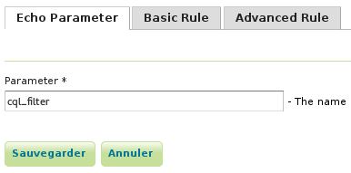
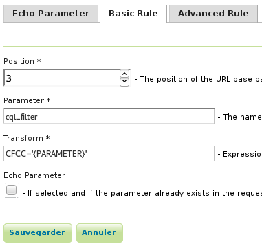
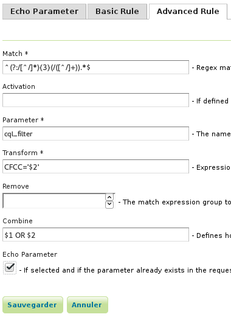
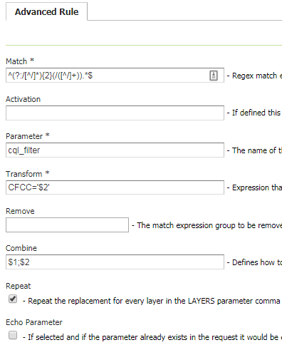
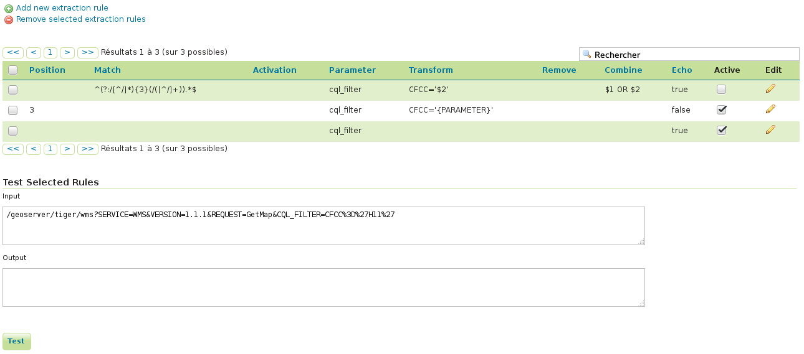

# Using the Parameters Extractor module

This module allow us to entering specific request parameters as URL path fragments instead of using the query string. For example, we want to be able to apply a cql_filter using a URL in the following form:

    /geoserver/<workspace>/<layer>/<filter>/ows?service=WMS&version=1.3.0&request=GetMap

As a simple example of usage, if the <filter> is something like:

    K_140M

the URL would become:

    /geoserver/<workspace>/<layer>/K_140M/ows?service=WMS&version=1.3.0&request=GetMap

and this module will translate the URL to this new one:

    /geoserver/<workspace>/<layer>/ows?service=WMS&version=1.3.0&request=GetMap&cql_filter=seq='K140M'

This module is configured by a set of rules that will be applied to the incoming URLs. Note that a get capabilities result will include the original URL maintaining the extra filter.

This module also gives the possibility to echo existing URL parameters to the result of a get capabilities result. As an example, by default the following get capabilities request (note the existing cql_filter parameter):

    /geoserver/ows?service=wms&version=1.3.0&request=GetCapabilities&cql_filter=CFCC=%27D68%27 

will return a get capabilities document were the URLs will be of the type:

    /geoserver/ows?SERVICE=WMS&

if this module is configured to echo an existing cql_filter parameter the result would be:

    /geoserver/ows?SERVICE=WMS&CQL_FILTER=CFCC%3D%27D68%27&

This module is configured using three types of rules: echo parameter rules, basic rules and advanced rules. All of them can be managed in this module UI which is integrated in GeoServer UI.

## Echo Parameter Rules

Echo parameter rules are very simple, they allow us to define that a certain existing URL parameter should be echoed to a get capabilities result. This type of rules only required one mandatory parameter which is the name of the existing URL parameter that should be echoed to a get capabilities result.

Example of an echo parameter rule:


*Example of a echo parameter rule defined in the UI*

This rule will echo the cql_filter of this URL:

    /geoserver/ows?service=wms&version=1.3.0&request=GetCapabilities&cql_filter=CFCC=%27D68%27

to the get capabilities result:

    /geoserver/ows?SERVICE=WMS&CQL_FILTER=CFCC%3D%27D68%27&

## Basic Rules

Basic rules allow us to handle simple uses cases where we only want to extract a parameter from the URL.

A basic rule is defined by three mandatory attributes:

|               |                                                                                                                    |
|---------------|--------------------------------------------------------------------------------------------------------------------|
| **Attribute** | **Description**                                                                                                    |
| `Position`    | The position of the URL base path element to be selected                                                           |
| `Parameter`   | The name of the parameter produced by this rule                                                                    |
| `Transform`   | Expression that defines the value of the parameter, use {PARAMETER} as a placeholder for the selected path element |

For commodity is also possible when defining this type of rules to configure that an existing parameter in the URL should be echoed to a get capabilities result.

Example of a basic rule:


*Example of a basic rule defined in the UI*

This rule will transform the URL:

    /geoserver/tiger/wms/H11?SERVICE=WMS&VERSION=1.1.1&REQUEST=GetMap

in:

    /geoserver/tiger/wms?SERVICE=WMS&VERSION=1.1.1&REQUEST=GetMap&CQL_FILTER=CFCC%3D%27H11%27

## Advanced Rules

Advanced rules allow us to handle more complex uses cases where more flexibility is required.

An advanced rule is defined by three mandatory attributes and four optional ones:

|               |                                                                                                                                                                                                    |               |
|---------------|----------------------------------------------------------------------------------------------------------------------------------------------------------------------------------------------------|---------------|
| **Attribute** | **Description**                                                                                                                                                                                    | **Mandatory** |
| `Match`       | Regex match expression with groups, for example \^(?:/[\^/]*){3}(/([\^/]+)).*\$ selects the URL base path third element                                                                        | Yes           |
| `Activation`  | If defined this rule will only be applied to URLs that match this regex expression                                                                                                                 | No            |
| `Parameter`   | The name of the parameter produced by this rule                                                                                                                                                    | Yes           |
| `Transform`   | Expression that defines the value of the parameter, use \$1 \... \$n as placeholders for groups defined in the match expression                                                                    | Yes           |
| `Remove`      | The match expression group to be removed from URL, by default 1                                                                                                                                    | No            |
| `Combine`     | Defines how to combine parameter existing value (\$1 existing value, \$2 new value), by default the value is overridden                                                                            | No            |
| `Repeat`      | If defined, Combine is applied not only once, but for every layer included in the LAYERS parameter, this allows filling parameters that require a value for each layer (e.g. STYLES or CQL_FILTER) | No            |

For commodity is also possible when defining this type of rules to configure that an existing parameter in the URL should be echoed to a get capabilities result.

Example of an advanced rule:


*Example of an advanced rule defined in the UI*

This rule will transform the URL:

    /geoserver/tiger/wms/H11?SERVICE=WMS&VERSION=1.1.1&REQUEST=GetMap&CQL_FILTER=CFCC%3D%27D68%27

in:

    /geoserver/tiger/wms?SERVICE=WMS&VERSION=1.1.1&REQUEST=GetMap&CQL_FILTER=CFCC%3D%27D68%27+or+CFCC%3D%27H11%27

No that this rule will also echo an existing cql_filter parameter to the get capabilities result.

Example of an advanced rule with repeat:


*Example of an advanced rule with repeat defined in the UI*

This rule will transform the URL:

    /geoserver/wms/H11?SERVICE=WMS&VERSION=1.1.1&REQUEST=GetMap&LAYERS=tiger,other

in:

    /geoserver/wms?SERVICE=WMS&VERSION=1.1.1&REQUEST=GetMap&LAYERS=tiger,otherCQL_FILTER=CFCC%3D%27D68%27%3BCFCC%3D%27H11%27

## Rules Management

Rules can be managed and tested in the rules management UI. Besides the basic operations like add, remove and update is also possible to activate or deactivate rules. A deactivated rule will be ignored by this module.

Follow a print screen of the rules management UI with all the rules previously defined:


*Rules management UI*

Note that the first rule (the advanced one) is not active.

## REST API

The rules and echo parameters can also be managed by means of a REST API found at `geoserver/rest/params-extractor`. Documentation for it is available in [Swagger format](https://docs.geoserver.org/latest/en/api/#1.0.0/params-extractor.yaml)

## Intercepting the security filters chain

By default, the params-extractor module does not interact with the security authentication filters. This is because the params-extractor filter is called later in the GeoServer filters chain.

If you want params-extractor to work before the security filter chain, you have to configure it as a standard servlet filter in the GeoServer WEB-INF/web.xml file.

This can be done adding the following to your current web.xml (immediately after the `Set Character Encoding` filter) and restarting GeoServer:

> ``` xml
> ```
>
> <!DOCTYPE beans PUBLIC "-//SPRING//DTD BEAN//EN" "<http://www.springframework.org/dtd/spring-beans.dtd>"> <web-app> \... <filter> <filter-name>ExtractParams</filter-name> <filter-class>org.geoserver.params.extractor.Filter</filter-class> </filter> \... <filter-mapping> <filter-name>ExtractParams</filter-name> <url-pattern>/*</url-pattern> </filter-mapping> \... </web-app>
