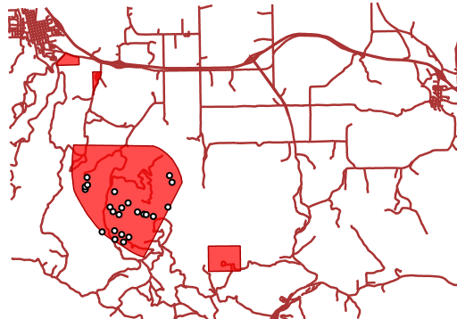
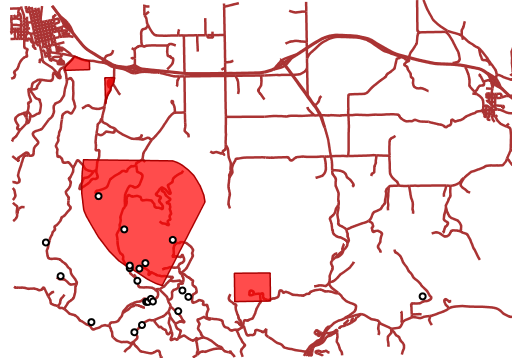

# Cross-layer filtering

Cross-layer filtering provides the ability to find features from layer A that have a certain relationship to features in layer B. This can be used, for example, to find all bus stops within a given distance from a specified shop, or to find all coffee shops contained in a specified city district.

The **querylayer** module adds filter functions that implement cross-layer filtering. The functions work by querying a secondary layer within a filter being applied to a primary layer. The name of the secondary layer and an attribute to extract from it are provided as arguments, along with an ECQL filter expression to determine which features are of interest. A common use case is to extract a geometry-valued attribute, and then use the value(s) in a spatial predicate against a geometry attribute in the primary layer.

Filter functions are widely supported in GeoServer, so cross-layer filtering can be used in SLD rules and WMS and WFS requests, in either XML or CQL filters.

## Installing the querylayer module

-   Visit the [website download](https://geoserver.org/download) page, locate your release, and download: {{ download_extension('querylayer') }} (nightly {{ download_extension('querylayer','snapshot') }})

    > ::: warning
    > ::: title
    > Warning
    > :::
    >
    > The version of the extension **must** match the version of the GeoServer instance
    > :::

1.  Extract the contents of the extension archive into the **`WEB-INF/lib`** directory of the GeoServer installation.
2.  To check the module is properly installed request the WFS 1.1 capabilities from the GeoServer home page. The `Filter_Capabilities` section should contain a reference to a function named `queryCollection`.

``` xml
...
<ogc:Filter_Capabilities>
    ...
    <ogc:ArithmeticOperators>
      ...
      <ogc:Functions>
        <ogc:FunctionNames>
          ...
          <ogc:FunctionName nArgs="-1">queryCollection</ogc:FunctionName>
          <ogc:FunctionName nArgs="-1">querySingle</ogc:FunctionName>
          ...
        </ogc:FunctionNames>
      </ogc:Functions>
    </ogc:ArithmeticOperators>
  </ogc:Scalar_Capabilities>
  ...
</ogc:Filter_Capabilities>
...
```

## Function reference

The extension provides the following filter functions to support cross-layer filtering.

|                   |                                                           |                                                                                                                                                                                                                                                                                                                                                                                               |
|-------------------|-----------------------------------------------------------|-----------------------------------------------------------------------------------------------------------------------------------------------------------------------------------------------------------------------------------------------------------------------------------------------------------------------------------------------------------------------------------------------|
| **Name**          | **Arguments**                                             | **Description**                                                                                                                                                                                                                                                                                                                                                                               |
| querySingle       | `layer` : String, `attribute` : String, `filter` : String | Queries the specified `layer` applying the specified [ECQL](../../filter/ecql_reference.md) `filter` and returns the value of `attribute` from the first feature in the result set. The layer name must be qualified (e.g. `topp:states`). If no filtering is desired use the filter `INCLUDE`.                                                                                              |
| queryCollection   | `layer` : String, `attribute` : String, `filter` : String | Queries the specified `layer` applying the specified [ECQL](../../filter/ecql_reference.md) `filter` and returns a list containing the value of `attribute` for every feature in the result set. The layer name must be qualified (e.g. `topp:states`). If no filtering is desired use the filter `INCLUDE`. An exception is thrown if too many results are collected (see *Memory Limits*). |
| collectGeometries | `geometries`: a list of Geometry objects                  | Converts a list of geometries into a single Geometry object. The output of `queryCollection` must be converted by this function in order to use it in spatial filter expressions (since geometry lists cannot be used directly). An exception is thrown if too many coordinates are collected (see *Memory Limits*).                                                                          |

## Optimizing performance

In the GeoServer 2.1.x series, in order to have cross-layer filters execute with optimal performance it is necessary to specify the following system variable when starting the JVM:

    -Dorg.geotools.filter.function.simplify=true 

This ensures the functions are evaluated once per query, instead of once per result feature. This flag is not necessary for the GeoServer 2.2.x series. (Hopefully this behavior will become the default in 2.1.x as well.)

## Memory limits

The `queryCollection` and `collectGeometries` functions do not perform a true database-style join. Instead they execute a query against the secondary layer every time they are executed, and load the entire result into memory. The functions thus risk using excessive server memory if the query result set is very large, or if the collected geometries are very large. To prevent impacting server stability there are built-in limits to how much data can be processed:

-   at most 1000 features are collected by `queryCollection`
-   at most 37000 coordinates (1MB worth of Coordinate objects) are collected by `collectGeometries`

These limits can be overridden by setting alternate values for the following parameters (this can be done using JVM system variables, servlet context variables, or environment variables):

-   `QUERY_LAYER_MAX_FEATURES` controls the maximum number of features collected by `queryCollection`
-   `GEOMETRY_COLLECT_MAX_COORDINATES` controls the maximum number of coordinates collected by `collectGeometries`

## WMS Examples

The following examples use the `sf:bugsites`, `sf:roads` and `sf:restricted` demo layers available in the standard GeoServer download.

-   **Display only the bug sites overlapping the restricted area whose category is 3**:

The CQL cross-layer filter on the `bugsites` layer is

> `INTERSECTS(the_geom, querySingle('restricted', 'the_geom','cat = 3'))`.

The WMS request is:

    http://localhost:8080/geoserver/wms?LAYERS=sf%3Aroads%2Csf%3Arestricted%2Csf%3Abugsites&STYLES=&FORMAT=image%2Fpng&SERVICE=WMS&VERSION=1.1.1&REQUEST=GetMap&EXCEPTIONS=application%2Fvnd.ogc.se_inimage&SRS=EPSG%3A26713&CQL_FILTER=INCLUDE%3BINCLUDE%3BINTERSECTS(the_geom%2C%20querySingle(%27restricted%27%2C%20%27the_geom%27%2C%27cat%20%3D%203%27))&BBOX=589081.6705629,4914128.1213261,609174.02430924,4928177.0717971&WIDTH=512&HEIGHT=358

The result is:



-   **Display all bug sites within 200 meters of any road**:

The CQL cross-layer filter on the `bugsites` layer is

> `DWITHIN(the_geom, collectGeometries(queryCollection('sf:roads','the_geom','INCLUDE')), 200, meters)`.

The WMS request is:

    http://localhost:8080/geoserver/wms?LAYERS=sf%3Aroads%2Csf%3Arestricted%2Csf%3Abugsites&STYLES=&FORMAT=image%2Fpng&SERVICE=WMS&VERSION=1.1.1&REQUEST=GetMap&EXCEPTIONS=application%2Fvnd.ogc.se_inimage&SRS=EPSG%3A26713&CQL_FILTER=INCLUDE%3BINCLUDE%3BDWITHIN(the_geom%2C%20collectGeometries(queryCollection(%27sf%3Aroads%27%2C%27the_geom%27%2C%27INCLUDE%27))%2C%20200%2C%20meters)&BBOX=589042.42768447,4914010.3926913,609134.78143081,4928059.3431623&WIDTH=512&HEIGHT=358

The result is:



## WFS Examples

The following examples use the `sf:bugsites`, `sf:roads` and `sf:restricted` demo layers available in the standard GeoServer download.

-   **Retrieve only the bug sites overlapping the restricted area whose category is 3**:

``` xml
<wfs:GetFeature xmlns:wfs="http://www.opengis.net/wfs"
                xmlns:sf="http://www.openplans.org/spearfish"
                xmlns:ogc="http://www.opengis.net/ogc"
                service="WFS" version="1.0.0">
  <wfs:Query typeName="sf:bugsites">
    <ogc:Filter>
      <ogc:Intersects>
        <ogc:PropertyName>the_geom</ogc:PropertyName>
        <ogc:Function name="querySingle">
           <ogc:Literal>sf:restricted</ogc:Literal>
           <ogc:Literal>the_geom</ogc:Literal>
           <ogc:Literal>cat = 3</ogc:Literal>
        </ogc:Function>
      </ogc:Intersects>
    </ogc:Filter>
  </wfs:Query>
</wfs:GetFeature>
```

-   **Retrieve all bugsites within 200 meters of any road**:

``` xml
<wfs:GetFeature xmlns:wfs="http://www.opengis.net/wfs"
  xmlns:sf="http://www.openplans.org/spearfish"
  xmlns:ogc="http://www.opengis.net/ogc"
  service="WFS" version="1.0.0">
  <wfs:Query typeName="sf:bugsites">
    <ogc:Filter>
      <ogc:DWithin>
        <ogc:PropertyName>the_geom</ogc:PropertyName>
        <ogc:Function name="collectGeometries">
          <ogc:Function name="queryCollection">
            <ogc:Literal>sf:roads</ogc:Literal>
            <ogc:Literal>the_geom</ogc:Literal>
            <ogc:Literal>INCLUDE</ogc:Literal>
          </ogc:Function>
        </ogc:Function>
        <ogc:Distance units="meter">100</ogc:Distance>
      </ogc:DWithin>
    </ogc:Filter>
  </wfs:Query>
</wfs:GetFeature>
```
