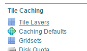
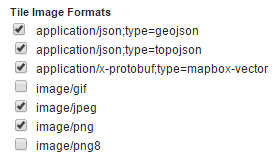
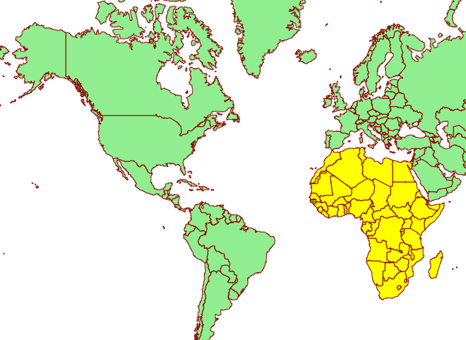

# Vector tiles tutorial {: #vectortiles.tutorial }

This tutorial will show how to use the GeoServer vector tiles output.

## Why use vector tiles?

The advantages of vector tiles are:

-   **Rendering is done by the client** (for example, OpenLayers), not by the server. This allows different maps/applications to style a map differently without having to reconfigure GeoServer.
-   **The size of a vector tile is usually smaller** than an image tile, resulting in faster data transfer and lower bandwidth usage.
-   GeoWebCache, embedded with GeoServer efficiently stores the vector tile data. Since styling is done by the client, not the server, **GeoWebCache only needs to store one tile for all different styles**.
-   Because the vector data is available on the client, very **high-resolution maps can be drawn without corresponding increases in bandwidth**.
-   **The client has native access to the actual feature information** (attributes and geometry), allowing for very sophisticated rendering.

On the other hand, the main disadvantage of vector tiles is that the geographic data may need to be pre-processed to allow the client to do the drawings it requires (similar to preprocessing data for image maps). With this in mind, **vector tiles should only be used for rendering**.

## Vector tile formats

GeoServer can also produce vector tiles in three formats: GeoJSON, TopoJSON, and MapBox Vector (MVT). These are also supported by OpenLayers and other clients.

-   MVT is the preferred format for production.

| Format                                                            | MIME                                 | Description                                                                                                                                                                                                    |
|-------------------------------------------------------------------|--------------------------------------|----------------------------------------------------------------------------------------------------------------------------------------------------------------------------------------------------------------|
| [MapBox Vector (MVT)](https://github.com/mapbox/vector-tile-spec) | `application/vnd.mapbox-vector-tile` | **Recommended Format** This is an efficient binary format that is widely supported by almost all Vector Tile applications.                                                                                     |
| [GeoJSON](http://geojson.org/)                                    | `application/json;type=geojson`      | This is a human readable JSON format. Although many geo-spatial applications support GeoJSON datasets, few Vector Tile applications support tiles in this format. Supported by Open Layers 3.                  |
| [TopoJSON](https://github.com/mbostock/topojson/wiki)             | `application/json;type=topojson`     | This is a very complex, but somewhat human readable JSON format that is good for polygon coverages. It is not a widely supported and very few Vector Tile applications support it. Supported by Open Layers 3. |

## Publish vector tiles in GeoWebCache

We'll be publishing our vector tiles through GeoWebCache and publishing the layer in a custom OpenLayers application.

For this tutorial, we'll be using the layer `opengeo:countries` to show off the capabilities, though with slight modifications, any layer will do.

!!! note

    Download the [Admin 0 - Countries](http://www.naturalearthdata.com/downloads/110m-cultural-vectors) shapefile and publish the layer as `opengeo:countries`.

1.  In the GeoServer admin interface, click `Tile Layers` under `Tile Caching`.

    
    *Tile Layers*

2.  Click `opengeo:countries` in the list of layers.

3.  By default the tile formats are `image/jpeg` and `image/png`. Check the boxes for the following vector tile formats:

    -   `application/json;type=geojson`
    -   `application/json;type=topojson`
    -   `application/vnd.mapbox-vector-tile`

    
    *Vector tiles tile formats*

4.  Click `Save`.

Our layer is now ready to be served.

## Create OpenLayers application - TMS Vector Tiles

1.  Create a `www/tms-vectortiles` directory inside your GeoServer Data Directory.

2.  Download the [latest version of OpenLayers](http://openlayers.org/download/). Download the v<ol-version>-package.zip file`_.

3.  Extract the following files from the downloaded archive to the directory created in step 1:

    -   `v<ol-version>-package/dist/ol.js`
    -   `v<ol-version>-package/ol.css`

4.  In a text editor, create a new file with the following content:

    ``` {.html emphasize-lines="5"}
    <!DOCTYPE html -->
    <html>
    <head>
      <title>Vector tiles</title>
      <script src="ol.js"></script>
      <link rel="stylesheet" href="ol.css">
      <style>
        html, body {
          font-family: sans-serif;
          width: 100%;
        }
        .map {
          height: 500px;
          width: 100%;
        }
      </style>
    </head>
    <body>
      <h3>Mapbox Protobuf - vector tiles TMS</h3>
      <div id="map" class="map"></div>
      <script>

      var style_simple = new ol.style.Style({
        fill: new ol.style.Fill({
          color: '#ADD8E6'
        }),
        stroke: new ol.style.Stroke({
          color: '#880000',
          width: 1
        })
      });

      function simpleStyle(feature) { 
        return style_simple;
      }

      var layer = 'opengeo:countries';
      var projection_epsg_no = '900913';
      var map = new ol.Map({
        target: 'map',
        view: new ol.View({
          center: [0, 0],
          zoom: 2
        }),
        layers: [new ol.layer.VectorTile({
          style:simpleStyle,
          source: new ol.source.VectorTile({
            tilePixelRatio: 1, // oversampling when > 1
            tileGrid: ol.tilegrid.createXYZ({maxZoom: 19}),
            format: new ol.format.MVT(),
            url: '/geoserver/gwc/service/tms/1.0.0/' + layer +
                '@EPSG%3A'+projection_epsg_no+'@pbf/{z}/{x}/{-y}.pbf'
          })
        })]
      });
      </script>
    </body>
    </html>
    ```

5.  Save this file in the directory created above as `index.html`.

6.  Navigate to `http://localhost:8080/geoserver/www/tms-vectortiles/index.html` and verify that the output shows without any errors.

    !!! note

        If your GeoServer is deployed at a server other than `http://localhost:8080/geoserver/`, then please adjust the above URL.

    
    *Vector tile output*

These tiles are being rendered by the OpenLayers client.

## Create OpenLayers application - WMS Vector Tiles

!!! note

    Vector tiles requested with WMS allows retrieving non-cached vector tiles (server side) by setting the `tiled=false` parameter on the `getMap` request. This setting could be particularly useful when serving fast changing source data that should constantly be kept up-to-date for display. However, in terms of rendering performances, vector tiles can be faster than a PNG provided there are few features per tile and a limited amount of attributes in the source vector data. Vice versa, for tiles containing a large number of features with a long list of attributes the PNG may still be the preferred option since it is orders of magnitude smaller in size.

1.  Create a `www/wms-vectortiles` directory inside your GeoServer Data Directory.

2.  Download the [latest version of OpenLayers](http://openlayers.org/download/). Download the v<ol-version>-package.zip file.

3.  Extract the following files from the downloaded archive to the directory created in step 1:

    -   `v<ol-version>-package/dist/ol.js`
    -   `v<ol-version>-package/ol.css`

4.  In a text editor, create a new file with the following content:

    ``` {.html emphasize-lines="5"}
    <!doctype html>
    <html>
    <head>
      <title>Vector tiles</title>
      <script src="ol.js"></script>
      <link rel="stylesheet" href="ol.css">
      <style>
        html, body {
          font-family: sans-serif;
          width: 100%;
        }
        .map {
          height: 500px;
          width: 100%;
        }
      </style>
    </head>
    <body>
      <h3>Mapbox Protobuf - vector tiles WMS</h3>
      <div class="refresh-container">
      <button id="refresh-button" type="button" onclick="updateFunc();">Refresh/reload cache</button>
      </div>
      <div id="map" class="map"></div>
      <script>

        var layerParams = {'LAYERS': 'opengeo:countries', 'TILED': false, 'FORMAT': 'application/vnd.mapbox-vector-tile'};

      var sourceOptions = {
          url: '/geoserver/wms?',
          params: layerParams,
          serverType: 'geoserver',
          transition: 0,
          hidpi: false
        };

      var WMSTileSource = new ol.source.TileWMS(sourceOptions);

      var mvtVectorSource = new ol.source.VectorTile(
        Object.assign(
          sourceOptions,
          {
            url: undefined,
            format: new ol.format.MVT({layerName: '_layer_'}),
            tileUrlFunction: function(tileCoord, pixelRatio, projection) {
              return WMSTileSource.tileUrlFunction(tileCoord, pixelRatio, projection);
            }
          }
        )
      );


        var updateFunc = function () {
        WMSTileSource.updateParams(
          Object.assign(
            layerParams,
            {
              '_v_' : Date.now()
            }
          )
        );
        WMSTileSource.tileCache.pruneExceptNewestZ();
        mvtVectorSource.clear();
        mvtVectorSource.refresh();
      };


      var layer = new ol.layer.VectorTile({
        source: mvtVectorSource
      });

      var map = new ol.Map({
        target: 'map',
        view: new ol.View({
          center: [0,0],
          zoom: 2
        }),
        layers: [layer]
      });

      </script>
    </body>
    </html>
    ```

5.  Save this file in the directory created above as `index.html`.

6.  Navigate to `http://localhost:8080/geoserver/www/wms-vectortiles/index.html` and verify that the output shows without any errors.

    !!! note

        If your GeoServer is deployed at a server other than `http://localhost:8080/geoserver/`, then please adjust the above URL.

## Styling vector tiles

Since these tiles are rendered in the client, we need only change the styling instructions inside the client application. No changes to GeoServer are required, and tiles will not have to be regenerated.

1.  Change the fill color to light green:

    ``` {.none emphasize-lines="3"}
    var style_simple = new ol.style.Style({
      fill: new ol.style.Fill({
        color: 'lightgreen'
      }),
       stroke: new ol.style.Stroke({
          color: '#880000',
          width: 1
        })
    }) ;
    ```

2.  Save the file and reload the application.

    
    *Vector tile output with alternate color*

3.  We can also do attributed-based styling. This dataset contains has a property (`region_un`) which contains the region the country is in. Let's highlight countries in Africa by adding another style definition below the existing style:

    ``` {.html emphasize-lines="3"}
    var style_highlighted = new ol.style.Style({
      fill: new ol.style.Fill({
        color: 'yellow'
      }),
      stroke: new ol.style.Stroke({
        color: '#880000',
        width: 1
      })
    });
    ```

4.  Replace the existing style function:

    ``` {.html emphasize-lines="2"}
    function simpleStyle(feature) { 
      return style_simple;
    }
    ```

    with the following:

    ``` {.html emphasize-lines="2-5"}
    function simpleStyle(feature) { 
      if (feature.get("region_un") == "Africa") {
        return style_highlighted;
      }
      return style_simple;
    }
    ```

5.  Save the file and reload the application.

    
    *Vector tile output with Africa highlighted*
