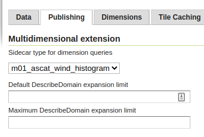

# WMTS Multidimensional performance {: #wmts_multidimensional_sidecar }

The multi-dimensional extension is designed to get quick summary responses, either when providing the full dimensions descriptions, or drilling into a particular sub-context, e.g., finding the times available in a particular bounding box.

The extension is often used to drive time sliders and visual tools to quickly drill down into a large multi-dimensional data set: as such, it's important that response times keep up with the user interactive usage.

For it to perform well, the typical configurations for relational databases are, in order of increasing complexity:

-   Indexing all dimensions involved (geometry, time, elevation, and so on).
-   Clustering the table on the dimensions which are the typical main UI driving factor (e.g. PostgreSQL one-off clustering, Oracle index organized tables).
-   Partition the table based on the same dimension (e.g., PostgreSQL table partitioning).
-   Create a summary table and use it for queries instead of the original one. The next section describes this approach.

## Sidecar summary tables for vector data

The multidimensional module can be configured to use a sidecar summary table, that will be queried in place of the original table, for any domain extraction purpose:

*Setting up a sidecar table.*

Conditions for the sidecar table to work:

-   Must contain all the same dimension columns as in the primary table, with same name and type.
-   Must have a significantly smaller number of records (meaning, the primary table has lots of duplicate dimension values).
-   May have reduced resolution in some dimension, if it's possible to accept reduced accuracy in the domain reports.

**Querying the sidecar table will bypass all of the main table configurations and security, including**:

-   Property mapping (renaming, type modification, synthetic properties based on expression).
-   CQL filtering defined in the layer configuration.
-   Any security restriction (the layer must be public).

In summary, the sidecar table is useful for vector layers that are:

-   Public.
-   Very large, with significant repetition of dimension values.
-   Read from the original table without any filtering or mapping.

While the documentation above refers to relational databases, it's also possible to use sidecar layers that come from the same data store. For example, given a directory of shapefiles, it would be possible to create a summary shapefile with a summary of a larger shapefile, and use it as the query target in its place.
