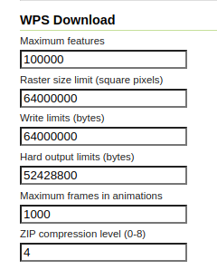

# WPS Download plugin {: #wpsdownload }

WPS Download plugin provides some useful features for easily downloading: * Raster or Vector layer as zip files * Large maps as images * Time based animation The module also provides facilities to control the output file size.

## Installing the WPS Download extension

The WPS Download extension is listed among the other extension downloads on the GeoServer download page.

The installation process is similar to other GeoServer extensions:

1.  From the [website download](https://geoserver.org/download) page, locate your release, and download: `wps-download`{.interpreted-text role="download_extension"}

    Verify that the version number in the filename corresponds to the version of GeoServer you are running (for example {{ release }} above).

2.  Extract the contents of the archive into the **`WEB-INF/lib`** directory in GeoServer. Make sure you do not create any sub-directories during the extraction process.

3.  Restart GeoServer.

## Module description

This module provides the following WPS process:

> -   `gs:Download` : can be used for downloading Raster and Vector Layers
> -   `gs:DownloadEstimator` : can be used for checking if the downloaded file does not exceeds the configured limits.
> -   `gs:DownloadMap`: allows to download a large map with the same composition found on the client side (eventually along with an asynchronous call)
> -   `gs:DownloadAnimation`: allows to download a map with the same composition found on the client side, with animation over a give set of times

## Configuring the limits

The user interface provides a way to configure the WPS download in the WPS administration page:

> 

Where the available limits are:

> -   Maximum features : maximum number of features to download
> -   Raster size limits : maximum pixel size of the Raster to read (in square pixels, width by height)
> -   Write limits : maximum raw raster size in bytes (a limit of how much space can a raster take in memory). For a given raster, its raw size in bytes is calculated by multiplying pixel number (raster_width x raster_height) with the accumulated sum of each band's pixel sample_type size in bytes, for all bands
> -   Hard output limit : maximum file size to download (will be checked while writing the output, post compression)
> -   ZIP compresion level : compression level for the output zip file
> -   Maximum frames in animation : maximum number of frames allowed (if no limit, the maximum execution time limits will still apply and stop the process in case there are too many)

The configuration is stored in a **download.properties** file found in the root of the GeoServer data directory.

> ``` 
> # Max #of features
> maxFeatures=100000
> #8000 px X 8000 px
> rasterSizeLimits=64000000
> #8000 px X 8000 px X 3 bands X 1 byte per band = 192MB
> writeLimits=192000000
> # 50 MB
> hardOutputLimit=52428800
> # STORE =0, BEST =8
> compressionLevel=4
> # When set to 0 or below, no limit
> maxAnimationFrames=1000
> ```

The file can also be manually modified while GeoServer is running, the file is under watch and gets reloaded on modification.

The configuration can also be edited via [the REST API](https://docs.geoserver.org/latest/en/api/#1.0.0/wpsdownload.yaml).

## The processes and their usage

The following describes the various processes, separating raw downloads from rendered downloads:

-   [Raw data download processes](rawDownload/.md)
-   [Rendered map/animation download processes](mapAnimationDownload/.md)
