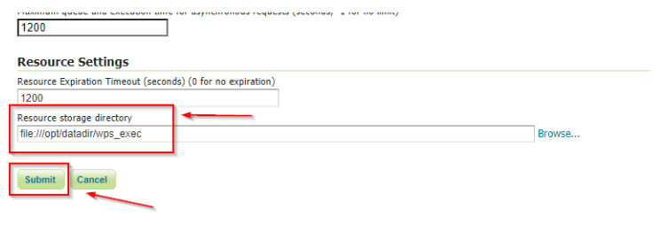

# WPS JDBC {: #data_wpsjdbc }

The WPS JDBC extension is a WPS status storage for asynchronous requests. Main advantages are:

-   Asynchronous request status sharing among multiple GeoServer nodes
-   Ability to retain the status of completed requests even after the GeoServer(s) have been restarted.

## Installing the WPS JDBC extension {: #wpsjdbc_install }

1.  From the [website download](https://geoserver.org/download) page, locate your release, and download: `wps-jdbc`{.interpreted-text role="download_extension"}

    Verify that the version number in the filename corresponds to the version of GeoServer you are running (for example {{ release }} above).

2.  Extract the contents of the archive into the **`WEB-INF/lib`** directory in GeoServer. Make sure you do not create any sub-directories during the extraction process.

3.  Restart GeoServer.

## Configuring the WPS JDBC properties

1.  Create a file named ``jdbcstatusstore.props`` into the `IR` root

2.  Update the sample content below accordingly to your connection parameters

    > ``` 
    > user=postgres
    > port=5432
    > password=******
    > passwd=******
    > host=localhost
    > database=gsstore
    > driver=org.postgresql.Driver
    > dbtype=postgis
    > ```

3.  Restart GeoServer

## Share the WPS Execution Directory among the cluster nodes

Typically the WPS JDBC plugin is useful when setting up a GeoServer cluster.

The plugin allows sharing of the execution status among the nodes of the cluster.

Nevertheless, this won't be sufficient. You will need to share the Execution folder too, in order to allow the different instances to correctly retrieve the executions results.

1.  Create a shared folder that all the nodes can reach somehow, e.g. by using `fs`
2.  From the GeoServer Admin dashboard, go to the `PS` menu and edit the Resource Storage Directory accordingly


*WPS JDBC shared Resource Storage Directory*
