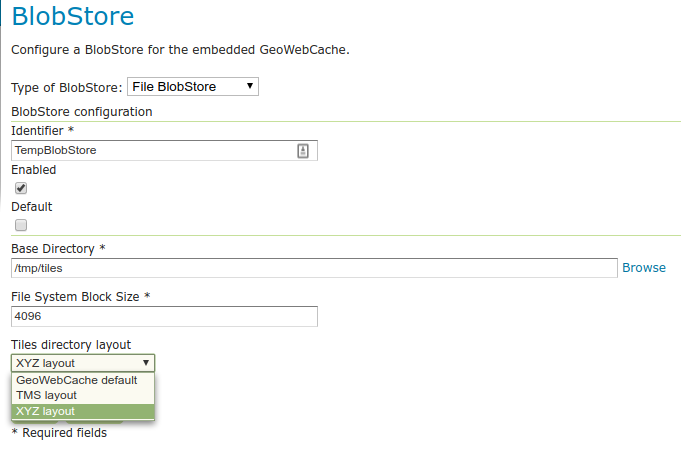

# BlobStores

BlobStores allow us to configure how and where GeoWebCache will store its cached data on a per-layer basis. This page allows us to define the different BlobStores present in the system. BlobStores can be created, modified and removed from here.

## General

### Identifier

Each BlobStore has a unique identifier.

### BlobStore Type

There can be different BlobStore types to use different ways of storage. There is only standard support for File BlobStores. Plugins may add additional types.

### Enabled

Disabled BlobStores will not be loaded. Disabling a BlobStore will disable caching for all layers and layergroups assigned to that BlobStore.

### Default

There should always be one default BlobStore, which cannot be removed. The default BlobStore will be used by all layers not assigned to a specific BlobStore. Removing a BlobStore will cause all layers assigned to this BlobStore to use the default BlobStore until specified otherwise.

## File BlobStore

These store data on a disk in a specified directory.

It is also possible to choose the tile file layout:

-   GeoWebCache default uses a path structure reducing the number of items in each directory, by splitting long lists in groups. In particular, the layout is `z/xc_yc/x_y.ext` where `xc=x/(2^(z/2))`, `yc=y/(2^(z/2))`. In other words, the tiles are split into square areas, the number of square areas growing with the zoom level, and each square being assigned to a intermediate directory. The Y coordinates are numbered from the south northwards.
-   TMS uses a TMS layout, that is, `z/y/x.ext` where the Y coordinates are numbered from the south northwards.
-   XYZ uses a "slippy map", or "Google Maps like" layout, that is, `z/y/x.ext` where the Y coordinates originate top left and grow southwards (opposite of TMS and GWC default order).

!!! note

    When switching file layout type, the tile directories won't be deleted, it's up to the admin to clean up the tiles on the file system, GeoServer/GWC won't do it automatically.

### Base Directory

The directory where the cached data is stored.

### Disk block size

This setting determines how the tile cache calculates disk usage. The value for this setting should be equivalent to the disk block size of the storage medium where the cache is located. The default block size is **4096 bytes**.
