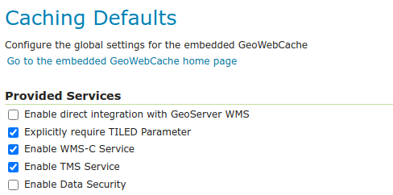
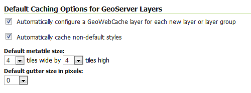
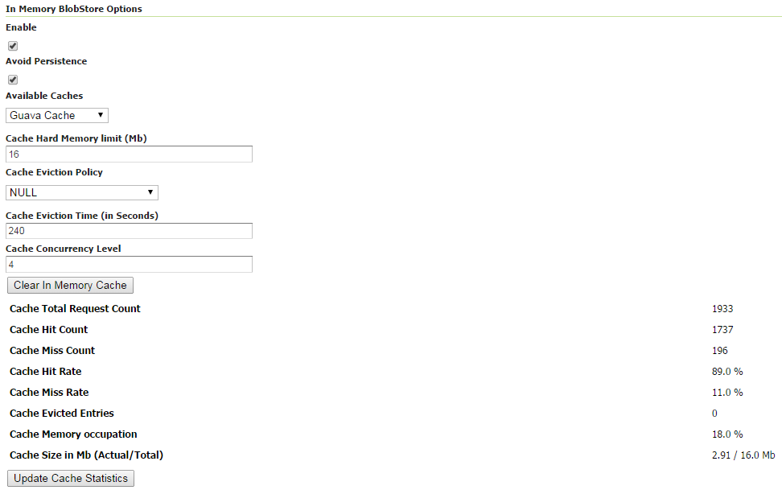
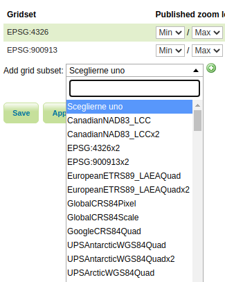

# Caching defaults {: #gwc_webadmin_defaults }

The Caching Defaults page shows the global configuration options for the tile caching functionality in GeoServer, an embedded GeoWebCache.

## GWC Provided Services

In addition to the GeoServer endpoints, GeoWebCache provides other endpoints for OGC services. For example, the GeoServer WMS endpoint is available at:

    http://GEOSERVER_URL/wms?...

The GeoWebCache WMS endpoint is:

    http://GEOSERVER_URL/gwc/service/wms?...

*Provided services*

The following settings describe the different services that can be enabled with GeoWebCache.

### Enable direct integration with GeoServer WMS

Direct integration allows WMS requests served through GeoServer to be cached as if they were received and processed by GeoWebCache. This provides all the advantages of using a tile server while still employing the more-flexible GeoServer WMS as a fallback. See the section on [Using GeoWebCache](../using.md) for more details about this feature.

With direct integration, tile caching is enabled for all standard WMS requests that contain the `tiled=true` parameter and conform to all required parameters.

This setting is disabled by default. When enabling this option, it is a good idea to also turn on [Disk Quotas](diskquotas.md) as well, to prevent unbounded growth of the stored tiles.

#### Explicitly require TILED Parameter

When this parameter is checked direct WMS integration requires that the `tiled=true` parameter be set in all requests that will be cached. If this parameter is unchecked all incoming requests will be considered for caching, the request must still conform to all required parameters.

### Enable WMS-C Service

Enables the Cached Web Map Service (WMS-C) service. When this setting is enabled, GeoWebCache will respond to its own WMS-C endpoint:

    http://GEOSERVER_URL/gwc/service/wms?SERVICE=WMS&VERSION=1.1.1&TILED=true&...

When the service is disabled, calls to the capabilities document will return a `Service is disabled` message.

### Enable TMS Service

Enables the Tiled Map Service (TMS) endpoint in GeoWebCache. With the TMS service, GeoWebCache will respond to its own TMS endpoint:

    http://GEOSERVER/URL/gwc/service/tms/1.0.0

When the service is disabled, calls to the capabilities document will return a `Service is disabled` message.

### Enable WMTS Service

Enables the Web Map Tiled Service (WMTS) endpoint in GeoWebCache. When this setting is enabled, GeoWebCache will respond to its own WMTS endpoint:

    http://GEOSERVER/URL/gwc/service/wmts?...

When the service is disabled, calls to the capabilities document will return a `Service is disabled` message.

HTTP RESTful API is available through the existing GWC integration allowing clients to retrieve the following resources:

-   capabilities document
-   tile
-   feature info

For more information read [GWC WMTS documentation](http://geowebcache.org/docs/current/services/wmts.html).

### Enable Data Security

Enables the [GeoServer Data Security](../config.md#gwc_data_security) in the embedded GeoWebCache.

## Default Caching Options for GeoServer Layers

This section describes the configuration of the various defaults and other global options for the tile cache in GeoServer.

*Default caching options*

### Automatically configure a GeoWebCache layer for each new layer or layer group

This setting, enabled by default, determines how layers in GeoServer are handled via the embedded GeoWebCache. When this setting is enabled, an entry in the GeoWebCache layer listing will be created whenever a new layer or layer group is published in GeoServer. Use this setting to keep the GeoWebCache catalog in sync. (This is enabled by default.)

### Automatically cache non-default styles

By default, only requests using the default style for a given layer will be cached. When this setting is enabled, all requests for a given layer, even those that use a non-standard style will be cached. Disabling this may be useful in situations where disk space is an issue, or when only one default style is important.

### Default metatile size

A metatile is several tiles combined into a larger one. This larger metatile is generated and then subdivided before being served back (and cached) as standard tiles. The advantage of using metatiling is in situations where a label or geometry lies on a boundary of a tile, which may be truncated or altered. With metatiling, these tile edge issues are greatly reduced.

Moreover, with metatiling, the overall time it takes to seed the cache is reduced in most cases, when compared with rendering a full map with single tiles. In fact, using larger metatiling factors is a good way to reduce the time spent in seeding the cache.

The disadvantage of metatiling is that at large sizes, memory consumption can be an issue.

The size of the default metatile can be adjusted here. By default, GeoServer sets a metatile size of **4x4**, which strikes a balance between performance, memory usage, and rendering accuracy.

### Default gutter size

The gutter size sets the amount of extra space (in pixels) used when generating a tile. Use this in conjunction with metatiles to reduce problems with labels and features not being rendered incorrectly due to being on a tile boundary.

### Default Cache Formats

This setting determines the default image formats that can be cached when tiled requests are made. There are four image formats that can be used when saving tiles:

-   PNG (24-bit PNG)
-   PNG8 (8-bit PNG)
-   JPEG
-   GIF

The default settings are subdivided into vector layers, raster layers, and layer groups. You may select any of the above four formats for each of the three types of layers. Any requests that fall outside of these layer/format combinations will not be cached if sent through GeoServer, and will return an error if sent to the GeoWebCache endpoints.

These defaults can be overwritten on a per-layer basis when [editing the layer properties](../../data/webadmin/layers.md).

*Default image formats*

### In Memory BlobStore Options

These options are used for enabling/disabling In Memory Caching for GeoWebCache. This feature can be used for saving GWC tiles directly in memory, for a fast data retrieval.

#### Enable

This parameter allows to enable or disable in memory caching. By default it is disabled.

#### Avoid Persistence

This parameter can be used to prevent the saving of any file in the file system, keeping all the GWC tiles only in memory. By default it is disabled.

#### Available Caches

This parameter defines which Cache method can be used for In Memory Caching. By default the Guava Caching is used. Note that if a caching method requires an immutable configuration at GeoServer startup like HazelCast, the *Hard Memory limit*, *Eviction Policy*, *Eviction Time* and *Concurrency Level* parameters are disabled.

More information on how to configure a new Cache object can be found in the GeoWebCache [Configuration](../config.md) page.

#### Cache Hard Memory limit (Mb)

Parameter for configuring in memory cache size in MB.

#### Cache Eviction Policy

Parameter for configuring in memory cache eviction policy, it may be: LRU, LFU, EXPIRE_AFTER_WRITE, EXPIRE_AFTER_ACCESS, NULL

This eviction policies may not be supported by all caches implementations. For example, Guava Caching only supports the eviction policies: EXPIRE_AFTER_WRITE, EXPIRE_AFTER_ACCESS and NULL.

Note, only the eviction policies accepted by the selected cache will be shown on the UI.

#### Cache Eviction Time (in Seconds)

Parameter for configuring in memory cache eviction time. It is in seconds.

!!! note

    Note that this parameter is also used for configuring an internal thread which performs a periodical cache cleanup.

#### Cache Concurrency Level

Parameter for configuring in memory cache concurrency.

#### Clear In Memory Cache

Button for clearing all the tiles in the in memory cache.

#### Cache Statistics

Various statistics parameters associated with the in memory cache.

#### Update Cache Statistics

Button for updating cache statistics seen above. The statistics are always related to the local cached entries, even in case of distributed in memory caching

!!! note

    Note that some Caches do not provide all the statistics parameters, in that case the user will only see *"Unavailable"* for those parameters.

*In Memory BlobStore Options*

!!! note

    Note that in the *TileCaching* tab for each Layer, you may decide to disable in memory caching for the selected Layer by clicking on the **Enable In Memory Caching for this Layer** checkbox. This option is disabled for those caches which don't support this feature.

### Skip caching on dimension warnings

WMS dimension handling can be complex, with ability to return tiles where the specified time was not a match, or when the request contained no time at all. This may not be a good match for tile caching, as it breaks the unique link between URL and tile content.

The following settings allow to disable caching when a WMS dimension warning is issued:

*Skip caching on cache warnings*

The best settings depend on the type of dataset and disk-quota configurations:

> -   For **static datasets with dimensions**, the default value skip could be removed, as it's going to generate at most one copy of the tiles. The nearest match and failed nearest could be cached if there is a disk quota (to speed up clients that repeatedly fail to perform an exact time match), but it's best not to cache it if there is no disk quota, as the mismatches can be potentially infinite, leading to an uncontrolled growth of the cache.
> -   For a **datasets growing over time**, it's better to disable caching on the default value, as it's often the "latest", that is, the most recently added to the dataset. This means the tiles contents change based on when they are asked for. The considerations for nearest and failed matches are the same as for the static datasets.

Caution is advised if the data ingestion might happen to skip some time/elevation values, to fill them only at a later time. In this case, nearest matches could cause the system to cache a tile for a nearby time value, which would hide the actual values if they get ingested at a later time.

### Default Cached Gridsets

This section shows the gridsets that will be automatically configured for cached layers. While there are some pre-configured gridsets available, only two are enabled by default. These correspond to the most common and universal cases:

-   EPSG:4326 (geographic) with 22 maximum zoom levels and 256x256 pixel tiles
-   EPSG:900913 (spherical Mercator) with 31 maximum zoom levels and 256x256 pixel tiles

*Default gridsets*

To add a pre-existing grid set, select it from the **Add default grid set** menu, and click the Add icon (green circle with plus sign).

*Adding an existing gridset to the list of defaults*

These definitions are described in more detail on the [Gridsets](gridsets.md) page.
