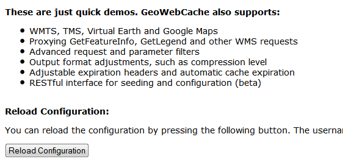

# Demo page

In addition to the [Tile Layers](layers.md) page, there is also a demo page where you can view configured layers, reload the configuration (when changing settings or adding new layers), and seed or refresh the existing cache on a per-layer basis.

As this interface is part of the standalone GeoWebCache, some of the functionality here is duplicated from the [Tile Layers](layers.md) page.

*Built-in demo page*

## Viewing

To view the demo page, append `/gwc/demo` to the address of your GeoServer instance. For example, if your GeoServer is at the following address:

    http://localhost:8080/geoserver

The GeoWebCache demo page is accessible here:

    http://localhost:8080/geoserver/gwc/demo

If there is a problem loading this page, verify the steps on the [Using GeoWebCache](../using.md) page have been carried out successfully.

## Reload configuration

The demo page contains a list of every layer that GeoWebCache is aware of. This is typically (though not necessarily) identical to the list of layers as published in the GeoServer WMS capabilities document. If configuration changes are made to GeoServer, GeoWebCache will not automatically become aware of them. To ensure that GeoWebCache is using the latest configuration information, click the **Reload Configuration** button. Reloading the configuration will trigger authentication to GeoServer, and will require an administration username and password. Use the same username and password that you would use to log on to the [Web administration interface](../../webadmin/index.md). After a successful logon, the number of layers found and loaded will be displayed.

*Reloading the configuration*

## Layers and output formats

For each layer that GeoWebCache serves, links are typically available for a number of different projections and output formats. By default, **OpenLayers** applications are available using image formats of PNG, PNG8, GIF, and JPEG in both **EPSG:4326** (standard lat/lon) and **EPSG:900913** (used in Google Maps) projections. In addition, **KML output** is available (EPSG:4326 only) using the same image formats, plus vector data ("kml").

Also on the list is an option to seed the layers (**Seed this layer**). More on this option below.

## Seeding

You can configure seeding processes via the [Web administration interface](../../webadmin/index.md). See the [Tile Layers](layers.md) page for more information.

It is also possible to configure seeding process via the [Demo page](demopage.md). The page contains a link next to each layer entitled **Seed this layer**. This link will trigger authentication with the GeoServer configuration. Use the same username and password that you would use to log on to the [Web administration interface](../../webadmin/index.md). After a successful logon, a new page shows up with seeding options.

The seeding options page contains various parameters for configuring the way that the layer is seeded.

| Option                     | Description                                                                                                                                                                                                                                                                                                           |
|----------------------------|-----------------------------------------------------------------------------------------------------------------------------------------------------------------------------------------------------------------------------------------------------------------------------------------------------------------------|
| `Number of threads to use` | Possible values are between **1** and **16**.                                                                                                                                                                                                                                                                         |
| `Type of operation`        | Sets the operation. There are three possible values: **Seed** (creates tiles, but does not overwrite existing ones), **Reseed** (like Seed, but overwrites existing tiles) and **Truncate** (deletes all tiles within the given parameters)                                                                           |
| `SRS`                      | Specifies the projection to use when creating tiles (default values are **EPSG:4326** and **EPSG:900913**)                                                                                                                                                                                                            |
| `Format`                   | Sets the image format of the tiles. Can be **application/vnd.google-earth.kml+xml** (Google Earth KML), **image/gif** (GIF), **image/jpeg** (JPEG), **image/png** (24 bit PNG), and **image/png8** (8 bit PNG)                                                                                                        |
| `Zoom start`               | Sets the minimum zoom level. Lower values indicate map views that are more zoomed out. When seeding, GeoWebCache will only create tiles for those zoom levels inclusive of this value and `Zoom stop`.                                                                                                                |
| `Zoom stop`                | Sets the maximum zoom level. Higher values indicate map views that are more zoomed in. When seeding, GeoWebCache will only create tiles for those zoom levels inclusive of this value and `Zoom start`.                                                                                                               |
| `Bounding box`             | *(optional)* Allows seeding to occur over a specified extent, instead of the full extent of the layer. This is useful if your layer contains data over a large area, but the application will only request tiles from a subset of that area. The four boxes correspond to **Xmin**, **Ymin**, **Xmax**, and **Ymax**. |

!!! warning

    Currently there is no progress bar to inform you of the time required to perform the operation, nor is there any intelligent handling of disk space. In short, the process may take a *very* long time, and the cache may fill up your disk. You may wish to set a [Disk quota](../using.md#gwc_diskquota) before running a seed job.
