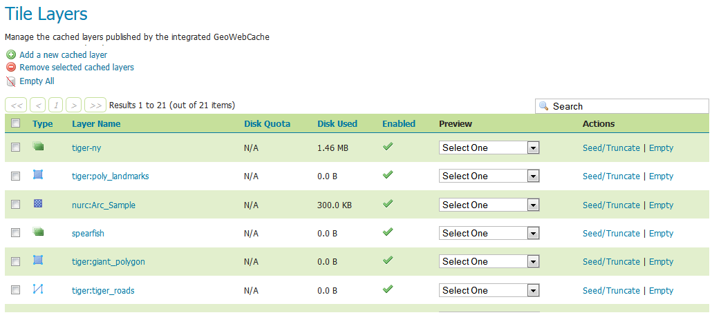
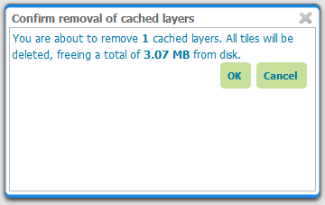
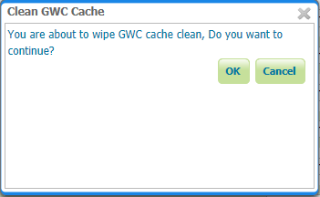
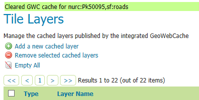

# Tile Layers

This page shows a listing of all of the layers known to the integrated GeoWebCache. It is similar to the [Layer Preview](../../data/webadmin/layerpreview.md) for GeoWebCache, with many of the same options.

!!! note

    There is also a link to the [GeoWebCache standalone demo page](demopage.md).

## Layer information

For each layer cached by GeoWebCache, the following information is available.

### Disk Quota

The maximum amount of disk space that can be used for this layer. By default, this will be set to **N/A** (unbounded) unless [Disk Quotas](diskquotas.md) are enabled.

### Disk Used

The current disk space being used by tiles for this particular layer.

!!! note

    **This counter will only be updated if disk quotas are enabled.** If disk quotas are not enabled, tiles will still be saved to disk, but the counter will remain as `0.0 B`.

### Enabled

Indicates whether tile caching is enabled for this layer. It is possible to have a layer definition here but to not have tile caching enabled (set in the layer properties).

### Preview

Similar to [Layer Preview](../../data/webadmin/layerpreview.md), this will generate a simple OpenLayers application populated with tiles from one of the available gridset/image format combinations. Select the desired option from the menu to view in OpenLayers.

### Seed/Truncate

Opens the GeoWebCache page for automatically seeding and truncating the tile cache. Use this if you want to pre-populate some of your cache.

### Empty

Will remove all saved tiles from the cache. This is identical to a full truncate operation for the layer.

## Add or remove cached layers

The list of layers displayed on this page is typically the same as, or similar to, the full list of layers known to GeoServer. However, it may not be desirable to have every layer published in GeoServer have a cached layer component. In this case, simply select the box next to the layer to remove, and click **Remove selected cached layers**. The layer will be removed from GeoWebCache, and the disk cache for this layer will be entirely removed.

!!! warning

    Deleting the tile cache cannot be undone.

*Removing a cached layer*

To add in a layer from GeoServer (if it wasn't set up to be added automatically), click the **Add a new cached layer** link.

*Adding a new cached layer*

## Clearing GeoWebCache

The `Empty all` link allows to clear the entire cache, for all layers, grid sets and filter parameters combination.

!!! warning

    This will truncate all layers in GeoWebCache

*Confirmation to GeoWebCache*

A confirmation will appear on the page as message with names of cleared Tile layers.

## Configuring a cached layer

You have two options for layer configuration. The first option is to load the layer using the default (global) settings. To do this, select the layer you wish to start caching, and click the **Configure selected layers with caching defaults** link. The second option is to configure the caching parameters manually, via the [layer configuration](../../data/webadmin/layers.md) pages. To do this, just click the layer name itself.

### Parameter Filters

Parameter filters allow GeoWebCache to cache a layer with varying parameters such as `STYLES`, `TIME`. One is needed for each parameter to be cached and it needs to know how to recognize valid values to be cached and which values are the same as other values so they only get cached once. There are several different kinds of filter as a result.

#### Adding a Filter

At the bottom of the filter list in the text box beside **Add filter** specify the name of the parameter. In the drop down box select the kind of filter you want then click the  button. For a filter that automatically tracks the layers styles in a parameter named `STYLES` click the **Add Style Filter** button.

#### Removing a Filter

To remove a filter, click the  button to the right of the filter's entry in the filter list.

#### Types of filter

All parameter filters take a default parameter that will be used if the parameter was not specified. Specific types of parameter filter provide different ways of specifying which parameter values are allowed, and which are equivalent to one another and should be cached together.

##### List of Strings

The `stringParameterFilter` takes a collection of plain text strings. If the value matches one of the strings, it is valid, otherwise it is not. Matching can be done in a case sensitive way, or the strings can all be converted to upper or lower case before matching. As case rules vary between languages, the locale to use for case changes can be specified.

##### Regular Expression

The ``regexParameterFilter`` takes a regular expression to match strings. This should be used with caution as it potentially allows an arbitrarily large number of caches to be created. Like the string filter, it can be normalized for case.

##### List of Numbers

The `floatParameterFilter` is like the string filter in taking a list of values, but it uses floating point numbers rather than arbitrary text strings. A threshold can be given to pull close numbers to a standard value.

##### List of Whole Numbers

The `integerParameterFilter` is like the float filter but works with integer/whole number values.

##### Styles

The `styleParameterFilter` is connected to the GeoServer catalog and knows what styles are available for the layer and when they change. You can specify a default distinct from the normal layer default if you wish, and restrict the range of additional styles available if you do not wish to cache all of them.
