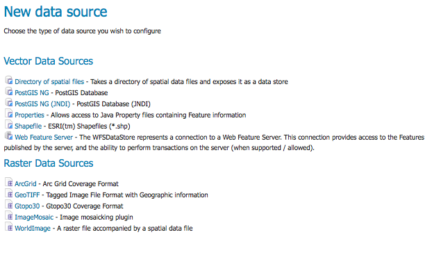
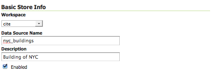
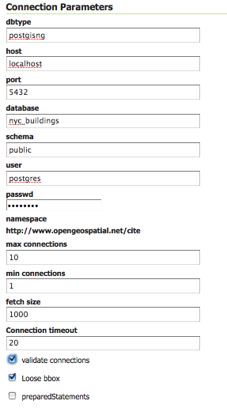
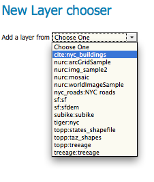
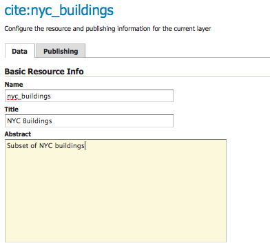
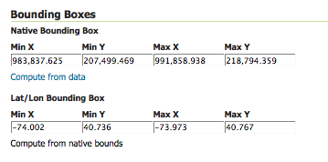
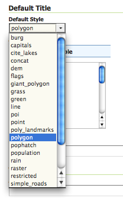
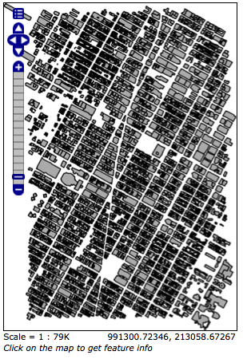

# Publishing a PostGIS table

This tutorial walks through the steps of publishing a PostGIS table with GeoServer.

!!! note

    This tutorial assumes that PostgreSQL/PostGIS has been previously installed on the system and responding on `localhost` on port `5432`, and also that GeoServer is running at `http://localhost:8080/geoserver`.

## Data preparation

First let's gather that the data that we'll be publishing.

1.  Download the file [nyc_buildings.zip](nyc_buildings.zip). It contains a PostGIS dump of a dataset of buildings from New York City.

2.  Create a PostGIS database called `nyc`. This can be done with the following commands:

    ``` console
    createdb nyc
    psql -d nyc -c 'CREATE EXTENSION postgis'
    ```

    !!! note

        You may need to supply a username and password with these commands.

3.  Extract **`nyc_buildings.sql`** from **`nyc_buildings.zip`**.

4.  Import **`nyc_buildings.sql`** into the `nyc` database:

    ``` console
    psql -f nyc_buildings.sql nyc
    ```

## Creating a new workspace

The next step is to create a workspace for the data. A workspace is a container used to group similar layers together.

!!! note

    This step is optional if you'd like to use an existing workspace. Usually, a workspace is created for each project, which can include stores and layers that are related to each other.

1.  In a web browser, navigate to `http://localhost:8080/geoserver`.

2.  Log into GeoServer as described in the [Logging In](../web-admin-quickstart/index.md#logging_in) section.

3.  Navigate to **Data --> Workspaces**.

    
    *Workspaces page*

4.  Click the **Add new workspace** button.

5.  You will be prompted to enter a workspace **Name** and **Namespace URI**.

    
    *Configure a new workspace*

6.  Enter the **Name** as `nyc` and the **Namespace URI** as `http://geoserver.org/nyc`.

    !!! note

        A workspace name is an identifier describing your project. It must not exceed ten characters or contain spaces. A Namespace URI (Uniform Resource Identifier) can usually be a URL associated with your project with an added trailing identifier indicating the workspace. The Namespace URI filed does not need to resolve to an actual valid web address.

7.  Click the **Submit** button. The `nyc` workspace will be added to the **Workspaces** list.

## Creating a store

Once the workspace is created, we are ready to add a new store. The store tells GeoServer how to connect to the database.

1.  Navigate to **Data-->Stores**.

2.  You should see a list of stores, including the type of store and the workspace that the store belongs to.

    
    *Adding a new data source*

3.  Create a new store by clicking the `PostGIS` link.

4.  Enter the **Basic Store Info**:

    -   Select the `nyc` **Workspace**
    -   Enter the **Data Source Name** as `nyc_buildings`
    -   Add a brief **Description**

    
    *Basic Store Info*

5.  Specify the PostGIS database **Connection Parameters**:

    | Option                   | Value                              |
    |--------------------------|------------------------------------|
    | **dbtype**               | `is`                               |
    | **host**                 | `st`                               |
    | **port**                 | `32`                               |
    | **database**             | `yc`                               |
    | **schema**               | `ic`                               |
    | **user**                 | `es`                               |
    | **passwd**               | (Password for the `postgres` user) |
    | **validate connections** | (Checked)                          |

    !!! note

        Leave all other fields at their default values.

    
    *Connection Parameters*

6.  Click **Save**.

## Creating a layer

Now that the store is loaded, we can publish the layer.

1.  Navigate to **Data --> Layers**.

2.  Click **Add a new resource**.

3.  From the **New Layer chooser** menu, select `nyc:nyc_buidings`.

    
    *Store selection*

4.  On the resulting layer row, select the layer name `nyc_buildings`.

    
    *New layer selection*

5.  The **Edit Layer** page defines the data and publishing parameters for a layer. Enter a short **Title** and an **Abstract** for the `nyc_buildings` layer.

    
    *Basic Resource Info*

6.  Generate the layer's bounding boxes by clicking the **Compute from data** and then **Compute from native bounds** links.

    
    *Generating bounding boxes*

7.  Click the **Publishing** tab at the top of the page.

8.  We can set the layer's style here. Under **WMS Settings**, ensure that the **Default Style** is set to **polygon**.

    
    *Select Default Style*

9.  Finalize the layer configuration by scrolling to the bottom of the page and clicking **Save**.

## Previewing the layer

In order to verify that the `nyc_buildings` layer is published correctly, we can preview the layer.

1.  Navigate to the **Layer Preview** screen and find the `nyc:nyc_buildings` layer.

2.  Click the **OpenLayers** link in the **Common Formats** column.

3.  An OpenLayers map will load in a new tab and display the shapefile data with the default line style. You can use this preview map to zoom and pan around the dataset, as well as display the attributes of features.

    
    *Preview map of nyc_buildings*
