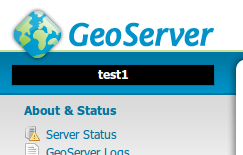
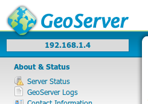
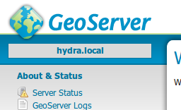

# Make cluster nodes identifiable from the GUI {: #identify }

When running one or more clusters of GeoServer installations it is useful to identify which cluster (and eventually which node of the cluster) one is working against by just glancing the web administration UI.

This is possible by setting one variable, `GEOSERVER_NODE_OPTS`, with one of the supported mechanisms:

> -   as a system variable
> -   as an environment variable
> -   as a servlet context parameter

`GEOSERVER_NODE_OPTS` is a semicolon separated list of key/value pairs and it can contain the following keys:

> -   id: the string identifying the node, which in turn can be a static string, or include the following substitution tokens
>     -   `$host_ip` The IP address of the node
>     -   `$host_name` The hostname of the node
>     -   `$host_short_name` The hostname truncated to not include the domain (`foo.local` becomes `foo`)
>     -   `$host_compact_name` The hostname with all domain parts shortened to their first character (`foo.local` becomes `foo.l`)
> -   color: the label color, as a CSS color
> -   background: the background color, as a CSS color

Here are some examples:

*GEOSERVER_NODE_OPTS="id:test1;background:black;color:white"*

*GEOSERVER_NODE_OPTS="id:$host_ip"*

*GEOSERVER_NODE_OPTS="id:$host_name"*
