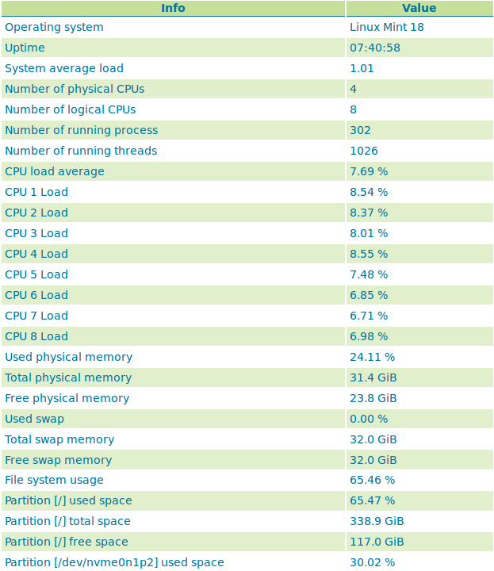

# About

The REST API allows you to set and retrieve information about the server itself.

!!! note

    Read the ``API reference for /about/manifests <manifests.yaml>__``.

## Retrieving component versions

**Retrieve the versions of the main components: GeoServer, GeoTools, and GeoWebCache**

*Request*

!!! abstract "curl"

        curl -v -u admin:geoserver -XGET -H "Accept: text/xml" 
          http://localhost:8080/geoserver/rest/about/version.xml

*Response*

``` xml
<about>
 <resource name="GeoServer">
  <Build-Timestamp>11-Dec-2012 17:55</Build-Timestamp>
  <Git-Revision>e66f8da85521f73d0fd00b71331069a5f49f7865</Git-Revision>
  <Version>2.3-SNAPSHOT</Version>
 </resource>
 <resource name="GeoTools">
  <Build-Timestamp>04-Dec-2012 02:31</Build-Timestamp>
  <Git-Revision>380a2b8545ee9221f1f2d38a4f10ef77a23bccae</Git-Revision>
  <Version>9-SNAPSHOT</Version>
 </resource>
 <resource name="GeoWebCache">
  <Git-Revision>2a534f91f6b99e5120a9eaa5db62df771dd01688</Git-Revision>
  <Version>1.3-SNAPSHOT</Version>
 </resource>
</about>
```

## Retrieving manifests

**Retrieve the full manifest and subsets of the manifest as known to the ClassLoader**

*Request*

!!! abstract "curl"

        curl -v -u admin:geoserver -XGET -H "Accept: text/xml"
          http://localhost:8080/geoserver/rest/about/manifest.xml

!!! note

    The result will be a very long list of manifest information. While this can be useful, it is often desirable to filter this list.

**Retrieve manifests, filtered by resource name**

!!! note

    This example will retrieve only resources where the `name` attribute matches `gwc-.*`.

*Request*

!!! abstract "curl"

        curl -v -u admin:geoserver -XGET -H "Accept: text/xml"
          http://localhost:8080/geoserver/rest/about/manifest.xml?manifest=gwc-.*

*Response*

``` xml
<about>
  <resource name="gwc-2.3.0">
    ...
  </resource>
  <resource name="gwc-core-1.4.0">
    ...
  </resource>
  <resource name="gwc-diskquota-core-1.4.0">
    ...
  </resource>
  <resource name="gwc-diskquota-jdbc-1.4.0">
    ...
  </resource>
  <resource name="gwc-georss-1.4.0">
    ...
  </resource>
  <resource name="gwc-gmaps-1.4.0">
    ...
  </resource>
  <resource name="gwc-kml-1.4.0">
    ...
  </resource>
  <resource name="gwc-rest-1.4.0">
    ...
  </resource>
  <resource name="gwc-tms-1.4.0">
    ...
  </resource>
  <resource name="gwc-ve-1.4.0">
    ...
  </resource>
  <resource name="gwc-wms-1.4.0">
    ...
  </resource>
  <resource name="gwc-wmts-1.4.0">
    ...
  </resource>
</about>
```

**Retrieve manifests, filtered by resource property**

!!! note

    This example will retrieve only resources with a property equal to `GeoServerModule`.

*Request*

!!! abstract "curl"

        curl -u admin:geoserver -XGET -H "Accept: text/xml"
          http://localhost:8080/geoserver/rest/about/manifest.xml?key=GeoServerModule

*Response*

``` xml
<about>
 <resource name="control-flow-2.3.0">
  <GeoServerModule>extension</GeoServerModule>
  ...
 </resource>
 ...
 <resource name="wms-2.3.0">
  <GeoServerModule>core</GeoServerModule>
  ...
 </resource>
</about>
```

**Retrieve manifests, filtered by both resource name and property**

!!! note

    This example will retrieve only resources where a property with named `GeoServerModule` has a value equal to `extension`.

*Request*

!!! abstract "curl"

        curl -u admin:geoserver -XGET -H "Accept: text/xml"
          http://localhost:8080/geoserver/rest/about/manifest.xml?key=GeoServerModule&value=extension

## System Status

It is possible to request the available system information (monitoring data) through the GeoServer REST API. The supported formats are XML, JSON and HTML.

The available REST endpoints are: :

    /geoserver/rest/about/system-status

    /geoserver/rest/about/system-status.json

    /geoserver/rest/about/system-status.xml

    /geoserver/rest/about/system-status.html

The HTML representation of the system data is equal to the `System status` tab representation:


*System status*

The XML and JSON representations are quite similar. For each system information metric, the following attributes will be available:

|             |                                                                              |
|-------------|------------------------------------------------------------------------------|
| **Name**    | **Description**                                                              |
| name        | name of the metric                                                           |
| available   | TRUE if the system information value is available                            |
| description | description of this system information                                       |
| unit        | unit of the system information, can be empty                                 |
| category    | category of this system information                                          |
| priority    | this value can be used to render the metrics in a predefined order           |
| identifier  | identifies the resource associated with the metric, e.g. file partition name |

Example of XML representation:

``` xml
<metrics>
  <metric>
   <value>99614720</value>
   <available>true</available>
   <description>Partition [/dev/nvme0n1p2] total space</description>
   <name>PARTITION_TOTAL</name>
   <unit>bytes</unit>
   <category>FILE_SYSTEM</category>
   <identifier>/dev/nvme0n1p2</identifier>
   <priority>507</priority>
 </metric>
 (...)
```

Example of JSON representation:

``` json
{
    "metrics": {
        "metric": [
            {
              "available": true,
              "category": "FILE_SYSTEM",
              "description": "Partition [/dev/nvme0n1p2] total space",
              "identifier": "/dev/nvme0n1p2",
              "name": "PARTITION_TOTAL",
              "priority": 507,
              "unit": "bytes",
              "value": 99614720
            },
```
