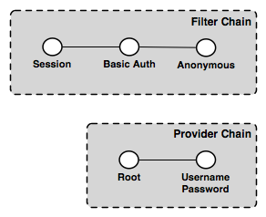
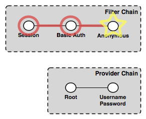
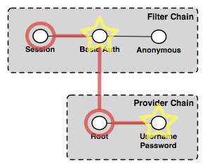

# Authentication to OWS and REST services {: #security_auth_owsrest }

OWS and REST services are stateless and have no inherent awareness of "session", so the authentication scheme for these services requires the client to supply credentials on every request. That said, "session integration" is supported, meaning that if a session already exists on the server (from a concurrent [authenticated web admin session](web.md)) it will be used for authentication. This scheme allows GeoServer to avoid the overhead of session creation for OWS and REST services.

The default GeoServer configuration ships with support for [HTTP Basic authentication](http://en.wikipedia.org/wiki/Basic_access_authentication) for services.

The typical process of authentication is as follows:

1.  User makes a service request without supplying any credentials
2.  If the user is accessing an unsecured resource, the request is handled normally
3.  If the user is accessing a secured resource:

> -   An HTTP 401 status code is sent back to the client, typically forcing the client to prompt for credentials.
> -   The service request is then repeated with the appropriate credentials included, usually in the HTTP header as with Basic Authentication.
> -   If the user has sufficient privileges to access the resource the request is handled normally, otherwise, a HTTP 404 status code is returned to the client.

4.  Subsequent requests should include the original user credentials

## Examples

The following describes the authentication chain for an OWS service:

*The OWS service authentication chain*

In this example the filter chain consists of three filters:

-   **Session**---Handles "session integration", recognizing existing sessions (but *not* creating new sessions)
-   **Basic Auth**---Extracts Basic Authentication credentials from request HTTP header
-   **Anonymous**---Handles anonymous access

The provider chain is made up of two providers:

-   **Root**---[Root account](../root.md) has a special "super user" provider. As this account is rarely used, this provider is rarely invoked.
-   **Username/password**---Performs username/password authentication against a user database

To illustrate how the elements of the various chains work, here are some example OWS requests.

### Anonymous WMS GetCapabilities request

This example shows the process for when a WMS client makes an anonymous GetCapabilities request.

*Authentication chain for a WMS client making an anonymous GetCapabilities request*

The *Session* filter looks for an existing session, but finds none, so processing continues. The *Basic Auth* filter looks for the Basic Authorization header in the request, but as the request is anonymous, the filter finds none. Finally, the *Anonymous* filter executes and authenticates the request anonymously. Since GetCapabilities is a "discovery" operation it is typically not locked down, even on a secure server. Assuming this is the case here, the anonymous request succeeds, returning the capabilities response to the client. The provider chain is not invoked.

### Anonymous WMS GetMap request for a secured layer

This example shows the process invoked when a WMS client makes an anonymous GetMap request for a secured layer

The chain executes exactly as described above. The *Session* filter looks for an existing session, but finds none, so processing continues. The *Basic Auth* filter looks for the Basic Authorization header in the request, but as the request is anonymous, the filter finds none. Finally, the *Anonymous* filter executes and authenticates the request anonymously. However, in this case the layer being accessed is a secured resource, so the handling of the GetMap request fails. The server returns an exception accompanied with a HTTP 401 status code, which usually triggers the client presenting the user with a login dialog.

### WMS GetMap request with user-supplied credentials

This example shows the process invoked when a WMS client gathers credentials from the user and reissues the previous request for a secured layer.

*Authentication chain for a WMS client making a GetMap request with user-supplied credentials*

The *Session* filter executes as described above, and does nothing. The *Basic Auth* filter finds the authorization header in the request, extracts the credentials for it, and invokes the provider chain. Processing moves to the *Username/password* provider that does the actual authentication. If the credentials have the necessary privileges to access the layer, the processing of the request continues normally and the GetMap request succeeds, returning the map response. If the credentials are not sufficient, the HTTP 401 status code will be supplied instead, which may again trigger the login dialog on the client side.
