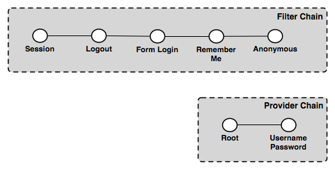
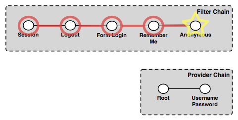
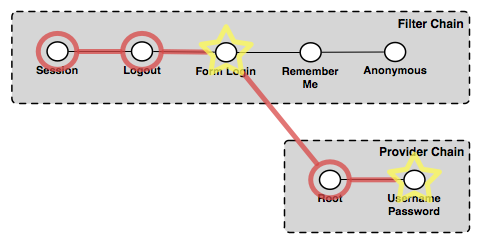
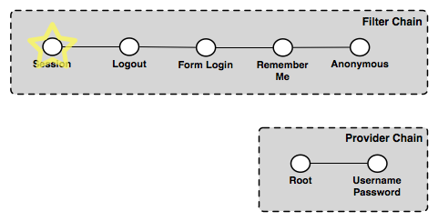
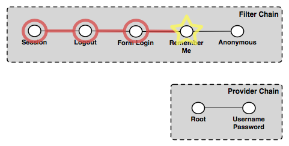

# Authenticating to the Web Admin Interface

The method of authenticating to the [Web administration interface](../../webadmin/index.md) application is typical of most web applications that provide login capabilities. The application is based primarily on form-based authentication, in which a user authenticates through a form in a web browser. Upon successful authentication a session is created on the server, eliminating the need for a user to repeat the login process for each page they wish to access. An optional "Remember Me" setting is also supported which will store authentication information in a client-side cookie to allow the user to bypass the form-based authentication after the initial session has timed out.

The typical process of authentication is as follows:

1.  User visits the home page of the web admin for the very first time, so neither a session or "Remember Me" cookie is present. In this case, the user is anonymously authenticated.
2.  User accesses a secured page and is presented with a login form.
3.  Upon successful login a session is created. Depending on the privileges of the account used to log in, the user will either be directed to the requested page or be redirected back to the home page.
4.  Upon subsequent requests to secured pages, the user is authenticated via browser session until the session expires or the user logs out.

## Examples

The following shows the default configuration of the authentication chain for the web admin.

*GeoServer authentication chain, with filter and provider chains*

In this example the filter chain is made up of the following filters:

-   **Session**---Handles session integration, recognizing existing sessions and creating new sessions on demand
-   **Logout**---Handles ending sessions (user logout)
-   **Form login**---Handles form logins
-   **Remember Me**---Handles "Remember Me" authentication, reading when the flag is set on a form login, creating the appropriate cookie, and recognizing the cookie on future requests
-   **Anonymous**---Handles anonymous access

The provider chain is made up of two providers:

-   **Root**---The [Root account](../root.md) has a special "super user" provider. As this account is rarely used, this provider is rarely invoked.
-   **Username/password**---Performs username/password authentication against a user database.

To following example requests illustrate how the elements of the various chains work.

### First time visit

This example describes the process when a user visits the home page of the web admin for the first time.

*Authentication chain for a first time visit from a user*

The first filter to execute is the *Session* filter. It checks for an existing session, but finds none, so processing continues to the next filter in the chain. The *Logout* filter checks for the case of a user logging out, which also is not the case, so processing continues. The *Form login* filter checks for a form login, and also finds none. The *Remember Me* filter determines if this request can be authenticated from a previous session cookie, but in this case it cannot. The final filter to execute is the *Anonymous* filter which checks if the user specified any credentials. In this case the user has not provided any credentials, so the request is authenticated anonymously. Since no authentication is required to view the home page, the provider chain is not invoked.

The last response to the request directs the user to the home page.

### User logs on

This examples describes the process invoked when a user logs on to the web admin via the login form.

*Authentication chain for a user logging in*

The *Session* filter finds no existing session, and processing continues. The *Logout* filter checks for a logout request, finds none, and continues. The *Form login* filter recognizes the request as a form login and begins the authentication process. It extracts the username and password from the request and invokes the provider chain.

In the provider chain, the *Root* provider checks for the root account login, but doesn't find it so processing continues to the next provider. The *Username/password* provider checks if the supplied credentials are valid. If they are valid the authentication succeeds, user is redirected to the home page and is considered to be logged on. During the post-processing step the *Session* filter recognizes that a successful authentication has taken place and creates a new session.

If the credentials are invalid, the user will be returned to the login form page and asked to try again.

### User visits another page

This example describes the process invoked when a user who is already logged on visits another page in the web admin.

*Authentication chain for a user visiting another page after logging in*

The *Session* filter executes and finds an existing session that is still valid. The session contains the authentication details and no further chain processing is required. The response is the page requested by the user.

### User returns after session time out

This example describes the process invoked when a user returns to the web admin after the previously created session has timed out.

A session will time out after a certain period of time. When the user returns to the web admin, this becomes essentially the same chain of events as the user visiting the web app for the first time (as described previously). The chain proceeds to the *Anonymous* filter that authenticates anonymously. Since the page requested is likely to be a page that requires authentication, the user is redirected to the home page and is not logged on.

### User logs on with "Remember Me" flag set

This example describes the process for logging on with the "Remember Me" flag set.

The chain of events for logging on with "Remember Me" set is identical to the process for when the flag is not set, except that after the successful authentication the *Form login* filter recognizes the "Remember Me" flag and triggers the creation of the browser cookie used to persist the authentication information. The user is now logged on and is directed to the home page.

### User returns after session time out (with "Remember Me")

This example describes the process invoked when the user returns to the web admin after a period of inactivity, while the "Remember Me" flag is set.

*Authentication chain for a user returning after session time out with the "Remember Me" flag*

Even though the "Remember Me" flag is set, the user's session on the server will still time out as normal. As such, the chain proceeds accordingly through the filters, starting with the *Session* filter, which finds no valid session. The *Logout* and *Form login* filters do not apply here. The *Remember Me* filter recognizes the browser cookie and is able to authenticate the request. The user is directed to whatever page was accessed and remains logged on.
