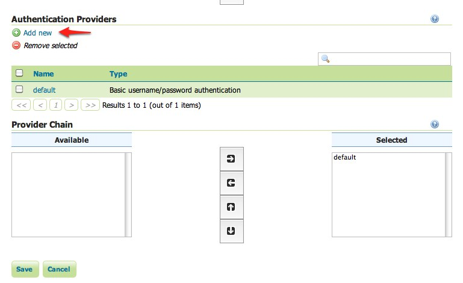
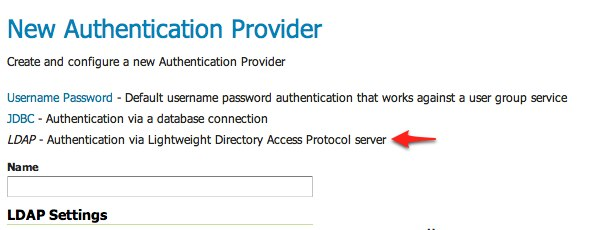
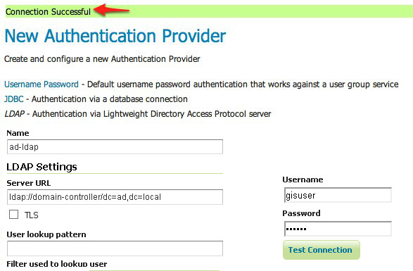
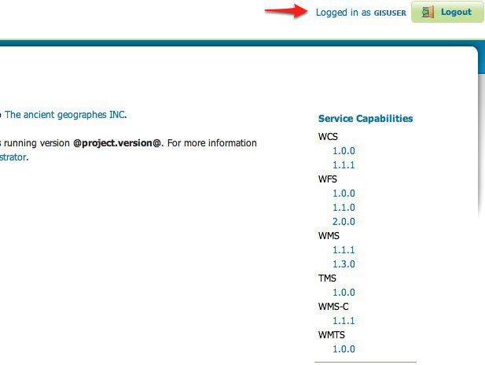
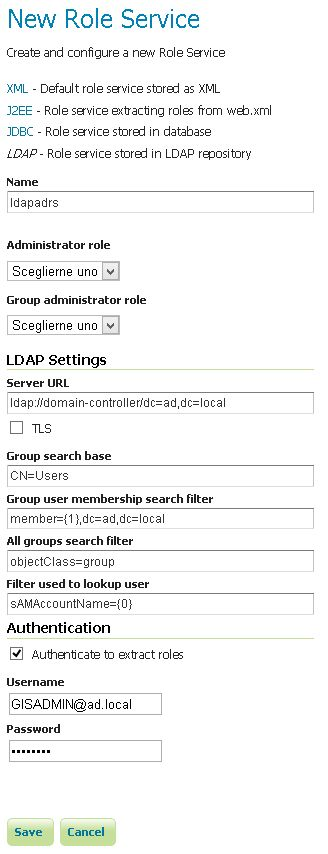

# Authentication with LDAP against ActiveDirectory {: #security_tutorials_activedirectory }

This tutorial explains how to use GeoServer LDAP support to connect to a Windows Domain using ActiveDirectory as an LDAP server. It is recommended that the [LDAP authentication](../../auth/providers.md#security_auth_provider_ldap) section be read before proceeding.

## Windows Server and ActiveDirectory

Active Directory is just another LDAP server implementation, but has some features that we must know to successfully use it with GeoServer LDAP authentication. In this tutorial we will assume to have a Windows Server Domain Controller with ActiveDirectory named `domain-controller` for a domain named `ad.local`. If your environment uses different names (and it surely will) use your real names where needed.

We will also assume that:

> -   a group named `GISADMINGROUP` exists.
> -   a user named `GISADMIN` exists, has password `secret`, and belongs to the `GISADMINGROUP` group.
> -   a user named `GISUSER` exists, has password `secret`, and does NOT belong to the `GISADMINGROUP` group.

!!! note

    ADMINISTRATOR cannot be generally used as the admin group name with ActiveDirectory, because Administrator is the root user name in Windows environment.

## Configure the LDAP authentication provider

1.  Start GeoServer and login to the web admin interface as the `admin` user.

2.  Click the `Authentication` link located under the `Security` section of the navigation sidebar.

    > 

3.  Scroll down to the `Authentication Providers` panel and click the `Add new` link.

    > 

4.  Click the `LDAP` link.

    > 

5.  Fill in the fields of the settings form as follows:

    -   Set `Name` to "ad-ldap"
    -   Set `Server URL` to "<ldap://domain-controller/dc=ad,dc=local>
    -   Set `Filter used to lookup user` to `(|(userPrincipalName={0})(sAMAccountName={1}))`
    -   Set `Format used for user login name` to "{<0%7D@ad.local>"
    -   Check `Use LDAP groups for authorization`
    -   Check `Bind user before searching for groups`
    -   Set `Group to use as ADMIN` to "GISADMINGROUP"
    -   Set `Group search base` to "cn=Users"
    -   Set `Group search filter` to "member={0}"

6.  Test the LDAP connection by entering the username "GISADMIN" and password "secret" in the connection test form located on the right and click the `Test Connection` button.

    

    A successful connection should be reported at the top of the page.

7.  Save.

8.  Back on the authentication page scroll down to the `Provider Chain` panel and move the `ad-ldap` provider from `Available` to `Selected`.

    

9.  Save.

## Test a LDAP login

1.  Navigate to the GeoServer home page and log out of the admin account.

#\. Login as the user "GISUSER" with the password "secret".

> 

Logging in as GISUSER doesn't yield any administrative functionality because the GISUSER account has not been mapped to the administrator role. In the next section GeoServer will be configured to map groups from the LDAP database to roles.

Now we will login with a user having administrative rights.

1.  Navigate to the GeoServer home page and log out of the account.
2.  Login as the user "GISADMIN" with the password "secret".

Once logged in full administrative functionality should be available.

## Configure the LDAP role service

An additional step permits to configure a role service to get GeoServer roles from the LDAP repository and allow access rights to be assigned to those roles.

1.  Click the `Users,Group,Roles` link located under the `Security` section of the navigation sidebar.

2.  Click the `Add new link` under the `Role Services` section.

3.  Click the `LDAP` option under the `New Role Service` section.

    

4.  Enter `ldapadrs` in the `Name` text field.

5.  Enter `ldap://domain-controller/dc=ad,dc=local` in the `Server URL` text field.

6.  Enter `CN=Users` in the `Group search base` text field.

7.  Enter `member={1},dc=ad,dc=local` in the `Group user membership search filter` text field.

8.  Enter `objectClass=group` in the `All groups search filter` text field.

9.  Enter `sAMAccountName={0}` in the `Filter used to lookup user` text field.

Then we need to a choose a user to authenticate on the server (many LDAP server don't allow anonymous data lookup).

1.  Check the `Authenticate to extract roles` checkbox.
2.  Enter `GISADMIN@ad.local` in the `Username` text field.
3.  Enter `secret` in the `Password` text field.
4.  Save.
5.  Click the `ldapadrs` role service item under the `Role Services` section.
6.  Select `ROLE_DOMAIN ADMINS` from the `Administrator role` combo-box.
7.  Select `ROLE_DOMAIN ADMINS` from the `Group administrator role` combo-box.
8.  Save again.

You should now be able to see and assign the new ActiveDirectory roles wherever an `Available Roles` list is shown (for example in the `Data` and `Services` rules sections.
