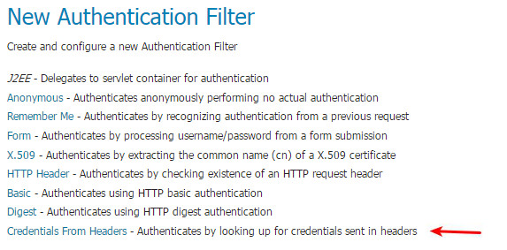
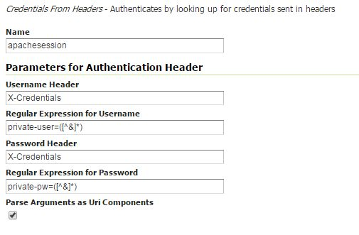
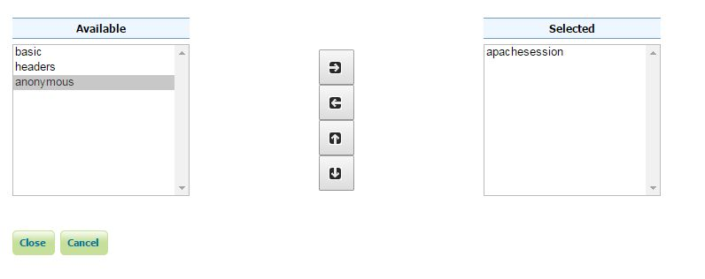

# Configuring Apache HTTPD Session Integration

## Introduction

When using Apache HTTPD as a proxy frontend for GeoServer, it is possible to share authentication with a proper configuration of both.

This requires enabling Session for the GeoServer location in Apache HTTPD and adding a custom Request Header with the session content, so that the GeoServer security system can receive user credentials and use them to authenticate the user with its internal filters.

To properly parse the received credentials we need to use the ``Credentials From Request Headers`` Authentication Filter.

Please note that the header containing the password is not sent back and forth to the user browser, but only from Apache HTTPD to GeoServer, so the password is not sent in clear through the public network.

This tutorial shows how to configure GeoServer to read user credentials from the Apache HTTPD Session and use them for authentication purposes.

## Prerequisites

This tutorial uses the [curl](http://curl.haxx.se/) utility to issue HTTP request that test authentication. Install curl before proceeding.

## Configure the Credentials From Request Headers filter

1.  Start GeoServer and login to the web admin interface as the `admin` user.

2.  Click the `Authentication` link located under the `Security` section of the navigation sidebar.

    > 

3.  Scroll down to the `Authentication Filters` panel and click the `Add new` link.

    > 

4.  Click the `Credentials From Headers` link.

    > 

5.  Fill in the fields of the settings form as follows:

    -   Set `Name` to "apachessesion"
    -   Set `Username Header` to "X-Credentials"
    -   Set `Regular Expression for Username` to "private-user=([\^&]*)"
    -   Set `Password Header` to "X-Credentials"
    -   Set `Regular Expression for Password` to "private-pw=([\^&]*)"

    

6.  Save.

7.  Back on the authentication page scroll down to the `Filter Chains` panel.

8.  Click on "default" in the chain grid.

9.  Scroll down and remove all filters from the `Selected` list and add the `apachessesion` filter.

    

10. Close.

11. Save.

## Test a login

1.  Execute the following curl command (with a wrong password):

        curl -v -H "X-Credentials: private-user=admin&private-pw=wrong" "http://localhost:8080/geoserver/wms?service=WMS&version=1.1.1&request=GetCapabilities"

    The result should be a 403 response signaling that access is denied. The output should look something like the following:

        * About to connect() to localhost port 8080 (#0)
        *   Trying ::1... connected
        > GET /geoserver/wfs?request=getcapabilities HTTP/1.1
        > User-Agent: curl/7.22.0 (x86_64-pc-linux-gnu) libcurl/7.22.0 OpenSSL/1.0.1 zlib/1.2.3.4 libidn/1.23 librtmp/2.3
        > Host: localhost:8080
        > Accept: */*
        > 
        < HTTP/1.1 403 Access Denied
        < Content-Type: text/html; charset=iso-8859-1
        < Content-Length: 1407
        < Server: Jetty(6.1.8)
        < 
        <html>
        <head>
        <meta http-equiv="Content-Type" content="text/html; charset=ISO-8859-1"/>
        <title>Error 403 Access Denied</title>
        </head>
            ...

2.  Execute the same command but specify the right password.:

        curl -v -H "X-Credentials: private-user=admin&private-pw=geoserver" "http://localhost:8080/geoserver/wms?service=WMS&version=1.1.1&request=GetCapabilities"

    The result should be a successful authentication and contain the normal WMS capabilities response.

## Configure Apache HTTPD to forward an Header with authentication credentials

This can be done with an HTTPD configuration that looks like the following:

> ``` apacheconf
> <Location  /geoserver>
>     Session On
>     SessionEnv On
>     SessionHeader X-Replace-Session
>     SessionCookieName session path=/
>     SessionCryptoPassphrase secret
>     RequestHeader set X-Credentials "%{HTTP_SESSION}e"
> </Location>
> ```

This configuration adds a new ``X-Credentials`` Request Header to each GeoServer request. The request header will contain the HTTPD Session information in a special format.

An example of the Session content is the following:

> X-Credentials: private-user=admin&private-pw=geoserver

As you can see it contains both the username and password of the user, so the data can be used to authenticate the user in GeoServer.
