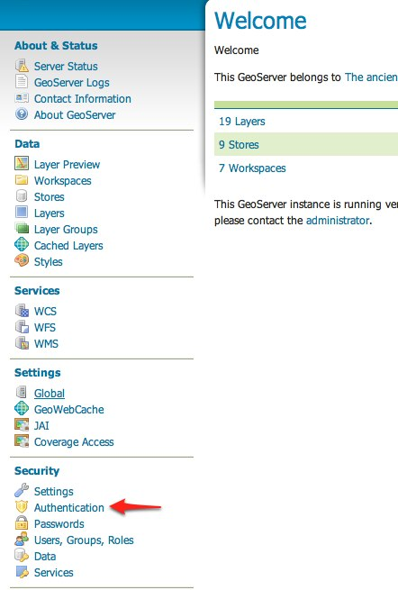
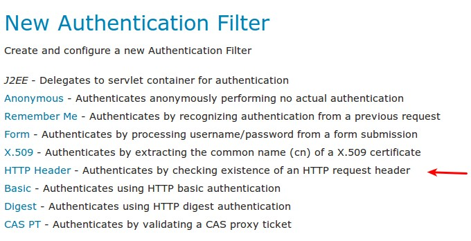
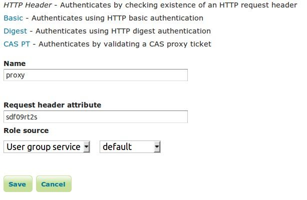
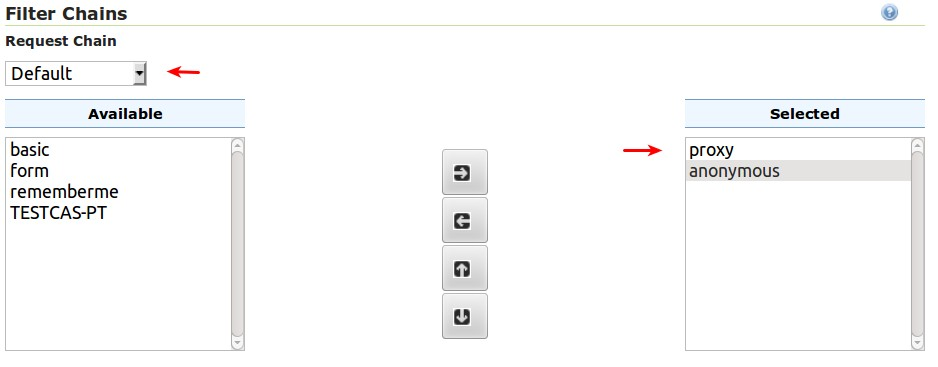
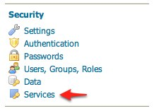
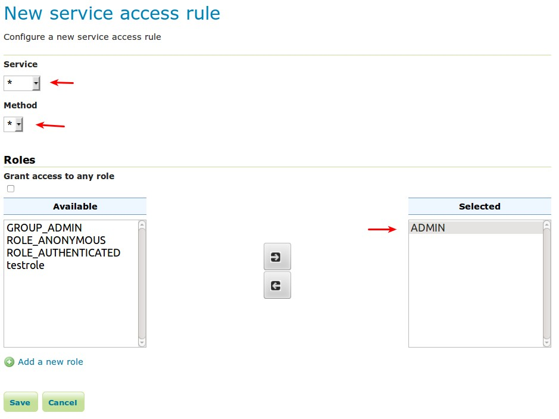

# Configuring HTTP Header Proxy Authentication

## Introduction

Proxy authentication is used in multi-tier system. The user/principal authenticates at the proxy and the proxy provides the authentication information to other services.

This tutorial shows how to configure GeoServer to accept authentication information passed by HTTP header attribute(s). In this scenario GeoServer will do no actual authentication itself.

## Prerequisites

This tutorial uses the [curl](http://curl.haxx.se/) utility to issue HTTP request that test authentication. Install curl before proceeding.

!!! note

    Any utility that supports setting HTTP header attributes can be used in place of curl.

## Configure the HTTP header filter

1.  Start GeoServer and login to the web admin interface as the `admin` user.

2.  Click the `Authentication` link located under the `Security` section of the navigation sidebar.

    > 

3.  Scroll down to the `Authentication Filters` panel and click the `Add new` link.

    > 

4.  Click the `HTTP Header` link.

    > 

5.  Fill in the fields of the settings form as follows:

    -   Set `Name` to "proxy"
    -   Set `Request header attribute to` to "sdf09rt2s"
    -   Set `Role source` to "User group service"
    -   Set the name of the user group service to "default"

Additional information about role services is here [Role source and role calculation](../../usergrouprole/rolesource.md)

> 
>
> ::: warning
> ::: title
> Warning
> :::
>
> The tutorial uses the obscure "sdf09rt2s" name for the header attribute. Why not use "user" or "username" ?. In a proxy scenario a relationship of trust is needed between the proxy and GeoServer. An attacker could easily send an HTTP request with an HTTP header attribute "user" and value "admin" and operate as an administrator.
>
> One possibility is to configure the network infrastructure preventing such requests from all IP addresses except the IP of the proxy.
>
> This tutorial uses a obscure header attribute name which should be a shared secret between the proxy and GeoServer. Additionally, the use of SSL is recommended, otherwise the shared secret is transported in plain text.
> :::

1.  Save.

2.  Back on the authentication page scroll down to the `Filter Chains` panel.

3.  Select "Default" from the `Request type` drop down.

4.  Unselect the `basic` filter and select the `proxy` filter. Position the the `proxy` filter before the `anonymous` filter.

    

5.  Save.

## Secure OGC service requests

In order to test the authentication settings configured in the previous section a service or resource must be first secured. The `Default` filter chain is the chain applied to all OGC service requests so a service security rule must be configured.

1.  From the GeoServer home page and click the `Services` link located under the `Security` section of the navigation sidebar.

    

2.  On the Service security page click the `Add new rule` link and add a catch all rule that secures all OGC service requests requiring the `ADMIN` role.

    

3.  Save.

## Test a proxy login

1.  Execute the following curl command:

        curl -v  -G "http://localhost:8080/geoserver/wfs?request=getcapabilities"

    The result should be a 403 response signaling that access is denied. The output should look something like the following:

        * About to connect() to localhost port 8080 (#0)
        *   Trying ::1... connected
        > GET /geoserver/wfs?request=getcapabilities HTTP/1.1
        > User-Agent: curl/7.22.0 (x86_64-pc-linux-gnu) libcurl/7.22.0 OpenSSL/1.0.1 zlib/1.2.3.4 libidn/1.23 librtmp/2.3
        > Host: localhost:8080
        > Accept: */*
        > 
        < HTTP/1.1 403 Access Denied
        < Content-Type: text/html; charset=iso-8859-1
        < Content-Length: 1407
        < Server: Jetty(6.1.8)
        < 
        <html>
        <head>
        <meta http-equiv="Content-Type" content="text/html; charset=ISO-8859-1"/>
        <title>Error 403 Access Denied</title>
        </head>
            ...

2.  Execute the same command but specify the `--header` option.:

        curl -v --header "sdf09rt2s: admin" -G "http://localhost:8080/geoserver/wfs?request=getcapabilities"

    The result should be a successful authentication and contain the normal WFS capabilities response.
