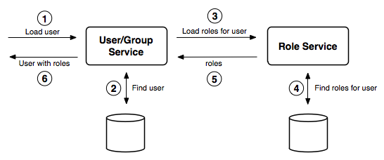
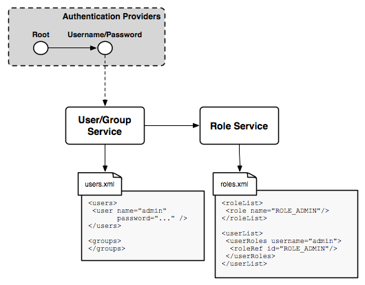

# Interaction between user/group and role services

The following section describes the interaction between the [User/group services](usergroupservices.md) and the [Role services](roleservices.md).

## Calculating the roles of a user

The diagram below illustrates how a user/group service and a role service interact to calculate user roles.

*User/group and role service interacting for role calculation*

On fetching an enabled user from a user/group service, the roles(s) assigned to that user must be identified. The identification procedure is:

1.  Fetch all enabled groups for the user. If a group is disabled, it is discarded.
2.  Fetch all roles associated with the user and add the roles to the result set.
3.  For each enabled group the user is a member of, fetch all roles associated with the group and add the roles to the result set.
4.  For each role in the result set, fetch all ancestor roles and add those roles to the result set.
5.  Personalize each role in the result set as required.
6.  If the result set contains the local admin role, add the role `ROLE_ADMINISTRATOR`.
7.  If the result set contains the local group admin role, add the role `ROLE_GROUP_ADMIN`.

!!! note

    Role personalization looks for role parameters (key/value pairs) for each role and checks if the user properties (key/value pairs) contain an identical key. If any matches are found, the value of the role parameter is replaced by the value of the user property.

## Authentication of user credentials

A user/group service is primarily used during authentication. An authentication provider in the [Authentication chain](../auth/chain.md) may use a user/group service to authenticate user credentials.

*Using a a user/group service for authentication*

## GeoServer defaults

The following diagram illustrates the default user/group service, role service, and authentication provider in GeoServer:

*Default GeoServer security configuration*

Two authentication providers are configured---the *Root* provider and the *Username/password* provider. The *Root* provider authenticates for the GeoServer [Root account](../root.md) and does not use a user/group service. The *Username/password* provider is the default provider and relays username and password credentials to a user/group service.

A single user/group service, which persist the user database as XML, is present. The database contains a single user named `admin` and no groups. Similarly, the role service persists the role database as XML. By default, this contains a single role named `ADMIN`, which is associated with the `admin` user. The `ADMIN` role is mapped to the `ROLE_ADMINISTRATOR` role and as a result, the `admin` user is associated with system administrator role during role calculation.
