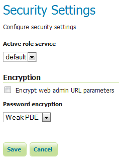

# Settings {: #security_webadmin_settings }

The Settings page controls the global GeoServer security settings.

*Security Settings page*

## Active role service

This option sets the active [role service](../usergrouprole/roleservices.md) (provides information about roles). Role services are managed on the [Users, Groups, Roles](ugr.md) page. There can be only one active role service at one time.

## Encryption

The GeoServer user interface (UI) can sometimes expose parameters in plain text inside the URLs. As a result, it may be desirable to encrypt the URL parameters. To enable encryption, select **Encrypt web admin URL parameters**. This will configure GeoServer to uses a PBE-based [Password encryption](../passwd.md#security_passwd_encryption).

For example, with this feature enabled, the page:

    http://GEOSERVER/web/?wicket:bookmarkablePage=:org.geoserver.security.web.SecuritySettingsPage

would now be found at the following URL:

    http://GEOSERVER/web/?x=hrTNYMcF3OY7u4NdyYnRanL6a1PxMdLxTZcY5xK5ZXyi617EFEFCagMwHBWhrlg*ujTOyd17DLSn0NO2JKO1Dw

## Password encryption

This setting allows you to select the type of [Password encryption](../passwd.md#security_passwd_encryption) used for passwords. The options are **Plain text**, **Weak PBE**, or **Strong PBE**.

If Strong PBE is not available as part of the JVM, a warning will display and the option will be disabled. To enable Strong PBE, you must install external policy JARs that support this form of encryption. See the section on [Password encryption](../passwd.md#security_passwd_encryption) for more details about these settings.

*Warning if Strong PBE is not available*
