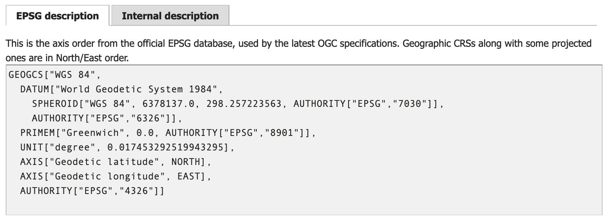
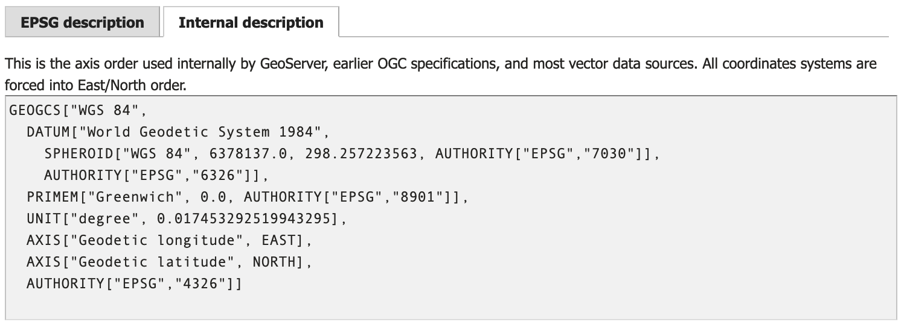

# Axis ordering

The definition of a spatial reference system includes an indication of the axis order used to interpret the coordinates. There are a number of projected spatial reference systems defined in ``north/east`` order in the formal `EPSG` definition, but are interpreted as being in `east/north` order by earlier versions of the `WFS` protocol.

-   `WFS 1.0.0`: Provides geographic coordinates in `east/north` and may not be trusted to respect the EPSG definition axis order.
-   `WFS 1.1.0`: Respects the axis order defined by the EPSG definition.
-   `WFS 2.0.0`: Respects the axis order defined by the EPSG definition.

Forcing content into `east/north` order was intended to be easier for developers where computer displays are defined with an ``x/y`` order. However this decision has introduced no end of confusion, and was corrected in later versions of `WFS`.

!!! note

    Some spatial reference systems, for example polar stereographic, do not have an `east` or `west` as they have a pole in the middle of the axis.

These differences may cause difficulties when clients switch between different `WFS` versions. To minimize confusion and increase interoperability, GeoServer has adopted the following guidelines when specifying spatial reference systems to avoid ambiguity.

| Representation                                 | Axis order         | Interpretation |
|------------------------------------------------|--------------------|----------------|
| `EPSG:4326`                                    | longitude/latitude | assumption     |
| `http://www.opengis.net/gml/srs/epsg.xml#xxxx` | longitude/latitude | strict         |
| `urn:x-ogc:def:crs:EPSG:xxxx`                  | latitude/longitude | strict         |
| `urn:ogc:def:crs:EPSG::4326`                   | latitude/longitude | strict         |

## SRSList Axis Order

To compare the spatial reference system definition for `EPSG:4326`:

1.  Navigate **Demos --> SRS List** page and search for ``4326``.

2.  Compare the formal ``EPSG`` definition of `WGS84`:

    
    *WGS84 EPSG definition*

3.  With the internal definition of `WGS84`:

    
    *WGS84 Internal definition*

The same approach can be used to check the definition of any spatial reference system supported by GeoServer.

!!! note

    The formal `EPSG` definition provides the axis-order used to interpret coordinate values. GeoServer uses an internal representation that does not always respect the `EPSG` provided axis order.
    
    In the example above `EPSG:4326` is defined with a ``north/east`` axis order, while the internal representation has `east/north` order.
    
    The startup option `-Dorg.geotools.referencing.forceXY=true` is used to configure GeoServer to prefer an internal representation in ``east/north`` axis order. We recommend the default value of `true` to match a wide range of clients that make this assumption.

## Layer Axis Order

The default data directory includes the following dataset illustrating this challenge:

-   **`shapefile/states.shp`**`: Data stored in x/y order:

        MULTIPOLYGON (((-121.664154 38.169369,-121.781296 38.066856, ...

-   **`shapefiles/states.prj`** :

        GEOGCS["GCS_WGS_1984",DATUM["WGS_1984",SPHEROID["WGS_1984",6378137,298.257223563]],PRIMEM["Greenwich",0],UNIT["Degree",0.017453292519943295]]

    Published as `topp:states` with Spatial Reference System `EPSG:4326`.

To review how this layer has been published:

1.  Navigate to the **Edit Layer** page for `topp:states`.

2.  Locate **Native SRS** and click on the **GCS_WGS_1984** link to show how GeoServer interpreted the **`PRJ`** file above.

    The **`PRJ`** did not provide an axis-order and GeoSever has filled in an assumption. This describing the data in ``x/y`` order which matches our data and we could use it unmodified.

    
    *Native SRS for topp:states*

3.  Locate **Declared SRS** and click on **EPSG:WGS 84\...** link to see the definition used to publish this content.

    This is the internal definition of `EPSG:4326` as shown in the SRSList above, which also describes the data in ``x/y`` order matching our data. This definition provides slightly more readable names along with additional `AUTHORITY` information that may be helpful to client applications.

    
    *Declared SRS for topp:states*

4.  The **SRS Handling** is set to `Force declared` to completely ignore the provided **Native SRS** definition and use the **Declared SRS**.

    

    Force declared SRS handling for topp:states

## WFS 1.0 Axis Order

**GetCapabilities** describes `topp:states` using:

<http://localhost:8080/geoserver/ows?service=wfs&version=1.0.0&request=GetCapabilities>

``` xml
<FeatureType><Name>topp:states</Name>
  <Title>USA Population</Title>
  <Abstract>This is some census data on the states.</Abstract>
  <Keywords>census, united, boundaries, state, states</Keywords>
  <SRS>EPSG:4326</SRS>
  <LatLongBoundingBox minx="-124.731422" miny="24.955967" maxx="-66.969849" maxy="49.371735" />
</FeatureType> 
```

WFS 1.0 describes the latitude / longitude bounds with the understanding that you will associate ``minx`` and ``maxx`` with longitude, and also ``miny`` and ``maxy`` with latitude.

WFS 1.0 *GetFeature* request defaults to GML2 output, and the default `EPSG:4326` spatial reference system used to publish the layer:

-   WFS 1.0 Default: <http://localhost:8080/geoserver/ows?service=WFS&version=1.0.0&request=GetFeature&typeName=topp%3Astates&featureId=states.1>

    The GML2 output uses `http://www.opengis.net/gml/srs/epsg.xml#4326` reference, with data in x/y order:

    ``` xml
    <gml:MultiPolygon srsName="http://www.opengis.net/gml/srs/epsg.xml#4326">
      <gml:polygonMember>
        <gml:Polygon>
          <gml:outerBoundaryIs><gml:LinearRing>
            <gml:coordinates decimal="." cs="," ts=" ">
              -88.071564,37.51099 -88.087883,37.476273
    ```

### WFS 1.0 output format GML3

-   GML3.1 (default `EPSG:4326`):

    <http://localhost:8080/geoserver/topp/ows?service=WFS&version=1.0.0&request=GetFeature&typeName=topp%3Astates&featureId=states.1&outputFormat=gml3>

    GML3 output uses `http://www.opengis.net/gml/srs/epsg.xml#4326` reference, with data in x/y order:

    ``` xml
    <gml:MultiSurface srsName="http://www.opengis.net/gml/srs/epsg.xml#4326">
      <gml:surfaceMember>
        <gml:Polygon>
          <gml:exterior>
            <gml:LinearRing>
              <gml:posList>
                -88.071564 37.51099 -88.087883 37.476273
    ```

-   GML3.1 reproject to `EPSG:4326`

    <http://localhost:8080/geoserver/topp/ows?service=WFS&version=1.0.0&request=GetFeature&typeName=topp%3Astates&featureId=states.1&outputFormat=gml3&srsName=urn:x-ogc:def:crs:EPSG:4326>

    GML3 output uses `http://www.opengis.net/gml/srs/epsg.xml#4326` reference, with data in x/y order:

    ``` xml
    <gml:MultiSurface srsName="http://www.opengis.net/gml/srs/epsg.xml#4326">
      <gml:surfaceMember>
        <gml:Polygon>
          <gml:exterior>
            <gml:LinearRing>
              <gml:posList>
                -88.071564 37.51099 -88.087883
    ```

-   GML 3.1 reproject to `urn:x-ogc:def:crs:EPSG:4326`

    <http://localhost:8080/geoserver/topp/ows?service=WFS&version=1.0.0&request=GetFeature&typeName=topp%3Astates&featureId=states.1&outputFormat=gml3&srsName=urn:x-ogc:def:crs:EPSG:4326>

    GML3.1 output using `urn:x-ogc:def:crs:EPSG:4326` reference and data in y/x order:

    ``` xml
    <gml:MultiSurface srsName="urn:x-ogc:def:crs:EPSG:4326">
      <gml:surfaceMember>
        <gml:Polygon>
          <gml:exterior>
            <gml:LinearRing>
              <gml:posList>
                37.51099 -88.071564 37.476273 -88.087883 
    ```

### WFS 1.0 output format GML32

-   GML3.2:

    <http://localhost:8080/geoserver/topp/ows?service=WFS&version=1.0.0&request=GetFeature&typeName=topp%3Astates&featureId=states.1&outputFormat=gml32>

    The GML32 output uses `http://www.opengis.net/gml/srs/epsg.xml#4326` reference, with data in x/y order:

    ``` xml
    <gml:MultiSurface srsName="http://www.opengis.net/gml/srs/epsg.xml#4326" gml:id="states.1.the_geom">
      <gml:surfaceMember>
        <gml:Polygon gml:id="states.1.the_geom.1">
          <gml:exterior>
            <gml:LinearRing>
              <gml:posList>-88.071564 37.51099 -88.087883 37.476273 
    ```

-   GML3.2 reproject to `EPSG:4326`:

    <http://localhost:8080/geoserver/topp/ows?service=WFS&version=1.0.0&request=GetFeature&typeName=topp%3Astates&featureId=states.1&outputFormat=gml32&srsName=EPSG:4326>

    The GML32 output uses `http://www.opengis.net/gml/srs/epsg.xml#4326` reference, with data in x/y order:

    ``` xml
    <gml:MultiSurface srsName="http://www.opengis.net/gml/srs/epsg.xml#4326" gml:id="states.1.the_geom">
      <gml:surfaceMember>
        <gml:Polygon gml:id="states.1.the_geom.1">
          <gml:exterior>
            <gml:LinearRing>
              <gml:posList>
                -88.071564 37.51099 -88.087883 37.476273
    ```

-   GML3.2 reproject to `urn:x-ogc:def:crs:EPSG:4326`:

    <http://localhost:8080/geoserver/topp/ows?service=WFS&version=1.0.0&request=GetFeature&typeName=topp%3Astates&featureId=states.1&outputFormat=gml32&srsName=urn:x-ogc:def:crs:EPSG:4326>

    GML3.2 output using `urn:x-ogc:def:crs:EPSG:4326` reference and data in y/x order:

    ``` xml
    <gml:MultiSurface srsName="urn:ogc:def:crs:EPSG::4326" gml:id="states.1.the_geom">
      <gml:surfaceMember>
        <gml:Polygon gml:id="states.1.the_geom.1">
          <gml:exterior>
            <gml:LinearRing><gml:posList>
              37.51099 -88.071564 37.476273 -88.087883 
    ```

## WFS 1.1 Axis Order

**GetCapabilities** describes `topp:states` using:

<http://localhost:8080/geoserver/ows?service=wfs&version=1.1.0&request=GetCapabilities>

``` xml
<FeatureType>
  <Name>topp:states</Name>
  <Title>USA Population</Title>
  <Abstract>This is some census data on the states.</Abstract>
  <ows:Keywords>
    <ows:Keyword>census</ows:Keyword><ows:Keyword>united</ows:Keyword><ows:Keyword>boundaries</ows:Keyword><ows:Keyword>state</ows:Keyword><ows:Keyword>states</ows:Keyword>
  </ows:Keywords>
  <DefaultSRS>urn:x-ogc:def:crs:EPSG:4326</DefaultSRS>
  <ows:WGS84BoundingBox>
    <ows:LowerCorner>-124.731422 24.955967</ows:LowerCorner>
    <ows:UpperCorner>-66.969849 49.371735</ows:UpperCorner>
  </ows:WGS84BoundingBox></FeatureType>    
```

WFS 1.1 describes the `WGS84BoundingBox` as a lower and upper corner in x/y order.

!!! warning

    This combination is inconsistent with `DefaultSRS` definition and the `LowerCorner` and `UpperCorner` coordinate order and may confuse client applications.
    
    The result matches the WFS 1.1.0 Implementation Specification GetCapabilities examples.

WFS 1.1 *GetFeature* request defaults to GML3 output, and the default `urn:x-ogc:def:crs:EPSG:4326` spatial reference system used to publish the layer:

-   WFS 1.1 Default:

    <http://localhost:8080/geoserver/ows?service=WFS&version=1.1.0&request=GetFeature&typeName=topp%3Astates&featureId=states.1>

    The GML3.1 output uses `urn:x-ogc:def:crs:EPSG:4326` reference, with data in y/x order:

    ``` xml
    <gml:MultiSurface srsName="urn:x-ogc:def:crs:EPSG:4326">
      <gml:surfaceMember>
        <gml:Polygon>
          <gml:exterior>
            <gml:LinearRing>
              <gml:posList>
                 37.51099 -88.071564 37.476273 -88.087883  
    ```

-   WFS 1.1 reproject to `EPSG:4326`:

    <http://localhost:8080/geoserver/ows?service=WFS&version=1.1.0&request=GetFeature&typeName=topp%3Astates&featureId=states.1&srsName=EPSG:4326>

    The GML3.1 output uses `http://www.opengis.net/gml/srs/epsg.xml#4326` reference, with data in x/y order:

    ``` xml
    <gml:MultiSurface srsName="http://www.opengis.net/gml/srs/epsg.xml#4326">
      <gml:surfaceMember>
        <gml:Polygon>
          <gml:exterior>
            <gml:LinearRing>
              <gml:posList>
                -88.071564 37.51099 -88.087883 37.476273
    ```

    !!! note

        The ``srsName`` and ``posList`` coordinate order are consistent.
    
        This approach can be used to force x/y order.

-   WFS 1.1 reproject to `urn:x-ogc:def:crs:EPSG:4326`:

    <http://localhost:8080/geoserver/ows?service=WFS&version=1.1.0&request=GetFeature&typeName=topp%3Astates&featureId=states.1&srsName=urn:x-ogc:def:crs:EPSG:4326>

    The GML3.1 output uses `http://www.opengis.net/gml/srs/epsg.xml#4326` reference, with data in y/x order:

    ``` xml
    <gml:MultiSurface srsName="http://www.opengis.net/gml/srs/epsg.xml#4326">
      <gml:surfaceMember>
        <gml:Polygon>
          <gml:exterior>
            <gml:LinearRing>
              <gml:posList>
                37.51099 -88.071564 37.476273 -88.087883
    ```

### WFS 1.1 output format GML2

-   GML2:

    <http://localhost:8080/geoserver/topp/ows?service=WFS&version=1.1.0&request=GetFeature&typeName=topp%3Astates&featureId=states.1&outputFormat=gml2>

    GML2 output uses `http://www.opengis.net/gml/srs/epsg.xml#4326` reference, with data in y/x order:

    ``` xml
    <gml:MultiPolygon srsName="http://www.opengis.net/gml/srs/epsg.xml#4326">
      <gml:polygonMember>
        <gml:Polygon><gml:outerBoundaryIs>
          <gml:LinearRing>
            <gml:coordinates decimal="." cs="," ts=" ">
              37.51099,-88.071564 37.476273,-88.087883
    ```

-   GML2 reproject to `EPSG:4326`:

    <http://localhost:8080/geoserver/topp/ows?service=WFS&version=1.1.0&request=GetFeature&typeName=topp%3Astates&featureId=states.1&outputFormat=gml2&srsName=EPSG:4326>

    GML2 output uses `http://www.opengis.net/gml/srs/epsg.xml#4326` reference, with data in x/y order:

    ``` xml
    <gml:MultiPolygon srsName="http://www.opengis.net/gml/srs/epsg.xml#4326">
      <gml:polygonMember>
        <gml:Polygon>
          <gml:outerBoundaryIs>
            <gml:LinearRing>
              <gml:coordinates decimal="." cs="," ts=" ">
                -88.071564,37.51099 -88.087883,37.476273
    ```

    !!! note

        The ``srsName`` and ``posList`` coordinate order are consistent.
    
        This approach can be used to force x/y order.

### WFS 1.1 output format GML3

-   GML3:

    <http://localhost:8080/geoserver/topp/ows?service=WFS&version=1.1.0&request=GetFeature&typeName=topp%3Astates&featureId=states.1&outputFormat=gml3>

    GML3.1 output uses `http://www.opengis.net/gml/srs/epsg.xml#4326` reference, with data in y/x order:

    ``` xml
    <gml:MultiSurface srsName="http://www.opengis.net/gml/srs/epsg.xml#4326">
      <gml:surfaceMember>
        <gml:Polygon>
          <gml:exterior>
            <gml:LinearRing>
              <gml:posList>
                37.51099 -88.071564 37.476273 -88.087883
    ```

-   GML3 reproject to `EPSG:4326`:

    <http://localhost:8080/geoserver/topp/ows?service=WFS&version=1.1.0&request=GetFeature&typeName=topp%3Astates&featureId=states.1&outputFormat=gml3&srsName=EPSG:4326>

    GML3.1 output uses `http://www.opengis.net/gml/srs/epsg.xml#4326` reference, *but has changed the data to x/y order*:

    ``` xml
    <gml:MultiSurface srsName="http://www.opengis.net/gml/srs/epsg.xml#4326">
      <gml:surfaceMember>
        <gml:Polygon>
          <gml:exterior>
            <gml:LinearRing>
              <gml:posList>
                -88.071564 37.51099 -88.087883 37.476273
    ```

    !!! note

        The ``srsName`` and ``posList`` coordinate order are consistent.
    
        This approach can be used to force x/y order.

-   GML3 reproject to `urn:x-ogc:def:crs:EPSG:4326`

    <http://localhost:8080/geoserver/topp/ows?service=WFS&version=1.1.0&request=GetFeature&typeName=topp%3Astates&featureId=states.1&outputFormat=gml3&srsName=urn:x-ogc:def:crs:EPSG:4326>

    GML3.1 output using `urn:x-ogc:def:crs:EPSG:4326` reference and data in y/x order:

    ``` xml
    <gml:MultiSurface srsName="http://www.opengis.net/gml/srs/epsg.xml#4326">
      <gml:surfaceMember>
        <gml:Polygon>
          <gml:exterior>
            <gml:LinearRing>
              <gml:posList>
                -88.071564 37.51099 -88.087883 37.476273
    ```

    !!! note

        The ``srsName`` and ``posList`` coordinate order are consistent.
    
        This approach can be used to force x/y order.

### WFS 1.1 output format GML32

-   GML3.2:

    <http://localhost:8080/geoserver/topp/ows?service=WFS&version=1.1.0&request=GetFeature&typeName=topp%3Astates&featureId=states.1&outputFormat=gml32>

    The GML32 output uses `http://www.opengis.net/gml/srs/epsg.xml#4326` reference, with data in y/x order:

    ``` xml
    <gml:MultiSurface srsName="urn:ogc:def:crs:EPSG::4326" gml:id="states.1.the_geom">
      <gml:surfaceMember><gml:Polygon gml:id="states.1.the_geom.1">
        <gml:exterior>
          <gml:LinearRing>
            <gml:posList>37.51099 -88.071564 37.476273 -88.087883
    ```

-   GML3.2 reproject to `EPSG:4326`:

    <http://localhost:8080/geoserver/topp/ows?service=WFS&version=1.0.0&request=GetFeature&typeName=topp%3Astates&featureId=states.1&outputFormat=gml32&srsName=EPSG:4326>

    The GML32 output uses `http://www.opengis.net/gml/srs/epsg.xml#4326` reference, with data in x/y order:

    ``` xml
    <gml:MultiSurface srsName="http://www.opengis.net/gml/srs/epsg.xml#4326" gml:id="states.1.the_geom">
      <gml:surfaceMember>
        <gml:Polygon gml:id="states.1.the_geom.1">
          <gml:exterior>
            <gml:LinearRing>
              <gml:posList>-88.071564 37.51099 -88.087883 37.476273
    ```

-   GML3.2 reproject to `urn:x-ogc:def:crs:EPSG:4326`:

    <http://localhost:8080/geoserver/topp/ows?service=WFS&version=1.0.0&request=GetFeature&typeName=topp%3Astates&featureId=states.1&outputFormat=gml32&srsName=urn:x-ogc:def:crs:EPSG:4326>

    GML3.2 output using `urn:x-ogc:def:crs:EPSG:4326` reference and data in y/x order:

    ``` xml
    <gml:MultiSurface srsName="urn:ogc:def:crs:EPSG::4326" gml:id="states.1.the_geom">
      <gml:surfaceMember>
        <gml:Polygon gml:id="states.1.the_geom.1">
          <gml:exterior>
            <gml:LinearRing><gml:posList>37.51099 -88.071564 37.476273 -88.087883 
    ```

## WFS 2.0 Axis Order

**GetCapabilities** describes `topp:states` using:

<http://localhost:8080/geoserver/ows?service=wfs&version=2.0.0&request=GetCapabilities>

``` xml
<FeatureType>
  <Name>topp:states</Name>
  <Title>USA Population</Title>
  <Abstract>This is some census data on the states.</Abstract>
  <ows:Keywords>
    <ows:Keyword>census</ows:Keyword><ows:Keyword>united</ows:Keyword><ows:Keyword>boundaries</ows:Keyword><ows:Keyword>state</ows:Keyword><ows:Keyword>states</ows:Keyword>
  </ows:Keywords>
  <DefaultCRS>urn:ogc:def:crs:EPSG::4326</DefaultCRS>
  <ows:WGS84BoundingBox>
    <ows:LowerCorner>-124.731422 24.955967</ows:LowerCorner>
    <ows:UpperCorner>-66.969849 49.371735</ows:UpperCorner>
  </ows:WGS84BoundingBox>
</FeatureType>
```

WFS 2.0 describes the `WGS84BoundingBox` as a lower and upper corner in x/y order.

!!! warning

    This combination is inconsistent with `DefaultSRS` definition and the `LowerCorner` and `UpperCorner` coordinate order and may confuse client applications.
    
    The result matches the WFS 2.0 GetCapabilities examples.

WFS 2.0 *GetFeature* request defaults to GML3.2 output, and the default `urn:ogc:def:crs:EPSG::4326` spatial reference system used to publish the layer:

-   WFS 2.0 Default:

    <http://localhost:8080/geoserver/ows?service=WFS&version=2.0.0&request=GetFeature&typeNames=topp%3Astates&featureId=states.1>

    The GML3.2 output uses `urn:ogc:def:crs:EPSG::4326` reference, with data in y/x order:

    ``` xml
    <gml:MultiSurface srsName="urn:ogc:def:crs:EPSG::4326" gml:id="states.1.the_geom">
      <gml:surfaceMember>
        <gml:Polygon gml:id="states.1.the_geom.1">
          <gml:exterior><gml:LinearRing>
            <gml:posList>
              37.51099 -88.071564 37.476273 -88.087883  
    ```

-   WFS 2.0 reproject to `EPSG:4326`:

    <http://localhost:8080/geoserver/ows?service=WFS&version=2.0.0&request=GetFeature&typeNames=topp%3Astates&featureId=states.1&srsName=EPSG:4326>

    The GML3.2 output uses `http://www.opengis.net/gml/srs/epsg.xml#4326` reference, with data in x/y order:

    ``` xml
    <gml:MultiSurface srsName="http://www.opengis.net/gml/srs/epsg.xml#4326" gml:id="states.1.the_geom">
      <gml:surfaceMember>
        <gml:Polygon gml:id="states.1.the_geom.1">
          <gml:exterior><gml:LinearRing>
            <gml:posList>
              -88.071564 37.51099 -88.087883 37.476273 
    ```

-   WFS 2.0 reproject to `urn:ogc:def:crs:EPSG::4326` <http://localhost:8080/geoserver/ows?service=WFS&version=2.0.0&request=GetFeature&typeNames=topp%3Astates&featureId=states.1&srsName=urn:ogc:def:crs:EPSG>::4326

    The GML3.2 output uses `urn:ogc:def:crs:EPSG::4326` reference, with data in y/x order:

    ``` xml
    <gml:MultiSurface srsName="urn:ogc:def:crs:EPSG::4326" gml:id="states.1.the_geom">
      <gml:surfaceMember>
        <gml:Polygon gml:id="states.1.the_geom.1">
          <gml:exterior><gml:LinearRing>
            <gml:posList>
              37.51099 -88.071564 37.476273 -88.087883 37.442852
    ```

### WFS 2.0 output format GML2

-   GML2:

    <http://localhost:8080/geoserver/ows?service=WFS&version=2.0.0&request=GetFeature&typeNames=topp%3Astates&featureId=states.1&outputFormat=gml2>

    ``` xml
    <gml:MultiPolygon srsName="http://www.opengis.net/gml/srs/epsg.xml#4326">
      <gml:polygonMember>
        <gml:Polygon>
          <gml:outerBoundaryIs>
            <gml:LinearRing>
              <gml:coordinates decimal="." cs="," ts=" ">
                37.51099,-88.071564 37.476273,-88.087883 
    ```

-   GML2 reproject to `EPSG:4326`:

    <http://localhost:8080/geoserver/ows?service=WFS&version=2.0.0&request=GetFeature&typeNames=topp%3Astates&featureId=states.1&outputFormat=gml2&srsName=EPSG:4326>

    ``` xml
    <gml:MultiPolygon srsName="http://www.opengis.net/gml/srs/epsg.xml#4326">
      <gml:polygonMember>
        <gml:Polygon>
          <gml:outerBoundaryIs>
            <gml:LinearRing>
              <gml:coordinates decimal="." cs="," ts=" ">
                -88.071564,37.51099 -88.087883,37.476273
    ```

    !!! note

        The ``srsName`` and ``posList`` coordinate order are consistent.
    
        This approach can be used to force x/y order.

-   GML2 reproject to `urn:x-ogc:def:crs:EPSG:4326`:

    <http://localhost:8080/geoserver/ows?service=WFS&version=2.0.0&request=GetFeature&typeNames=topp%3Astates&featureId=states.1&outputFormat=gml2&srsName=urn:x-ogc:def:crs:EPSG:4326>

    ``` xml
    <gml:MultiPolygon srsName="http://www.opengis.net/gml/srs/epsg.xml#4326">
      <gml:polygonMember>
        <gml:Polygon>
          <gml:outerBoundaryIs>
            <gml:LinearRing>
              <gml:coordinates decimal="." cs="," ts=" ">
                37.51099,-88.071564 37.476273,-88.087883
    ```

### WFS 2.0 output format GML3

-   GML3:

    <http://localhost:8080/geoserver/ows?service=WFS&version=2.0.0&request=GetFeature&typeNames=topp%3Astates&featureId=states.1&outputFormat=gml3>

    ``` xml
    <gml:MultiSurface srsName="urn:x-ogc:def:crs:EPSG:4326">
      <gml:surfaceMember>
        <gml:Polygon>
          <gml:exterior>
            <gml:LinearRing>
              <gml:posList>
                37.51099 -88.071564 37.476273 -88.087883 
    ```

-   GML3 reproject to `EPSG:4326`:

    <http://localhost:8080/geoserver/ows?service=WFS&version=2.0.0&request=GetFeature&typeNames=topp%3Astates&featureId=states.1&outputFormat=gml3&srsName=EPSG:4326>

    ``` xml
    <gml:MultiSurface srsName="urn:x-ogc:def:crs:EPSG:4326">
      <gml:surfaceMember>
        <gml:Polygon>
          <gml:exterior>
            <gml:LinearRing>
              <gml:posList>
                -88.071564 37.51099 -88.087883 37.476273
    ```

    !!! warning

        This combination is inconsistent between ``srsName`` and ``posList`` coordinate order and may confuse applications expecting a valid GML3 document.
    
        This approach can be used to force x/y order.

-   GML3 reproject to `urn:x-ogc:def:crs:EPSG:4326`:

    <http://localhost:8080/geoserver/ows?service=WFS&version=2.0.0&request=GetFeature&typeNames=topp%3Astates&featureId=states.1&outputFormat=gml3&srsName=urn:x-ogc:def:crs:EPSG:4326>

    ``` xml
    <gml:MultiSurface srsName="urn:x-ogc:def:crs:EPSG:4326">
      <gml:surfaceMember>
        <gml:Polygon>
          <gml:exterior>
            <gml:LinearRing>
              <gml:posList>
                37.51099 -88.071564 37.476273 -88.087883
    ```

### WFS 2.0 output format GML32

-   GML32:

    <http://localhost:8080/geoserver/ows?service=WFS&version=2.0.0&request=GetFeature&typeNames=topp%3Astates&featureId=states.1&outputFormat=gml32>

    ``` xml
    <gml:MultiSurface srsName="urn:ogc:def:crs:EPSG::4326" gml:id="states.1.the_geom">
      <gml:surfaceMember>
        <gml:Polygon gml:id="states.1.the_geom.1"><gml:exterior>
          <gml:LinearRing>
            <gml:posList>
              37.51099 -88.071564 37.476273 -88.087883 
    ```

-   GML32 reproject to `EPSG:4326`:

    <http://localhost:8080/geoserver/ows?service=WFS&version=2.0.0&request=GetFeature&typeNames=topp%3Astates&featureId=states.1&outputFormat=gml32&srsName=EPSG:4326>

    ``` xml
    <gml:MultiSurface srsName="urn:ogc:def:crs:EPSG::4326" gml:id="states.1.the_geom">
      <gml:surfaceMember>
        <gml:Polygon gml:id="states.1.the_geom.1"><gml:exterior>
          <gml:LinearRing>
            <gml:posList>
              -88.071564 37.51099 -88.087883 37.476273
    ```

    !!! warning

        This combination is inconsistent between ``srsName`` and ``posList`` coordinate order and may confuse applications expecting a valid GML3 document.
    
        This approach can be used to force x/y order.

-   GML32 reproject to `urn:x-ogc:def:crs:EPSG:4326`:

    <http://localhost:8080/geoserver/ows?service=WFS&version=2.0.0&request=GetFeature&typeNames=topp%3Astates&featureId=states.1&outputFormat=gml32&srsName=urn:x-ogc:def:crs:EPSG:4326>

    ``` xml
    <gml:MultiSurface srsName="urn:ogc:def:crs:EPSG::4326" gml:id="states.1.the_geom">
      <gml:surfaceMember>
        <gml:Polygon gml:id="states.1.the_geom.1"><gml:exterior>
          <gml:LinearRing>
            <gml:posList>
              37.51099 -88.071564 37.476273 -88.087883
    ```
