# GetLegendGraphic {: #get_legend_graphic }

This chapter describes whether to use the GetLegendGraphics request. The SLD Specifications 1.0.0 gives a good description about GetLegendGraphic requests:

``The GetLegendGraphic operation itself is optional for an SLD-enabled WMS. It provides a general mechanism for acquiring legend symbols, beyond the LegendURL reference of WMS Capabilities. Servers supporting the GetLegendGraphic call might code LegendURL references as GetLegendGraphic for interface consistency. Vendor-specific parameters may be added to GetLegendGraphic requests and all of the usual OGC-interface options and rules apply. No XML-POST method for GetLegendGraphic is presently defined``.

Here is an example invocation:

    http://localhost:8080/geoserver/wms?REQUEST=GetLegendGraphic&VERSION=1.0.0&FORMAT=image/png&WIDTH=20&HEIGHT=20&LAYER=topp:states

which would produce four 20x20 icons that graphically represent the rules of the default style of the topp:states layer.

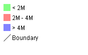
*Sample legend*

The following table lists the whole set of GetLegendGraphic parameters that can be used.

  --------------- -------------- ----------------------------------------------------------------------------------------------------------------------------------------------------------------------------------------------------------------------------------------------------------------------------------------------------------------------------------------------------------------------------------------------------
  **Parameter**   **Required**   **Description**

  *REQUEST*       Required       Value must be "GetLegendGraphic".

  *LAYER*         Required       Layer for which to produce legend graphic.

  *STYLE*         Optional       Style of layer for which to produce legend graphic. If not present, the default style is selected. The style may be any valid style available for a layer, including non-SLD internally-defined styles.

  *FEATURETYPE*   Optional       Feature type for which to produce the legend graphic. This is not needed if the layer has only a single feature type.

  *RULE*          Optional       Rule of style to produce legend graphic for, if applicable. In the case that a style has multiple rules but no specific rule is selected, then the map server is obligated to produce a graphic that is representative of all of the rules of the style.

  *SCALE*         Optional       In the case that a RULE is not specified for a style, this parameter may assist the server in selecting a more appropriate representative graphic by eliminating internal rules that are out-of-scope. This value is a standardized scale denominator, defined in Section 10.2. Specifying the scale will also make the symbolizers using Unit Of Measure resize according to the specified scale.

  *SLD*           Optional       This parameter specifies a reference to an external SLD document. It works in the same way as the SLD= parameter of the WMS GetMap operation.

  *SLD_BODY*      Optional       This parameter allows an SLD document to be included directly in an HTTP-GET request. It works in the same way as the SLD_BODY= parameter of the WMS GetMap operation.

  *FORMAT*        Required       This gives the MIME type of the file format in which to return the legend graphic. Allowed values are the same as for the FORMAT= parameter of the WMS GetMap request.

  *WIDTH*         Optional       This gives a hint for the width of the returned graphic in pixels. Vector-graphics can use this value as a hint for the level of detail to include.

  *HEIGHT*        Optional       This gives a hint for the height of the returned graphic in pixels.

  *EXCEPTIONS*    Optional       This gives the MIME type of the format in which to return exceptions. Allowed values are the same as for the EXCEPTIONS= parameter of the WMS GetMap request.

  *LANGUAGE*      Optional       Allows setting labels language for style titles and rules titles; needs a correctly localized SLD to work properly; if labels are not available in the requested language, the default text will be used; look at [i18N in SLD](../../../styling/sld/language.md) for further details.
  --------------- -------------- ----------------------------------------------------------------------------------------------------------------------------------------------------------------------------------------------------------------------------------------------------------------------------------------------------------------------------------------------------------------------------------------------------

## Controlling legend appearance with LEGEND_OPTIONS {: #get_legend_graphic_options }

GeoServer allows finer control over the legend appearance via the vendor parameter `LEGEND_OPTIONS`. The general format of `LEGEND_OPTIONS` is the same as `FORMAT_OPTIONS`, that is:

    ...&LEGEND_OPTIONS=key1:v1;key2:v2;...;keyn:vn

Here is a description of the various parameters that can be used in `LEGEND_OPTIONS`:

> -   **fontName (string)** the name of the font to be used when generating rule titles. The font must be available on the server
> -   **fontStyle (string)** can be set to italic or bold to control the text style. Other combinations are not allowed right now but we could implement that as well.
> -   **fontSize (integer)** allows us to set the Font size for the various text elements. Notice that default size is 12.
> -   **fontColor (hex)** allows us to set the color for the text of rules and labels (see above for recommendation on how to create values). Values are expressed in `0xRRGGBB` format
> -   **fontAntiAliasing (true/false)** when true enables antialiasing for rule titles
> -   **bgColor (hex)** background color for the generated legend, values are expressed in `0xRRGGBB` format
> -   **dpi (integer)** sets the DPI for the current request, in the same way as it is supported by GetMap. Setting a DPI larger than 91 (the default) makes all fonts, symbols and line widths grow without changing the current scale, making it possible to get a high resolution version of the legend suitable for inclusion in printouts
> -   **forceLabels** "on" means labels will always be drawn, even if only one rule is available. "off" means labels will never be drawn, even if multiple rules are available. Off by default.
> -   **forceTitles** "off" means layer titles will not be drawn for layer groups. On by default.
> -   **labelMargin** margin (in pixels) to use between icons and labels.
> -   **layout** sets icons layout to be **vertical** (default) or **horizontal**.
> -   **columnheight** enables **multicolumn** layout when layout is **vertical**. Each column height is limited by the columnheight value (in pixels).
> -   **rowwidth** enables **multirow** layout when layout is **horizontal**. Each row width is limited by the rowwidth value (in pixels).
> -   **columns** enables **multicolumn** layout when layout is **vertical**. The value is the maximum columns number of legend. The rows used are equal to the next greater integer of <total of icons>/<number of columns>.
> -   **rows** enables **multirow** layout when layout is **horizontal**. The value is the maximum rows number of legend. The columns used are equal to the next greater integer of <total of icons>/<number of rows>.
> -   **grouplayout** Orientation of groups of layer, possible values are **horizontal** and **vertical** (default if not specified).
> -   **countMatched** When set to true, adds at the end of each label the number of features matching that rule in the current map. Requires extra parameters, see details in the [dedicated section](index.md#content-dependent).
> -   **hideEmptyRules** When set to true hides rules that are not matching any feature.
> -   **wrap** When set to true word wraps long legend labels, leading to taller legends but less wide ones.
> -   **wrap_limit** when set, it wraps the legend label with the specified number of pixels.

Here is a sample request sporting most the options:

    http://localhost:8080/geoserver/wms?REQUEST=GetLegendGraphic&VERSION=1.0.0&FORMAT=image/png&WIDTH=20&HEIGHT=20&LAYER=topp:states&legend_options=fontName:Times%20New%20Roman;fontAntiAliasing:true;fontColor:0x000033;fontSize:14;bgColor:0xFFFFEE;dpi:180

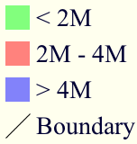
*Using LEGEND_OPTIONS to control the output*

## Controlling legend layout

A set of LEGEND_OPTIONS keys are used to control icons layout in the produced legend images. In particular, a **vertical** or **horizontal** layout can be chosen.

Multi column or multi row layouts are possible, and are controlled by the columnheight / rowwidth options (to limit each column / row size) or by the columns / rows options (to fix the \# of columns / rows to be used).

Both columnheight / columns and rowwidth / rows can be used to limit the whole size of the produced image (some icons are skipped if they do not fit into the given limits).

In addition, orientation of legends in a layergroup can be configured using the grouplayout option.

## Raster Legends Explained

This chapter aims to briefly describe the work that I have performed in order to support legends for raster data that draw information taken from the various bits of the SLD 1.0 RasterSymbolizer element. Recall, that up to now there was no way to create legends for raster data, therefore we have tried to fill the gap by providing an implementation of the getLegendGraphic request that would work with the ColorMap element of the SLD 1.0 RasterSymbolizer. Notice that some "debug" info about the style, like colormap type and band used are printed out as well.

### What's a raster legend

Here below I have drawn the structure of a typical legend, where some elements of interests are parameterized.

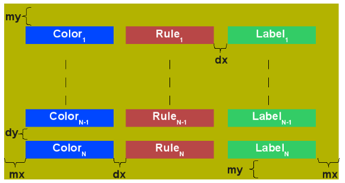
*The structure of a typical legend*

Take as an instance one of the SLD files attached to this page, each row in the above table draws its essence from the ColorMapEntry element as shown here below:

``` xml
<ColorMapEntry color="#732600" quantity="9888" opacity="1.0" label="<-70 mm"/>
```

The producer for the raster legend will make use of this elements in order to build the legend, with this in mind, notice that:

> -   the width of the Color element is driven by the requested width for the GetLegendGraphic request
> -   the width and height of label and rules is computed accordingly to the used Font and Font size for the prepared text (**no new line management for the moment**)
> -   the height of the Color element is driven by the requested width for the GetLegendGraphic request, but notice that for ramps we expand this a little since the goal is to turn the various Color elements into a single long strip
> -   the height of each row is set to the maximum height of the single elements
> -   the width of each row is set to the sum of the width of the various elements plus the various paddings
> -   **dx,dy** the spaces between elements and rows are set to the 15% of the requested width and height. Notice that **dy** is ignored for the colormaps of type **ramp** since they must create a continuous color strip.
> -   **absoluteMargins** true/false, used to change the Unit of Measure of **dx** from percentage (when false) to a fixed number of pixels (when true).
> -   **mx,my** the margins from the border of the legends are set to the 1.5% of the total size of the legend

In conclusion, here below I am adding an image of a sample legend with all the various options at work. The request that generated it is the following:

    http://localhost:8081/geoserver/wms?REQUEST=GetLegendGraphic&VERSION=1.0.0&FORMAT=image/png&WIDTH=100&HEIGHT=20&LAYER=it.geosolutions:di08031_da&LEGEND_OPTIONS=forceRule:True;dx:0.2;dy:0.2;mx:0.2;my:0.2;fontStyle:bold;borderColor:0000ff;border:true;fontColor:ff0000;fontSize:18

Do not worry if it seems like something written in ancient dead language, I am going to explain the various params here below.

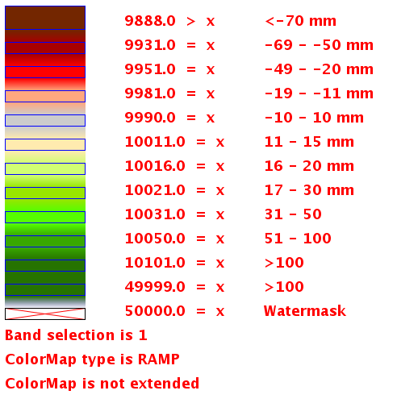
*Example of a raster legend*

### Raster legends' types

As you may know (well, actually you might not since I never wrote any real docs about the RasterSymbolizer work I did) GeoServer supports three types of ColorMaps:

> -   **ramp** this is what SLD 1.0 dictates, which means a linear interpolation weighted on values between the colors of the various ColorMapEntries.
> -   **values** this is an extension that allows link quantities to colors as specified by the ColorMapEntries quantities. Values not specified are translated into transparent pixels.
> -   **classes** this is an extension that allows pure classifications based on intervals created from the ColorMapEntries quantities. Values not specified are translated into transparent pixels.

Here below I am going to list various examples that use the attached styles on a rainfall floating point geotiff.

### ColorMap type is VALUES

Refer to the SLD rainfall.sld in attachment.

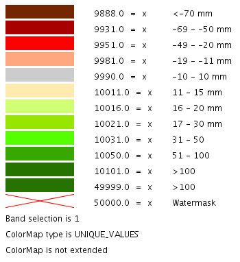
*Raster legend - VALUES type*

### ColorMap type is CLASSES

Refer to the SLD rainfall_classes.sld in attachment.

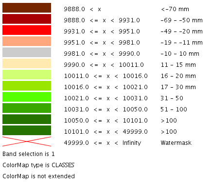
*Raster legend - CLASSES type*

### ColorMap type is RAMP

Refer to the SLD rainfall_classes.sld in attachment. Notice that the first legend shows the default border behavior while the second has been forced to draw a border for the breakpoint color of the colormap entry quantity described by the rendered text. Notice that each color element has a part that show the fixed color from the colormap entry it depicts (the lowest part of it, the one that has been outlined by the border in the second legend below) while the upper part of the element has a gradient that connects each element to the previous one to point out the fact that we are using linear interpolation.

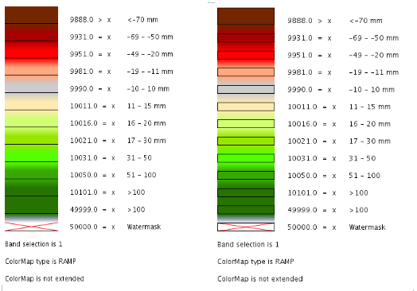
*Raster legend - RAMP type*

### The various control parameters and how to set them

I am now going to briefly explain the various parameters that we can use to control the layout and content of the legend. A request that puts all the various options is shown here:

    http://localhost:8081/geoserver/wms?REQUEST=GetLegendGraphic&VERSION=1.0.0&FORMAT=image/png&WIDTH=100&HEIGHT=20&LAYER=it.geosolutions:di08031_da&LEGEND_OPTIONS=forceRule:True;dx:0.2;dy:0.2;mx:0.2;my:0.2;fontStyle:bold;borderColor:0000ff;border:true;fontColor:ff0000;fontSize:18

Let's now examine all the interesting elements, one by one. Notice that I am not going to discuss the mechanics of the GetLegendGraphic operation, for that you may want to refer to the SLD 1.0 spec, my goal is to briefly discuss the LEGEND_OPTIONS parameter.

> -   **forceRule (boolean)** by default rules for a ColorMapEntry are not drawn to keep the legend small and compact, unless there are no labels at all. You can change this behaviour by setting this parameter to true.
> -   **dx,dy,mx,my (double)** can be used to set the margin and the buffers between elements
> -   **border (boolean)** activates or deactivates the border on the color elements in order to make the separations clearer. Notice that I decided to **always** have a line that would split the various color elements for the ramp type of colormap.
> -   **borderColor (hex)** allows us to set the color for the border in 0xRRGGBB format

### CQL Expressions and ENV

If CQL expressions are used in ColorMapEntry attributes (see [here](../../../styling/sld/reference/rastersymbolizer.md#sld_reference_rastersymbolizer_colormap_cql)) to create a dynamic color map taking values from ENV, the same ENV parameters used for GetMap can be given to GetLegendGraphic to get the desired legend entries.

### Content dependent legends {: #content-dependent }

GeoServer allows building content dependent legend, that is, legends whose contents depend on the currently displayed map. In order to support it the GetLegendGraphic call needs the following extra parameters:

> -   BBOX
> -   SRS or CRS (depending on the WMS version, SRS for 1.1.1 and CRS for 1.3.0)
> -   SRCWIDTH and SRCHEIGHT, the size of the reference map (width and height already have a different meaning in GetLegendGraphic)

Other parameters can also be added to better match the GetMap request, for example, it is recommended to mirror filtering vendor parameters such as, for example, CQL_FILTER,FILTER,FEATUREID,TIME,ELEVATION.

Content dependent evaluation is enabled via the following LEGEND_OPTIONS parameters:

> -   countMatched: adds the number of features matching the particular rule at the end of the rule label (requires visible labels to work). Applicable only to vector layers.
> -   hideEmptyRules: hides rules that are not matching any feature. Applicable only if countMatched is true.

For example, let's assume the following layout is added to GeoServer (`legend.xml` to be placed in `GEOSERVER_DATA_DIR/layouts`):

    <layout>
        <decoration type="legend" affinity="top,right" offset="0,0" size="auto"/>
    </layout>

This will make a legend appear in the GetMap response. The following preview request uses the layout to embed a legend and activates feature counting in it:

    http://localhost:8080/geoserver/topp/wms?service=WMS&version=1.1.0&request=GetMap&layers=topp:states&styles=&bbox=-124.73142200000001,24.955967,-66.969849,49.371735&width=768&height=330&srs=EPSG:4326&format=application/openlayers&format_options=layout:legend&legend_options=countMatched:true;fontAntiAliasing:true

The result will look as follows:

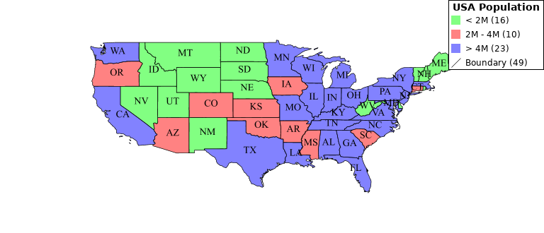
*Embedded legend, full map*

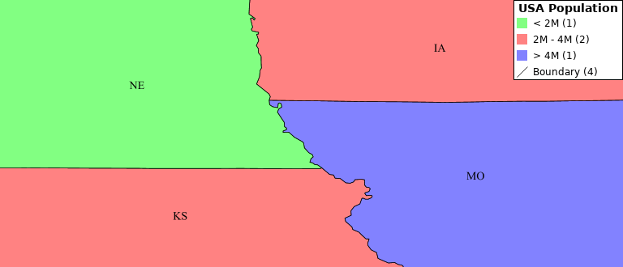
*Embedded legend, four states*

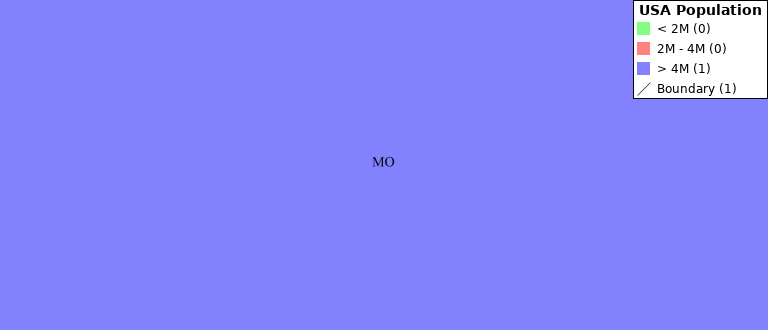
*Embedded legend, single state*

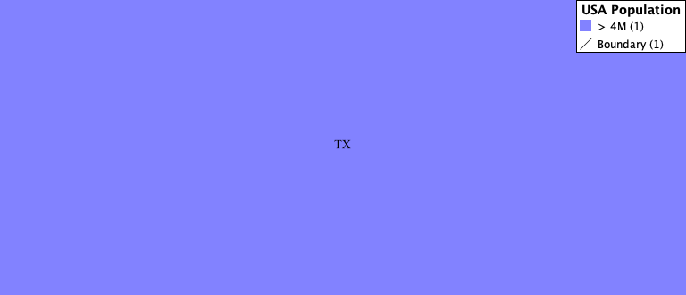
*Embedded legend, single state, hide empty rules*

The same can be achieved using a stand-alone GetLegendGraphic request:

    http://localhost:8080/geoserver/topp/wms?service=WMS&version=1.1.0&request=GetLegendGraphic&width=20&height=20&layer=topp:states&bbox=-124.73142200000001,24.955967,-66.969849,49.371735&srcwidth=768&srcheight=330&srs=EPSG:4326&format=image/png&legend_options=countMatched:true;fontAntiAliasing:true


*Direct legend request*

Or hide the empty rules using a stand-alone GetLegendGraphic request:

    http://localhost:8080/geoserver/topp/wms?service=WMS&version=1.1.0&request=GetLegendGraphic&width=20&height=20&layer=topp:states&bbox=-101.0028076171875,31.025390625,-96.7840576171875,32.838134765625&srcwidth=768&srcheight=330&srs=EPSG:4326&format=image/png&legend_options=countMatched:true;fontAntiAliasing:true;hideEmptyRules:true


*Direct legend request*

## JSON Output Format

Since version 2.15.0 it has been possible to use **application/json** as an output format in GetLegendGraphic requests. This allows a JSON aware client to receive a JSON representation of the legend graphic to use for its own rendering requirements.

A simple http request can be used:

    http://localhost:9000/geoserver/wms?service=WMS&version=1.1.0&request=GetLegendGraphic&layer=topp:states&format=application/json

Which returns a JSON response:

``` javascript
{"Legend": [{
  "layerName": "states",
  "title": "USA Population",
  "rules":   [
        {
      "title": "< 2M",
      "filter": "[PERSONS < '2000000']",
      "symbolizers": [{"Polygon":       {
        "fill": "#4DFF4D",
        "fill-opacity": "0.7"
      }}]
    },
        {
      "title": "2M - 4M",
      "filter": "[PERSONS BETWEEN '2000000' AND '4000000']",
      "symbolizers": [{"Polygon":       {
        "fill": "#FF4D4D",
        "fill-opacity": "0.7"
      }}]
    },
        {
      "title": "> 4M",
      "filter": "[PERSONS > '4000000']",
      "symbolizers": [{"Polygon":       {
        "fill": "#4D4DFF",
        "fill-opacity": "0.7"
      }}]
    },
        {
      "title": "Boundary",
      "symbolizers":       [
        {"Line":         {
          "stroke": "#000000",
          "stroke-width": "0.2",
          "stroke-opacity": "1",
          "stroke-linecap": "butt",
          "stroke-linejoin": "miter"
        }},
        {"Text":         {
          "label": "[STATE_ABBR]",
          "fonts": [          {
            "font-family": ["Times New Roman"],
            "font-style": "Normal",
            "font-weight": "normal",
            "font-size": "14"
          }],
          "label-placement":           {
            "x-anchor": "0.5",
            "y-anchor": "0.5",
            "rotation": "0.0"
          }
        }}
      ]
    }
  ]
}]}
```

This JSON contains an array of Legends (one for each layer requested) and each legend contains some metadata about the legend and an array of `rule` objects for each rule within the feature type of the style. Each `rule` contains the metadata associated with the rule, any `filter` element and an array of `symbolizer` objects.

### Filters and Expressions

Filters are encoded using [ECQL](../../../filter/ecql_reference.md), a rule with an ElseFilter has an element "ElseFilter" set to the value "true". Expressions are also encoded in ECQL (wrapped in []) when encountered in the style.

### Symbolizers

-   PointSymbolizer

    A point symbolizer will be represented as a series of elements containing metadata and an array of `graphics` symbols (see [here](../../../styling/sld/reference/pointsymbolizer.md#sld_reference_graphic)) , these can be well known `marks` or external graphics. The point symbolizer also provides an "URL" element which allows a client to make a request back to GeoServer to fetch a PNG image of the point symbol.

    ``` javascript
    {"Point":     {
        "title": "title",
        "abstract": "abstract",
        "url": "http://localhost:9000/geoserver/kml/icon/capitals?0.0.0=",
        "size": "6",
        "opacity": "1.0",
        "rotation": "0.0",
        "graphics": [      {
          "mark": "circle",
          "fill": "#FFFFFF",
          "fill-opacity": "1.0",
          "stroke": "#000000",
          "stroke-width": "2",
          "stroke-opacity": "1",
          "stroke-linecap": "butt",
          "stroke-linejoin": "miter"
        }]}}
    ```

-   LineSymbolizer

    A line symbolizer is represented as a list of metadata elements and the `stroke
    parameters <sld_reference_linesymbolizer_css>`{.interpreted-text role="ref"}, it is possible for there to be a [graphic-stroke](../../../styling/sld/reference/linesymbolizer.md#sld_reference_linesymbolizer_graphicstroke) element too.

    ``` javascript
    {"Line":     {
      "stroke": "#AA3333",
      "stroke-width": "2",
      "stroke-opacity": "1",
      "stroke-linecap": "butt",
      "stroke-linejoin": "miter"
    }}


    {"Line":       {
        "graphic-stroke":         {
          "url": "http://local-test:8080/geoserver/kml/icon/Default Styler",
          "size": "6",
          "opacity": "0.4",
          "rotation": "[(rotation*-1)]",
          "graphics": [          {
            "mark": "square",
            "fill": "#FFFF00",
            "fill-opacity": "1.0"
          }]
        },
        "stroke-opacity": "1",
        "stroke-linecap": "butt",
        "stroke-linejoin": "miter",
        "perpendicular-offset": "10"
      }}  
    ```

-   PolygonSymbolizer

    A polygon symbolizer contains `stroke
    parameters <sld_reference_linesymbolizer_css>`{.interpreted-text role="ref"} and `fill 
    parameters <sld_reference_fill>`{.interpreted-text role="ref"}.

    ``` javascript
    {"Polygon":       {
      "stroke": "#000000",
      "stroke-width": "0.5",
      "stroke-opacity": "1",
      "stroke-linecap": "butt",
      "stroke-linejoin": "miter",
      "fill": "#0099CC",
      "fill-opacity": "1.0"
    }}
    ```

    Or a graphic stroke and/or a graphic fill (as described above).

    ``` javascript
    {"Polygon":       {
      "graphic-stroke":         {
        "url": "http://local-test:8080/geoserver/kml/icon/Default Styler",
        "size": "6",
        "opacity": "0.4",
        "rotation": "[(rotation*-1)]",
        "graphics": [          {
          "mark": "square",
          "fill": "#FFFF00",
          "fill-opacity": "1.0"
        }]
      },
      "stroke-opacity": "1",
      "stroke-linecap": "butt",
      "stroke-linejoin": "miter",
      "graphic-fill":         {
        "url": "http://local-test:8080/geoserver/kml/icon/Default Styler",
        "size": "4",
        "opacity": "0.4",
        "rotation": "[(rotation*-1)]",
        "graphics": [          {
          "mark": "circle",
          "fill": "#FFFFFF",
          "fill-opacity": "1.0"
        }]
      }}}
    ```

-   RasterSymbolizer

    Raster symbolizers contain a `colormap` with an array of `entries`, each entry contains a `label`, `quantity` and `color` element.

    ``` javascript
    {"Raster":   {
      "colormap":     {
        "entries":       [
                  {
            "label": "values",
            "quantity": "0",
            "color": "#AAFFAA"
          },
                  {
            "quantity": "1000",
            "color": "#00FF00"
          },
                  {
            "label": "values",
            "quantity": "1200",
            "color": "#FFFF00"
          },
                  {
            "label": "values",
            "quantity": "1400",
            "color": "#FF7F00"
          },
                  {
            "label": "values",
            "quantity": "1600",
            "color": "#BF7F3F"
          },
                  {
            "label": "values",
            "quantity": "2000",
            "color": "#000000"
          }
        ],
        "type": "ramp"
      },
      "opacity": "1.0"
    }}
    ```

-   TextSymbolizer

    A text symbolizer contains a `label` expression, followed by an array of `fonts` and a `label-placement` object containing details of how the label is placed.

    ``` javascript
    {"Text":         {
        "label": "[STATE_ABBR]",
        "fonts": [          {
            "font-family": ["Times New Roman"],
            "font-style": "Normal",
            "font-weight": "normal",
            "font-size": "14"
        }],
        "label-placement":           {
            "x-anchor": "0.5",
            "y-anchor": "0.5",
            "rotation": "0.0"
        }
    }}
    ```

### Vendor Options

In any case where one or more vendor options is included in the symbolizer there will be a `vendor-options` element included in the output. This object will include one line for each vendor option.

``` javascript
"vendor-options": {
  "labelAllGroup": "true",
  "spaceAround": "10",
  "followLine": "true",
  "autoWrap": "50"
}
```
