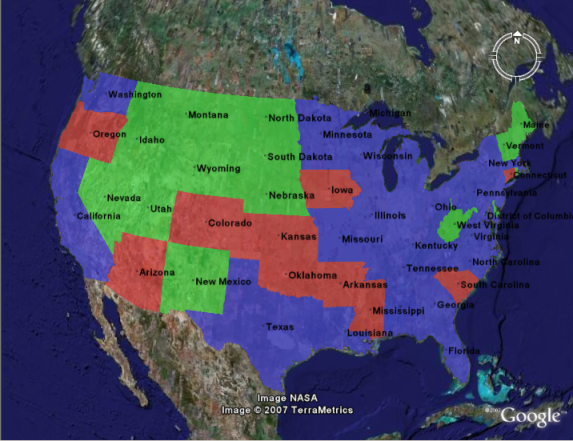
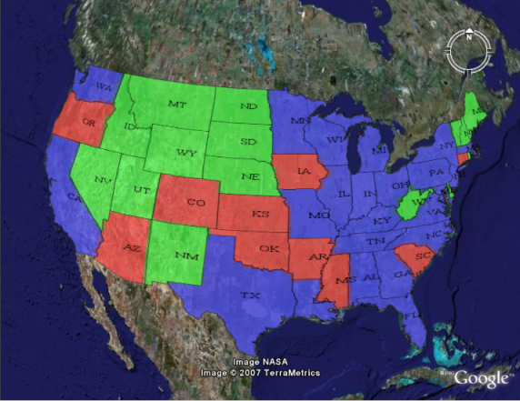

# KML Scoring

!!! note

    KML scoring only applies when using the super-overlay mode `refresh`. See [KML Super-Overlays](kmlsuperoverlays.md) for more information.

GeoServer can return KML in one of two forms. The first is as a number of placemark elements (vectors). Each placemark corresponds to a feature in the underlying dataset. This form only applies to vector datasets.

The second form is as an overlay (image). In this form the rendering is done by the GeoServer WMS and only the resulting graphic is sent to Google Earth. This is the only form available for raster datasets, but can be applied to vector datasets as well.

There are advantages to and disadvantages to each output mode when rendering vector data. Placemarks look nicer, but there can be performance problems with Google Earth if the data set is large. Overlays put less of a strain on Google Earth, but aren't as nice looking.

The following shows the same dataset rendered in Placemark form on the top and Overlay form on the bottom.

KML scoring is the process of determining whether to render features as rasters or as vectors.

## The kmscore attribute

GeoServer makes the determination on whether to render a layer as raster or vector based on how many features are in the data set and an attribute called `kmscore`. The `kmscore` attribute determines the maximum amount of vector features rendered. It is calculated by this formula:

    maximum number of features = 10^(kmscore/15)

The following table shows the values of this threshold for various values of the `kmscore` parameter:

|             |                               |
|-------------|-------------------------------|
| **kmscore** | **Maximum \# of features**    |
| 0           | Force overlay/raster output   |
| 10          | 4                             |
| 20          | 21                            |
| 30          | 100                           |
| 40          | Approx. 450                   |
| 50          | (*default*) Approx. 2150      |
| 60          | Approx. 10,000                |
| 70          | Approx. 45,000                |
| 80          | Approx. 200,000               |
| 90          | Approx. 1,000,000             |
| 100         | Force placemark/vector output |

The syntax for specifying `kmscore` is:

    kmscore=<value>

where `<value>` is an integer between 0 and 100. For example:

    http://localhost:8080/geoserver/wms/kml?layers=topp:states&mode=refresh&kmscore=20

The `kmscore` attribute will be ignored if using a reflector mode other than `refresh`.
