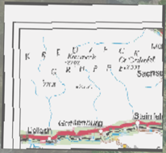
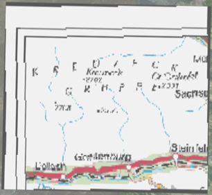
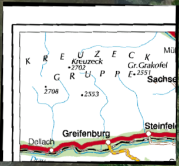

# KML Super-Overlays

Super-overlays are a form of KML in which data is broken up into regions. This allows Google Earth to refresh/request only particular regions of the map when the view area changes. Super-overlays are used to efficiently publish large sets of data. (Please see [Google's page on super-overlays](http://code.google.com/apis/kml/documentation/kml_21tutorial.html#superoverlays) for more information.)

GeoServer supports two types of super-overlays: **raster** and **vector**. With raster super-overlays, GeoServer intelligently produces imagery appropriate to the current zoom level and dynamically outputs new imagery when the zoom level changes. With vector super-overlays, feature data is requested for only the visible features and new features are dynamically loaded as necessary. Raster super-overlays require less resources on the client, but vector super-overlays have a higher output quality.

When using the [KML Reflector](kmlreflector.md), super-overlays are enabled by default, whether the data in question is raster or vector. For more information on the various options for KML super-overlay output, please see the page on the [KML Reflector](kmlreflector.md).

## Raster Super-Overlays

Consider this image, which is generated from GeoServer. When zoomed out, the data is at a small size.

When zooming in, the image grows larger, but since the image is at low resolution (originally designed to be viewed small), the quality degrades.

However, in a super-overlay, the KML document requests a new image from GeoServer of a higher resolution for that zoom level. As the new image is downloaded, the old image is replaced by the new image.

## Raster Super-Overlays and GeoWebCache

GeoServer implements super-overlays in a way that is compatible with the WMS Tiling Client Recommendation. Super-overlays are generated such that the tiles of the super-overlay are the same tiles that a WMS tiling client would request. One can therefore use existing tile caching mechanisms and reap a potentially large performance benefit.

The easiest way to tile cache a raster super overlay is to use GeoWebCache which is built into GeoServer:

    http://GEOSERVER_URL/gwc/service/kml/<layername>.<imageformat>.kmz

where `GEOSERVER_URL` is the URL of your GeoServer instance.

## Vector Super-Overlays

GeoServer can include the feature information directly in the KML document. This has lots of benefits. It allows the user to select (click on) features to see descriptions, toggle the display of individual features, as well as have better rendering, regardless of zoom level. For large datasets, however, the feature information can take a long time to download and use a lot of client-side resources. Vector super-overlays allow the client to only download part of a dataset, and request more features as necessary.

Vector super-overlays can use the process of [KML Regionation](kmlregionation.md) to organize features into a hierarchy. The regionation process can operate in a variety of modes. Most of the modes require a "regionation attribute" which is used to determine which features should be visible at a particular zoom level. Please see the [KML Regionation](kmlregionation.md) page for more details.

## Vector Super-Overlays and GeoWebCache

As with raster super-overlays, it is possible to cache vector super-overlays using GeoWebCache. Below is the syntax for generating a vector super-overlay KML document via GeoWebCache:

    http://GEOSERVER_URL/gwc/service/kml/<layername>.kml.kmz

where `GEOSERVER_URL` is the URL of your GeoServer instance.

Unlike generating a super-overlay with the standard [KML Reflector](kmlreflector.md), it is not possible to specify the regionation properties as part of the URL. These parameters must be set in the [Layers](../../../../data/webadmin/layers.md) configuration which can be navigated to by clicking on 'Layers' in the left hand sidebar and then selecting your vector layer.
