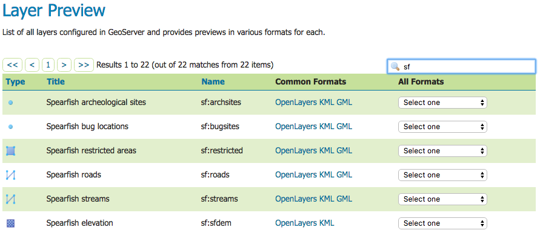
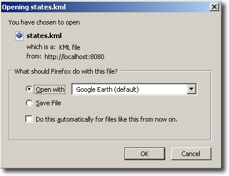
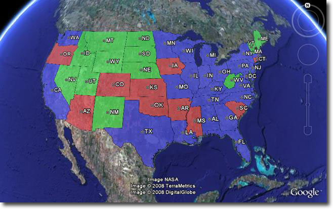
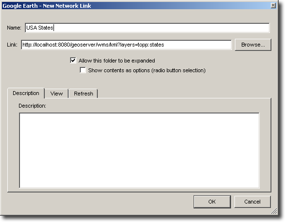

# Quickstart

!!! note

    If you are using GeoServer locally, the GEOSERVER_URL is usually `http://localhost:8080/geoserver`

## Viewing a layer

Once GeoServer is installed and running, open up a web browser and go to the web admin console ([Web administration interface](../../../webadmin/index.md)). Navigate to the [Layer Preview](../../../data/webadmin/layerpreview.md) by clicking on the Layer Preview link at the bottom of the left sidebar. You will be presented with a list of the currently configured layers in your GeoServer instance. Find the row that says `topp:states`. To the right of the layer click on the link that says **KML**.

> 
> *The Map Preview page*

If Google Earth is correctly installed on your computer, you will see a dialog asking how to open the file. Select **Open with Google Earth**.

> 
> *Open with Google Earth*

When Google Earth is finished loading the result will be similar to below.

> 
> *The topp:states layer rendered in Google Earth*
>
> ::: note
> ::: title
> Note
> :::
> :::

## Direct access to KML

All of the configured FeatureTypes are available to be output as KML (and thus loaded into Google Earth). The URL structure for KMLs is:

    http://GEOSERVER_URL/wms/kml?layers=<layername>

For example, the topp:states layer URL is:

    http://GEOSERVER_URL/wms/kml?layers=topp:states

## Adding a Network Link

An alternative to serving KML directly into Google Earth is to use a Network Link. A Network Link allows for better integration into Google Earth. For example, using a Network Link enables the user to refresh the data within Google Earth, without having to retype a URL, or click on links in the GeoServer Map Preview again.

To add a Network Link, pull down the **Add** menu, and go to **Network Link**. The **New Network Link** dialog box will appear. Name your layer in the **Name** field. (This will show up in **My Places** on the main Google Earth screen.) Set **Link** to:

    http://GEOSERVER_URL/wms/kml?layers=topp:states

(Don't forget to replace the GEOSERVER_URL.) Click **OK**. You can now save this layer in your **My Places**.

> 
> *Adding a network link*

Check out the sections on [Tutorials](tutorials/index.md) and the [KML Styling](kmlstyling.md) for more information.
