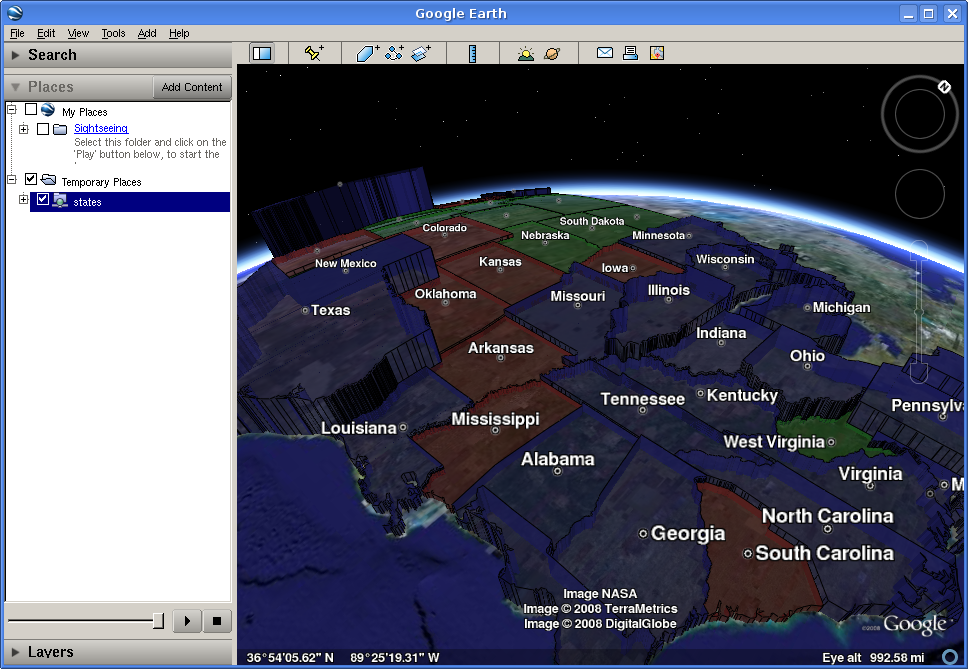

# Heights Templates

## Introduction

Height Templates in KML allow you to use an attribute of your data as the 'height' of features in Google Earth.

!!! note

    This tutorial assumes that GeoServer is running on <http://localhost:8080>.

## Getting Started

For the purposes of this tutorial, you just need to have GeoServer with the release configuration, and Google Earth installed. Google Earth is available for free from <<http://earth.google.com/> <<http://earth.google.com/>>`_.

## Step One

By default GeoServer renders all features with 0 height, so they appear to lay flat on the world's surface in Google Earth.

To view the `topp:states` layer (packaged with all releases of GeoServer) in Google Earth, the easiest way is to use a network link. In Google Earth, under **Places**, right-click on **Temporary Places**, and go to **Add --> Network Link**. In the dialog box, fill in `topp:states` as the **Name**, and the following URL as the **Link**:

    http://localhost:8080/geoserver/wms/reflect?layers=topp:states&format=application/vnd.google-earth.kml+xml

*topp:states in Google Earth*

## Step Two

An interesting value to use for the height would be the population of each state (so that more populated states appear taller on the map). We can do this by creating a file called `height.ftl` in the GeoServer data directory under `workspaces/topp/states_shapefile/states`. To set the population value, we enter the following text inside this new file:

    ${PERSONS.value}

This uses the value of the `PERSONS` attribute as the height for each feature. To admire our handiwork, we can refresh our view by right-clicking on our temporary place (called `topp:states`) and selecting **Refresh**:

*Height by Population*

## Step Three

Looking at our population map, we see that California dwarfs the rest of the nation, and in general all of the states are too tall for us to see the heights from a convenient angle. In order to scale things down to a more manageable size, we can divide all height values by 100. Just change the template we wrote earlier to read:

    ${PERSONS.value / 100}

Refreshing our view once again, we see that our height field has disappeared. Looking at the GeoServer log (in the data directory under logs/geoserver.log) we see something like:

    Caused by: freemarker.core.NonNumericalException: Error on line 1, column 3 in height.ftl
    Expression PERSONS.value is not numerical

However, we know that the `PERSONS` field is numeric, even if it is declared in the shapefile as a string value. To force a conversion, we can append `?number`, like so:

    ${PERSONS.value?number / 100}

One final **Refresh** brings us to a nicely sized map of the US:

*Scaled Height*

## Step Four

There are still a couple of tweaks we can make. The default is to create a 'solid' look for features with height, but Google Earth can also create floating polygons that are disconnected from the ground. To turn off the 'connect to ground' functionality, add a format option called 'extrude' whose value is 'false'. That is, change the **Link** in the Network Link to be:

    http://localhost:8080/geoserver/wms/reflect?layers=topp:states&format=application/vnd.google-earth.kml%2Bxml&format_options=extrude:false

We also have a few options for how Google Earth interprets the height field. By default, the height is interpreted as relative to the ground, but we can also set the heights relative to sea level, or to be ignored (useful for reverting to the 'flat' look without erasing your template). This is controlled with a format option named altitudeMode, whose values are summarized below.

**altitudeMode**

:   **Purpose**

altitudeMode

:   Interpret height as relative to ground level

absolute

:   Interpret height as relative to sea level

clampToGround

:   Ignore height entirely
