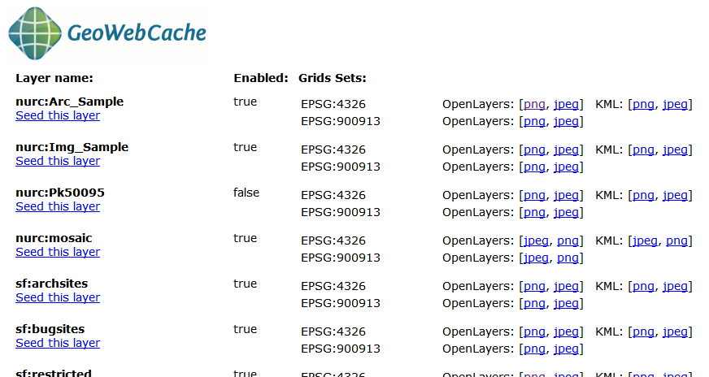
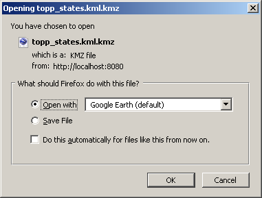

# Super-Overlays and GeoWebCache

## Overview

This tutorial explains how to use [GeoWebCache](http://geowebcache.org) (GWC) to enhance the performance of super-overlays in Google Earth. For more information please see the page on [KML Super-Overlays](../features/kmlsuperoverlays.md)

Conveniently GeoWebCache can generate super-overlays automatically. With the standalone GeoWebCache it takes minimal amount of configuration. Please see the [GeoWebCache documentation](http://geowebcache.org/trac/wiki/configuration) for more information on the standalone version of GeoWebCache.

We are going to use the plug in version of GeoWebCache where there is no configuration need. For this tutorial we are also using the topp:states layer. Using the GeoWebCache plug in with super-overlays

To access GWC from GeoServer go to <http://localhost:8080/geoserver/gwc/demo/>. This should return a layer list of similar to below.

To use a super-overlay in GeoWebCache select the KML (vector) option display for each layer. Lets select topp:states.The url would be <http://localhost:8080/geoserver/gwc/service/kml/topp:states.kml.kmz> After doing so you will be presented with a open option dialog, choose Google Earth.

When Google Earth finishes loading you should be viewing a the topp:states layers.

