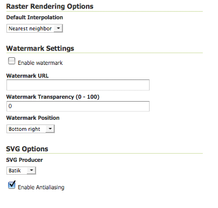
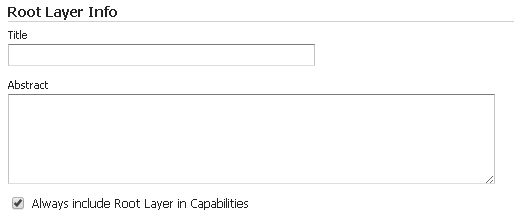
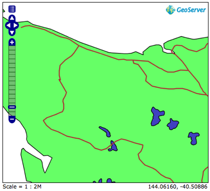
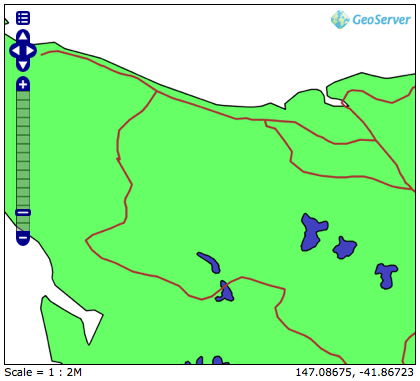
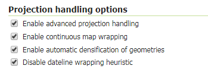
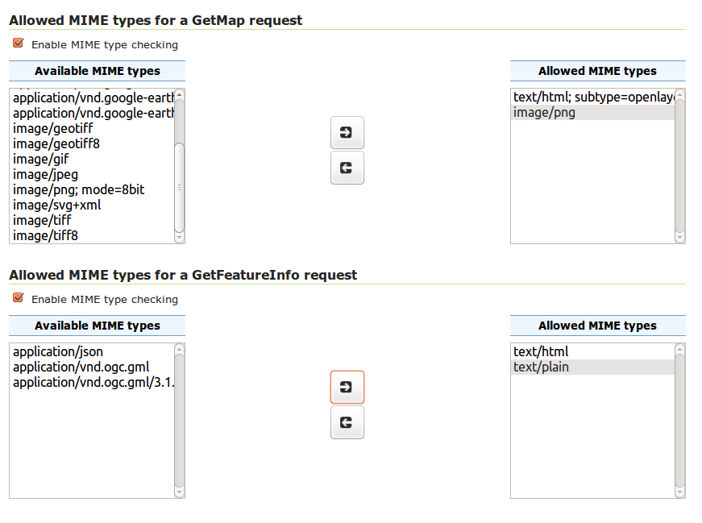
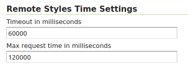
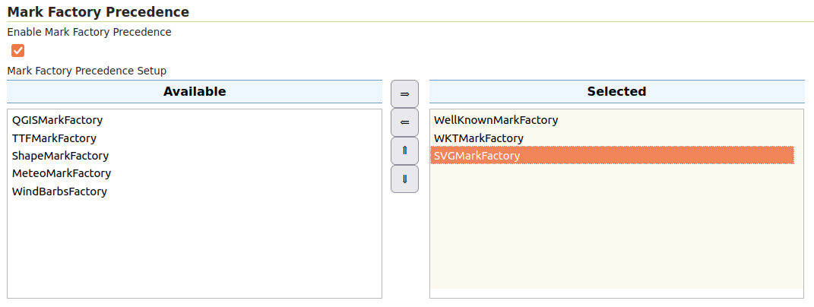

# WMS settings {: #services_webadmin_wms }

This page details the configuration options for WMS in the web administration interface.

*WMS configuration options*

## Workspace

Select **workspace** empty to configure global WMS settings.

See section on [Workspace Services](../../data/webadmin/workspaces.md#workspace_services) to override settings used by WMS [Virtual Services](../../configuration/virtual-services.md).

## Service Metadata

For a description of WMS services, see the section on [Service Metadata](../../configuration/service-metadata/index.md).

## Root Layer Information {: #services_webadmin_wms_raster_options }

In this section is possible to define a title and an abstract for the root layer in the WMS capabilities. When these are left empty the WMS service title and abstract are used.

It is also possible to set the flag **Always include Root Layer in capabilities**. This is checked by default, but can be unset so that the root layer is included in capabilities only when there is NOT already a single top level Layer element. This can be useful to allow compatibility with some WMS clients that are not happy with the two or more layer tree levels. This default setting can be overridden at the layer or request level.

## Raster Rendering Options

The Web Map Service Interface Standard (WMS) provides a simple way to request and serve geo-registered map images. During pan and zoom operations, WMS requests generate map images through a variety of raster rendering processes. Such image manipulation is generally called resampling, interpolation, or down-sampling. GeoServer supports three resampling methods that determine how cell values of a raster are outputted. These sampling methods-Nearest Neighbor, Bilinear Interpolation and Bicubic-are available on the Default Interpolation menu.

**Nearest Neighbor** -Uses the center of nearest input cell to determine the value of the output cell. Original values are retained and no new averages are created. Because image values stay exactly the same, rendering is fast but possibly pixelated from sharp edge detail. Nearest neighbor interpolation is recommended for categorical data such as land use classification.

**Bilinear** -Determines the value of the output cell based by sampling the value of the four nearest cells by linear weighting. The closer an input cell, the higher its influence of on the output cell value. Since output values may differ from nearest input, bilinear interpolation is recommended for continuous data like elevation and raw slope values. Bilinear interpolation takes about five times as long as nearest neighbor interpolation.

**Bicubic** -Looks at the sixteen nearest cells and fits a smooth curve through the points to find the output value. Bicubic interpolation may both change the input value as well as place the output value outside of the range of input values. Bicubic interpolation is recommended for smoothing continuous data, but this incurs a processing performance overhead.

## Dimensions settings

The WMS specification mandates the throwing of an `InvalidDimensionValue` exception when a dimension value is not valid, and the nearest match is not enabled. This is the default behavior of GeoServer starting with version 2.25, while older versions simply ignored the invalid value and returned empty responses.

The behavior can be controlled in the **Dimension Settings** section, with a choice of three possible values:

-   **Use GS version default**. Will return an exception if version is greater or equal than 2.25, otherwise will ignore the invalid value.
-   **Return InvalidDimensionValue**. Will return an exception on invalid value, unless nearest neighbor match has been enabled for the layer (standard compliant behavior).
-   **Ignore invalid value**. Will ignore invalid values and return an empty map/info (legacy behavior).

## Watermark Settings

Watermarking is the process of embedding an image into a map. Watermarks are usually used for branding, copyright, and security measures. Watermarks are configured in the WMS watermarks setting section.

**Enable Watermark** -Turns on watermarking. When selected, all maps will render with the same watermark. It is not currently possible to specify watermarking on a per-layer or per-feature basis.

**Watermark URL** -Location of the graphic for the watermark. The graphic can be referenced as an absolute path (e.g., **`C:\GeoServer\watermark.png`**), a relative one inside GeoServer's data directory (e.g., **`watermark.png`**), or a URL (e.g., `http://www.example.com/images/watermark.png`).

Each of these methods have their own advantages and disadvantages. When using an absolute or relative link, GeoServer keeps a cached copy of the graphic in memory, and won't continually link to the original file. This means that if the original file is subsequently deleted, GeoServer won't register it missing until the watermark settings are edited. Using a URL might seem more convenient, but it is more I/O intensive. GeoServer will load the watermark image for every WMS request. Also, should the URL cease to be valid, the layer will not properly display.

**Watermark Transparency**--Determines the opacity level of the watermark. Numbers range between 0 (opaque) and 100 (fully invisible).

**Watermark Position** -Specifies the position of the watermark relative to the WMS request. The nine options indicate which side and corner to place the graphic (top-left, top-center, top-right, etc). The default watermark position is bottom-right. Note that the watermark will always be displayed flush with the boundary. If extra space is required, the graphic itself needs to change.

Because each WMS request renders the watermark, a single tiled map positions *one* watermark relative to the view window while a tiled map positions the watermark for each tile. The only layer specific aspect of watermarking occurs because a single tile map is one WMS request, whereas a tiled map contains many WMS requests. (The latter watermark display resembles Google Maps faint copyright notice in their Satellite imagery.) The following three examples demonstrate watermark position, transparency and tiling display, respectively.

*Single tile watermark (aligned top-right, transparency=0)*

*Single tile watermark (aligned top-right, transparency=90)*

*Tiled watermark (aligned top-right, transparency=90)*

## SVG Options

The GeoServer WMS supports SVG (Scalable Vector Graphics) as an output format. GeoServer currently supports two SVG renderers, available from the SVG producer menu.

1.  *Simple* -Simple SVG renderer. It has limited support for SLD styling, but is very fast.
2.  *Batik* -Batik renderer (as it uses the Batik SVG Framework). It has full support for SLD styling, but is slower.

**Enable Anti-aliasing** Anti-aliasing is a technique for making edges appear smoother by filling in the edges of an object with pixels that are between the object's color and the background color. Anti-aliasing creates the illusion of smoother lines and smoother selections. Turning on anti-aliasing will generally make maps look nicer, but will increase the size of the images, and will take longer to return. If you are overlaying the anti-aliased map on top of others, beware of using transparencies as the anti-aliasing process mixes with the colors behind and can create a "halo" effect.

## Limited SRS list

Some clients can have problems processing the large list of SRS (projections) that GeoServer can support when they are all listed in the capabilities document. It is possible to add a list of needed projections in the *Limited SRS List* box. This takes the form of a list of EPSG codes separated by commas, e.g. `4326,27700`.

*A limited SRS list*

The `Output bounding box for every supported CRS` flag is only respected if a Limited SRS list has been specified.Setting this flag causes the WMS capabilities document to contain a Bounding Box for each supported CRS, for each Layer. Doing this for every CRS in the EPSG database, for each Layer in the catalog, would result in a impractically huge capabilities document.

## Authorization headers forwarding for remote SLDs

A GetMap request may specify the style by referring a remote URL in the SLD parameter. There might be the case that the remote URL require same authorization headers as the current GetMap request. If that's the case a list of allowed style URLs can be specified using newline as separators (URLs might be long). Authorization headers will be only forwarded to a remote URL when it starts with one of the specified URLs.

*The list of remote URLs being allowed for authorization headers forwarding.*

## Advanced projection handling and map wrapping

Advanced projection handling is a set of extra "smarts" applied while rendering that help getting a good looking map despite the data touching or crossing "difficult areas" in selected map projection. This includes, among others:

-   Cutting the geometries so that they fit within the area of mathematical stability of the projection math, e.g., it will cut any bit at more than 45 degrees west and east from the central meridian of a transverse Mercator projection, or beyond 85 degrees north or south in a Mercator projection
-   Make sure both "ends" of the world get queried for data when a map in polar stereographic is hitting an area that includes the dateline
-   Ability to optionally preprocess geometries with a densify operation that allows better results when a reprojection operation causes a lot of deformation in the original geometry. Adding more points to the original geometry produces a more precise reprojected one (e.g. straight lines that become curves when reprojected).

Along with advanced projection handling there is the possibility of creating a continuous map across the dateline, wrapping the data on the other side of the longitude range, to get a continuous map. This is called continuous map wrapping, and it's enabled in Mercator and Equirectangular (plate carrée) projections. This also uses an heuristic to guess direction of lines that cross the dateline (west to east or east to west). The heuristic can be disabled using the **Disable dateline wrapping heuristic** option.

Advanced projection handling and continuous map wrapping functionalities are rather useful, and enabled by default, but the tendency to generate multiple or-ed bounding boxes (to query both sides of the dateline) can cause extreme slowness in certain databases (e.g. Oracle), and some users might simply not like the wrapping output, thus, it's possible to disable both functions in the WMS UI:

Continuous map wrapping is disabled if advanced projection handling is disabled.

Automatic densification can slow down rendering, so it's disabled by default, but can be enabled using the **Enable automatic densification of geometries** option.

Advanced projection handling can also be disabled using the `advancedProjectionHandling` [Format Option](vendor.md#format_options). Similarly, continuous map wrapping can also be disabled using the `mapWrapping` [Format Option](vendor.md#format_options), automatic densification can be enabled using the `advancedProjectionHandlingDensification` [Format Option](vendor.md#format_options), and the dateline heuristic can be disabled using the `disableDatelineWrappingHeuristic` [Format Option](vendor.md#format_options).

## Restricting MIME types for GetMap and GetFeatureInfo requests

GeoServer supports restricting formats for WMS GetMap and WMS GetFeatureInfo requests. The default is to allow all MIME types for both kinds of request.

The following figure shows an example for MIME type restriction. The MIME types **image/png** and **text/html;subtype=openlayers** are allowed for GetMap requests, the MIME types **text/html** and **text/plain** are allowed for GetFeatureInfo requests. A GetMap/GetFeatureInfo request with a MIME type not allowed will result in a service exception reporting the error.

!!! note

    Activating MIME type restriction and not allowing at least one MIME type disables the particular request.

## Disabling usage of dynamic styling in GetMap, GetFeatureInfo and GetLegendGraphic requests

Dynamic styles can be applied to layers in GetMap, GetFeatureInfo and GetLegendGraphic requests using the SLD or SLD_BODY parameters for GET requests.

In addition, GetMap POST requests can contain inline style definition for layers.

The usage of dynamic styling can be restricted on a global or per virtual service basis using the **Dynamic styling** section.

When the flag is checked, a GetMap/GetFeatureInfo/GetLegendGraphic request with a dynamic style will result in a service exception reporting the error.

## Disabling GetFeatureInfo requests results reprojection

By default GetFeatureInfo results are reproject to the map coordinate reference system. This behavior can be deactivated on a global or per virtual service basis in the **GetFeatureInfo results reprojection** section.

When the flag is checked, GetFeatureInfo requests results will not be reprojected and will instead used the layer coordinate reference system.

## Disabling GetFeatureInfo requests results transformation {: #services_webadmin_wms_featureinfo_transformation }

By default GetFeatureInfo results are determined from the output after evaluating rendering transformation on the layer data. This behavior can be changed only for **raster** sources (i.e., raster-to-raster and raster-to-vector transformations). This behavior can be deactivated on a global or per virtual service basis in the **GetFeatureInfo results transformation** section. This setting can be overridden for individual FeatureTypeStyle elements using the `transformFeatureInfo` SLD vendor option (See section [Rendering Transformations](../../styling/sld/extensions/rendering-transform.md)).

When the flag is checked, GetFeatureInfo requests results will not be transformed and will instead use the raw, underlying raster data.

!!! note

    **WMS Specification**
    
    While this option provides a way to revert to the behavior that was used in older GeoServer versions (<2.21.0), the WMS specification states that "The GetFeatureInfo operation is designed to provide clients of a WMS with more information about features in the pictures of maps that were returned by previous Map requests" so using this option might not be the behavior as the specification intended it.

## Enabling GetFeatureInfo requests results HTML auto-escaping

By default GetFeatureInfo results are printed in the HTML templates without any automatic escaping, which could result in incorrect and potentially malicious results. This behavior can be activated on a global or per virtual service basis in the **GetFeatureInfo results auto-escaping** section.

When the flag is checked, values that are printed in the HTML templates for GetFeatureInfo requests results will be automatically escaped. The default FreeMarker templates can be overridden to enable or disable auto-escaping on a per template, per block or per value basis.

## Setting Remote Style max connection and request time

Remote styles max request time and connection timeout can be configured in milliseconds.

**Timeout in milliseconds** -The max connection timeout in milliseconds for remote style requests.

**Max request time in milliseconds** -The max request time limit in milliseconds for remote style requests.

## Mark Factory Precedence

Mark factories can be filtered and ordered during the rendering execution. This makes room to optimize the rendering phase by omitting unused mark factories and prioritizing the fastest ones.

**Enable Mark Factory Precedence** -Enables the mark factory precedence setup.

**Mark Factory Precedence setup** -The allowed mark factories to use and its execution order.

## i18n Settings

Select default language for WMS Service.

*Default language*

See [Internationalization (i18n)](../../configuration/internationalization/index.md) section for a how this setting is used.
