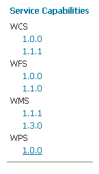

# Installing the WPS extension {: #wps_install }

The WPS module is not a part of GeoServer core, but instead must be installed as an extension. To install WPS:

1.  Navigate to the [GeoServer download page](https://geoserver.org/download).

2.  Find the page that matches the exact version of GeoServer you are running.

    !!! warning

        Be sure to match the version of the extension with that of GeoServer, otherwise errors will occur.

3.  Download the WPS extension: `wps`{.interpreted-text role="download_extension"}

    The download link for **WPS** will be in the **Extensions** section under **Other**.

4.  Extract the files in this archive to the **`WEB-INF/lib`** directory of your GeoServer installation.

5.  Restart GeoServer.

After restarting, load the [Web administration interface](../../webadmin/index.md). If the extension loaded properly, you should see an extra entry for WPS in the **Service Capabilities** column. If you don't see this entry, check the logs for errors.

*A link for the WPS capabilities document will display if installed properly*

## Configuring WPS

WPS processes are subject to the same feature limit as the WFS service. The limit applies to process **input**, so even processes which summarize data and return few results will be affected if applied to very large datasets. The limit is set on the [WFS settings](../wfs/webadmin.md) Admin page.

!!! warning

    If the limit is encountered during process execution, no error is given. Any results computed by the process may be incomplete
