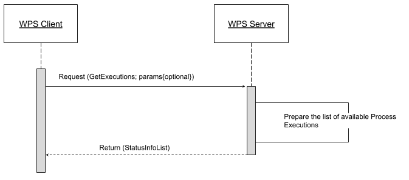
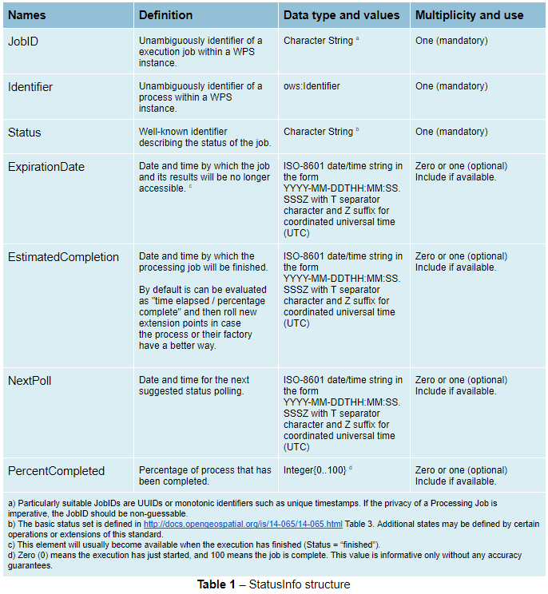
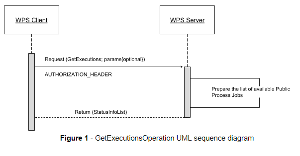
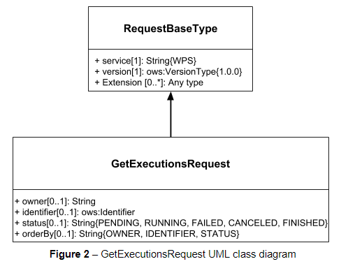
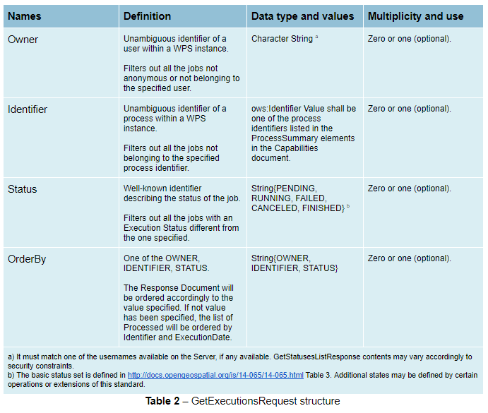
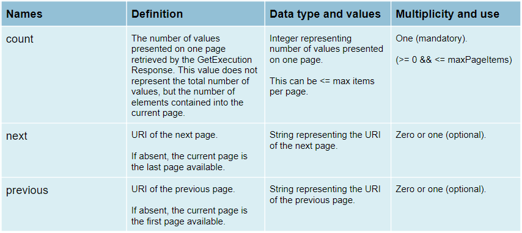
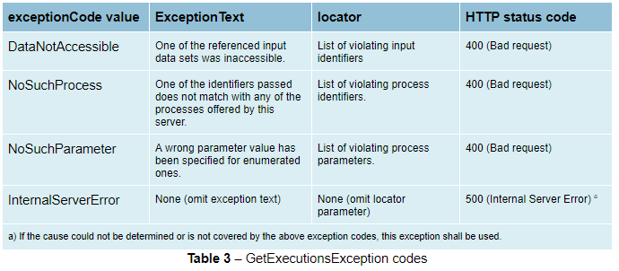

# WPS Operations {: #wps_operations }

The WPS 1.0.0 standard defines three operations for the discovery and execution of geospatial processes, and GeoServer extends these with two further vendor or pseudo-operations. The operations are:

  --------------------------- -----------------------------------------------------------------------------------------------------------------------
  **Operation**               **Description**

  `es`_                      Retrieves details of the service offering, including service metadata and metadata describing the available processes

  `ss`_                      Retrieves a description of a WPS process available through the service

  `te`_                      A request to perform the process with specified input values and required output data items

  `ss`_ (vendor extension)   Used to cancel the execution of a process

  `ns`_ (vendor extension)   Retrieves a list of the current Execution Statuses
  --------------------------- -----------------------------------------------------------------------------------------------------------------------

## GetCapabilities {: #wps_getcaps }

The **GetCapabilities** operation requests details of the service offering, including service metadata and metadata describing the available processes. The response is an XML document called the **capabilities document**.

The required parameters, as in all OGC GetCapabilities requests, are `service=WPS`, `version=1.0.0` and `request=GetCapabilities`.

An example of a GetCapabilities request is:

    http://localhost:8080/geoserver/ows?
      service=WPS&
      version=1.0.0&
      request=GetCapabilities

## DescribeProcess

The **DescribeProcess** operation requests a description of a WPS process available through the service.

The parameter `identifier` specifies the process to describe. Multiple processes can be requested, separated by commas (for example, `identifier=JTS:buffer,gs:Clip`). At least one process must be specified.

!!! note

    As with all OGC parameters, the keys (`request`, `version`, etc) are case-insensitive, and the values (`GetCapabilities`, `JTS:buffer`, etc.) are case-sensitive. GeoServer is generally more relaxed about case, but it is best to follow the specification.

The response is an XML document containing metadata about each requested process, including the following:

-   Process name, title and abstract
-   For each input and output parameter: identifier, title, abstract, multiplicity, and supported datatype and format

An example request for the process `JTS:buffer` is:

    http://localhost:8080/geoserver/ows?
      service=WPS&
      version=1.0.0&
      request=DescribeProcess&
      identifier=JTS:buffer

The response XML document contains the following information:

+--------------------+-------------------------------------------------------------------------------------------------------------------------------------------------+
| **Title**          | "Buffers a geometry using a certain distance"                                                                                                 |
+--------------------+-------------------------------------------------------------------------------------------------------------------------------------------------+
| **Inputs**         | **geom**: "The geometry to be buffered" *(geometry, mandatory)*                                                                               |
|                    |                                                                                                                                                 |
|                    | **distance**: "The distance (same unit of measure as the geometry)" *(double, mandatory)*                                                     |
|                    |                                                                                                                                                 |
|                    | **quadrant segments**: "Number of quadrant segments. Use > 0 for round joins, 0 for flat joins, < 0 for mitred joins" *(integer, optional)* |
|                    |                                                                                                                                                 |
|                    | **capstyle**: "The buffer cap style, round, flat, square" *(literal value, optional)*                                                         |
+--------------------+-------------------------------------------------------------------------------------------------------------------------------------------------+
| **Output formats** | One of the GeoServer supported formats for Geometry encoding                                                                                    |
+--------------------+-------------------------------------------------------------------------------------------------------------------------------------------------+

In general, GeoServer processes use complex objects as inputs and objects, like geometries, feature collections and raster data.

The formats available for input and output of each of those complex processes are commonly managed by Process Parameter IO classes, generic encoders/decoders that are attached to each process by the WPS machinery.

In the core of GeoServer WPS, the following PPIOs are available:

-   For geometries, GML 2 and 3, GeoJSON, Well Known Text.
-   For feature collections, GML2 and 3, GeoJSON, Zipped shapefile, and KML.
-   For rasters, GeoTIFF, PNG, JPEG.

The set of PPIOs can be extended by installing plugins. For example, the `DXF extension<dxf>`{.interpreted-text role="ref"} comes with a PPIO that can encode feature collections in DXF: when plugged in, most processes generating feature collections in output will offer to encode them also in DXF.

## Execute

The **Execute** operation is a request to perform the process with specified input values and required output data items. The request may be made as either a GET URL, or a POST with an XML request document. Because the request has a complex structure, the POST form is more typically used.

The inputs and outputs required for the request depend on the process being executed. GeoServer provides a wide variety of processes to process geometry, features, and coverage data. For more information see the section [Process Cookbook](processes/index.md).

Below is an example of a `Execute` POST request. The example process (`JTS:buffer`) takes as input a geometry `geom` (in this case the point `POINT(0 0)`), a `distance` (with the value `10`), a quantization factor `quadrantSegments` (here set to be 1), and a `capStyle` (specified as `flat`). The `<ResponseForm>` element specifies the format for the single output `result` to be GML 3.1.1.

``` xml
<?xml version="1.0" encoding="UTF-8"?>
<wps:Execute version="1.0.0" service="WPS" xmlns:xsi="http://www.w3.org/2001/XMLSchema-instance" xmlns="http://www.opengis.net/wps/1.0.0" xmlns:wfs="http://www.opengis.net/wfs" xmlns:wps="http://www.opengis.net/wps/1.0.0" xmlns:ows="http://www.opengis.net/ows/1.1" xmlns:gml="http://www.opengis.net/gml" xmlns:ogc="http://www.opengis.net/ogc" xmlns:wcs="http://www.opengis.net/wcs/1.1.1" xmlns:xlink="http://www.w3.org/1999/xlink" xsi:schemaLocation="http://www.opengis.net/wps/1.0.0 http://schemas.opengis.net/wps/1.0.0/wpsAll.xsd">
  <ows:Identifier>JTS:buffer</ows:Identifier>
  <wps:DataInputs>
    <wps:Input>
      <ows:Identifier>geom</ows:Identifier>
      <wps:Data>
        <wps:ComplexData mimeType="application/wkt"><![CDATA[POINT(0 0)]]></wps:ComplexData>
      </wps:Data>
    </wps:Input>
    <wps:Input>
      <ows:Identifier>distance</ows:Identifier>
      <wps:Data>
        <wps:LiteralData>10</wps:LiteralData>
      </wps:Data>
    </wps:Input>
    <wps:Input>
      <ows:Identifier>quadrantSegments</ows:Identifier>
      <wps:Data>
        <wps:LiteralData>1</wps:LiteralData>
      </wps:Data>
    </wps:Input>
    <wps:Input>
      <ows:Identifier>capStyle</ows:Identifier>
      <wps:Data>
        <wps:LiteralData>flat</wps:LiteralData>
      </wps:Data>
    </wps:Input>
  </wps:DataInputs>
  <wps:ResponseForm>
    <wps:RawDataOutput mimeType="application/gml-3.1.1">
      <ows:Identifier>result</ows:Identifier>
    </wps:RawDataOutput>
  </wps:ResponseForm>
</wps:Execute>
```

The process performs a buffer operation using the supplied inputs, and returns the outputs as specified. The response from the request is (with numbers rounded for clarity):

``` xml
<?xml version="1.0" encoding="utf-8"?>
<gml:Polygon xmlns:sch="http://www.ascc.net/xml/schematron"
 xmlns:gml="http://www.opengis.net/gml"
 xmlns:xlink="http://www.w3.org/1999/xlink">
  <gml:exterior>
    <gml:LinearRing>
      <gml:posList>
        10.0 0.0
        0.0 -10.0
        -10.0 0.0 
        0.0 10.0
        10.0 0.0
      </gml:posList>
    </gml:LinearRing>
  </gml:exterior>
</gml:Polygon>
```

For help in generating WPS requests you can use the built-in interactive [WPS Request Builder](requestbuilder.md).

## Dismiss

!!! note

    This is a vendor extension of the GeoServer WPS Service. This operation is specific to GeoServer.

According to the WPS specification, an asynchronous process execution returns a back link to a status location that the client can ping to get progress report about the process, and eventually retrieve its final results.

In GeoServer this link is implemented as a pseudo-operation called `GetExecutionStatus`, and the link has the following structure:

    http://host:port/geoserver/ows?service=WPS&version=1.0.0&request=GetExecutionStatus&executionId=397e8cbd-7d51-48c5-ad72-b0fcbe7cfbdb

The `executionId` identifies the running request, and can be used in the `Dismiss` vendor operation in order to cancel the execution of the process:

> [http://host:port/geoserver/ows?service=WPS&version=1.0.0&request=Dismiss&executionId=397e8cbd-7d51-48c5-ad72-b0fcbe7cfbdb](http://host:port/geoserver/ows?service=WPS&version=1.0.0&request=Dismiss&executionId=397e8cbd-7d51-48c5-ad72-b0fcbe7cfbdb)

Upon receipt GeoServer will do its best to stop the running process, and subsequent calls to `Dismiss` or `GetExecutionStatus` will report that the executionId is not known anymore. Internally, GeoServer will stop any process that attempts to report progress, and poison input and outputs to break the execution of the process, but the execution of processes that already got their inputs, and are not reporting their progress back, will continue until their natural end.

For example, let's consider the "<geo:Buffer>" process, possibly working against a very large input GML geometry, to be fetched from another host. The process itself does a single call to a JTS function, which cannot report progress. Here are three possible scenarios, depending on when the Dismiss operation is invoked:

-   Dismiss is invoked while the GML is being retrieved, in this case the execution will stop immediately
-   Dismiss is invoked while the process is doing the buffering, in this case, the execution will stop as soon as the buffering is completed
-   Dismiss is invoked while the output GML is being encoded, also in this case the execution will stop immediately

## GetExecutions

!!! note

    This is a vendor extension of the GeoServer WPS Service. This operation is specific to GeoServer.

This operation allows a client to recognize the list of WPS Executions.



The client makes a simple "GetExecutions" request to the WPS Server, in order to get back an XML document containing the list of current Execution Statuses.

It is also possible to filter the "GetExecutions" request along with simple parameters, in order to refine the output and get back only the executions status we are looking for.

Adding a bit more to this, AUTHORIZATION headers must be sent along with the "GetExecutions" request; the WPS Server will be able, if the security subsystem is available and enable on the latter, to prove the list resources to the client itself.

The operation will return only the list of available Executions the logged in user has started, except in the case it is an Administrator. In that case he will be able to get the whole list.

If the "lineage" option of the WPS Execute Request has been specified, the client will be able to retrieve the Execute Inputs values provided to the process Identifier.

### StatusInfo Document

Refers to <http://docs.opengeospatial.org/is/14-065/14-065.html> section 9.5 and extends it.

The StatusInfo document is used to provide identification and status information about jobs on a WPS server. The operation adds additional fields to the StatusInfo Document reporting also the WPS Process Identifier and other information on estimated execution and expiration time.



### GetExecutionsOperation

The GetExecutions Operation allows WPS clients to retrieve the list of available process jobs running on a WPS instance. The output is returned in the form of an XML document.

The GetExecutions Operation returns only the list of available Executions the logged in user has started, except in the case it is an Administrator. In that case he will be able to get the whole list.



### GetExecutionsRequest

The GetExecutions Request is a common structure for synchronous execution. It inherits basic properties from the RequestBaseType and contains additional elements that allow to filter out, refine and order the list of available Process Jobs.





### GetExecutionsResponse

The GetExecutionsResponse it is always in the form of an XML document. Except in case of Exception, the response document will contain a list of StatusInfo elements filtered, refined or ordered accordingly to the specified parameters.

### Response paging

Response paging is the ability of a client to scroll through a set of response values, N values at-a-time much like one scrolls through the response from a search engine one page at a time.

Similar to the WFS 2.0.0 response paging mechanism (see section "7.7.4.4 Response paging" of the specification), the output will show to the client the following attributes as part of the response document.



### GetExecutionsExceptions

When a WPS server encounters an error while performing an GetExecutionsResponse, it shall return an exception report as specified in clause 8 of [OGC 06-121r9]. If appropriate, the server shall use additional exception codes as defined in this section.



### Retrieve the WPS Execute Input values

The GetExecutions Operations tries (best-effort) to retrieve the Input values specified from the Execute Request **iff** the `lineage` option has been provided to the Execute Request.

Example requests with the `lineage` option active

``` xml
<?xml version="1.0" encoding="UTF-8"?>
<wps:Execute version="1.0.0" service="WPS" xmlns:xsi="http://www.w3.org/2001/XMLSchema-instance" xmlns="http://www.opengis.net/wps/1.0.0" xmlns:wfs="http://www.opengis.net/wfs" xmlns:wps="http://www.opengis.net/wps/1.0.0" xmlns:ows="http://www.opengis.net/ows/1.1" xmlns:gml="http://www.opengis.net/gml" xmlns:ogc="http://www.opengis.net/ogc" xmlns:wcs="http://www.opengis.net/wcs/1.1.1" xmlns:xlink="http://www.w3.org/1999/xlink" xsi:schemaLocation="http://www.opengis.net/wps/1.0.0 http://schemas.opengis.net/wps/1.0.0/wpsAll.xsd">
  <ows:Identifier>JTS:convexHull</ows:Identifier>
  <wps:DataInputs>
    <wps:Input>
      <ows:Identifier>geom</ows:Identifier>
      <wps:Reference mimeType="application/wkt" xlink:href="http://www.geo-solutions.it/geoserver/wfs?" method="GET"/>
    </wps:Input>
  </wps:DataInputs>
  <wps:ResponseForm>
    <wps:ResponseDocument lineage="true" storeExecuteResponse="true" status="true">
      <wps:Output asReference="false">
        <ows:Identifier>result</ows:Identifier>
      </wps:Output>
    </wps:ResponseDocument>
  </wps:ResponseForm>
</wps:Execute>
```

``` xml
<?xml version="1.0" encoding="UTF-8"?>
<wps:Execute version="1.0.0" service="WPS" xmlns:xsi="http://www.w3.org/2001/XMLSchema-instance" xmlns="http://www.opengis.net/wps/1.0.0" xmlns:wfs="http://www.opengis.net/wfs" xmlns:wps="http://www.opengis.net/wps/1.0.0" xmlns:ows="http://www.opengis.net/ows/1.1" xmlns:gml="http://www.opengis.net/gml" xmlns:ogc="http://www.opengis.net/ogc" xmlns:wcs="http://www.opengis.net/wcs/1.1.1" xmlns:xlink="http://www.w3.org/1999/xlink" xsi:schemaLocation="http://www.opengis.net/wps/1.0.0 http://schemas.opengis.net/wps/1.0.0/wpsAll.xsd">
  <ows:Identifier>gs:BufferFeatureCollection</ows:Identifier>
  <wps:DataInputs>
    <wps:Input>
      <ows:Identifier>features</ows:Identifier>
      <wps:Reference mimeType="text/xml" xlink:href="http://geoserver/wps" method="POST">
        <wps:Body>
            <wps:Execute version="1.0.0" service="WPS" xmlns:xsi="http://www.w3.org/2001/XMLSchema-instance" xmlns="http://www.opengis.net/wps/1.0.0" xmlns:wfs="http://www.opengis.net/wfs" xmlns:wps="http://www.opengis.net/wps/1.0.0" xmlns:ows="http://www.opengis.net/ows/1.1" xmlns:gml="http://www.opengis.net/gml" xmlns:ogc="http://www.opengis.net/ogc" xmlns:wcs="http://www.opengis.net/wcs/1.1.1" xmlns:xlink="http://www.w3.org/1999/xlink" xsi:schemaLocation="http://www.opengis.net/wps/1.0.0 http://schemas.opengis.net/wps/1.0.0/wpsAll.xsd">
              <ows:Identifier>gs:CollectGeometries</ows:Identifier>
              <wps:DataInputs>
                <wps:Input>
                  <ows:Identifier>features</ows:Identifier>
                  <wps:Reference mimeType="text/xml" xlink:href="http://geoserver/wfs" method="POST">
                    <wps:Body>
                      <wfs:GetFeature service="WFS" version="1.0.0" outputFormat="GML2" xmlns:geonode="http://www.geonode.org/">
                        <wfs:Query typeName="geonode:san_andres_y_providencia_administrative"/>
                      </wfs:GetFeature>
                    </wps:Body>
                  </wps:Reference>
                </wps:Input>
              </wps:DataInputs>
              <wps:ResponseForm>
                <wps:RawDataOutput lineage="true" mimeType="text/xml; subtype=gml/3.1.1">
                  <ows:Identifier>result</ows:Identifier>
                </wps:RawDataOutput>
              </wps:ResponseForm>
            </wps:Execute>
        </wps:Body>
      </wps:Reference>
    </wps:Input>
    <wps:Input>
      <ows:Identifier>distance</ows:Identifier>
      <wps:Data>
        <wps:LiteralData>0.005</wps:LiteralData>
      </wps:Data>
    </wps:Input>
  </wps:DataInputs>
  <wps:ResponseForm>
    <wps:ResponseDocument lineage="true" storeExecuteResponse="true" status="true">
      <wps:Output asReference="false">
        <ows:Identifier>result</ows:Identifier>
      </wps:Output>
    </wps:ResponseDocument>
  </wps:ResponseForm>
</wps:Execute>
```

``` xml
<?xml version="1.0" encoding="UTF-8"?>
<wps:Execute version="1.0.0" service="WPS" xmlns:xsi="http://www.w3.org/2001/XMLSchema-instance" xmlns="http://www.opengis.net/wps/1.0.0" xmlns:wfs="http://www.opengis.net/wfs" xmlns:wps="http://www.opengis.net/wps/1.0.0" xmlns:ows="http://www.opengis.net/ows/1.1" xmlns:gml="http://www.opengis.net/gml" xmlns:ogc="http://www.opengis.net/ogc" xmlns:wcs="http://www.opengis.net/wcs/1.1.1" xmlns:xlink="http://www.w3.org/1999/xlink" xsi:schemaLocation="http://www.opengis.net/wps/1.0.0 http://schemas.opengis.net/wps/1.0.0/wpsAll.xsd">
  <ows:Identifier>gs:Clip</ows:Identifier>
  <wps:DataInputs>
    <wps:Input>
      <ows:Identifier>features</ows:Identifier>
      <wps:Reference mimeType="text/xml" xlink:href="http://geoserver/wfs" method="POST">
        <wps:Body>
          <wfs:GetFeature service="WFS" version="1.0.0" outputFormat="GML2" xmlns:geonode="http://www.geonode.org/">
            <wfs:Query typeName="geonode:san_andres_y_providencia_administrative"/>
          </wfs:GetFeature>
        </wps:Body>
      </wps:Reference>
    </wps:Input>
    <wps:Input>
      <ows:Identifier>clip</ows:Identifier>
      <wps:Data>
        <wps:ComplexData mimeType="application/json"><![CDATA[{"type":"MultiLineString","coordinates":[[[-81.8254,12.199],[-81.8162,12.1827],[-81.812,12.1653],[-81.8156,12.1465],[-81.8269,12.1321],[-81.8433,12.123],[-81.8614,12.119],[-81.8795,12.1232],[-81.8953,12.1336],[-81.9049,12.1494],[-81.9087,12.1673],[-81.9054,12.1864],[-81.8938,12.2004],[-81.8795,12.2089],[-81.8593,12.2136],[-81.8399,12.2096],[-81.8254,12.199]],[[-81.6565,12.635],[-81.6808,12.6391],[-81.7085,12.6262],[-81.739,12.6046],[-81.7611,12.5775],[-81.775,12.5397],[-81.7708,12.5207],[-81.7667,12.4971],[-81.7701,12.4748],[-81.7646,12.4504],[-81.739,12.4369],[-81.7022,12.4389],[-81.6835,12.4578],[-81.6794,12.4883],[-81.6676,12.5153],[-81.651,12.541],[-81.66,12.5552],[-81.6489,12.5762],[-81.6274,12.5931],[-81.6309,12.6181],[-81.6565,12.635]],[[-81.2954,13.3496],[-81.3004,13.3132],[-81.3143,13.29],[-81.3413,13.2755],[-81.3731,13.2674],[-81.4058,13.2657],[-81.4335,13.2633],[-81.4531,13.2771],[-81.4574,13.3079],[-81.4663,13.3257],[-81.463,13.3476],[-81.447,13.3674],[-81.4228,13.3879],[-81.412,13.4126],[-81.403,13.4375],[-81.391,13.4582],[-81.3674,13.4687],[-81.3503,13.4574],[-81.3205,13.448],[-81.2941,13.4177],[-81.2846,13.3878],[-81.2954,13.3496]],[[-79.9333,14.9856],[-79.9333,15.5028]]]}]]></wps:ComplexData>
      </wps:Data>
    </wps:Input>
  </wps:DataInputs>
  <wps:ResponseForm>
    <wps:ResponseDocument lineage="true" storeExecuteResponse="true" status="true">
      <wps:Output asReference="false">
        <ows:Identifier>result</ows:Identifier>
      </wps:Output>
    </wps:ResponseDocument>
  </wps:ResponseForm>
</wps:Execute>
```
