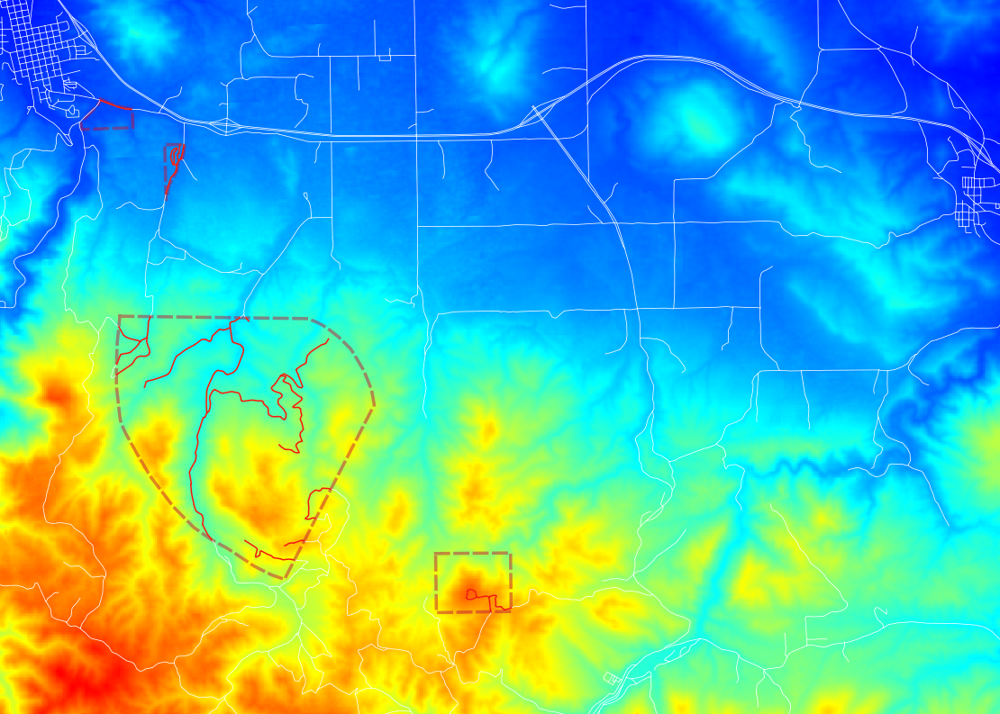

# Process chaining

One of the benefits of WPS is its native ability to chain processes. Much like how functions can call other functions, a WPS process can use as its input the output of another process. Many complex functions can thus be combined in to a single powerful request.

For example, let's take some of the sample data that is shipped with GeoServer and use the WPS engine to chain a few of the built in processes, which will allow users to perform geospatial analysis on the fly.

The question we want to answer in this example is the following: How many miles of roads are crossing a protected area?

The data that will be used for this example is included with a standard installation of GeoServer:

-   `sf:roads`: the layer that contains road information
-   `sf:restricted`: the layer representing restricted areas

The restricted areas partially overlap the roads. We would like to know the total length of roads inside the restricted areas, as shown in the next screenshot. The road network is represented in white against a false color DEM (Digital Elevation Model). The restricted areas are represented with a dashed line in dark brown. The portion of the road network that is inside the restricted areas is drawn in red.


*Length of total roads inside restricted area*

In order to calculate the total length, we will need the following built in WPS processes:

-   `gs:IntersectionFeatureCollection`: returns the intersection between two feature collections adding the attributes from both of them
-   `gs:CollectGeometries`: collects all the default geometries in a feature collection and returns them as a single geometry collection
-   `JTS:length`: calculates the length of a geometry in the same unit of measure as the geometry

The sequence in which these processes are executed is important. The first thing we want to do is intersect the road network with the restricted areas. This gives us the feature collection with all the roads that we are interested in. Then we collect those geometries into a single GeometryCollection so that the length can be calculated with the built in JTS algorithm.

``gs:IntersectionFeatureCollection`` --> ``gs:CollectGeometries`` --> ``JTS:length``

The sequence of processes determines how the WPS request is built, by embedding the first process into the second, the second into the third, etc. A process produces some output which will become the input of the next process, resulting in a processing pipeline that can solve complex spatial analysis with a single HTTP request. The advantage of using GeoServer's layers is that data is not being shipped back and forth between processes, resulting in very good performance.

Here is the complete WPS request in XML format:

``` xml
<?xml version="1.0" encoding="UTF-8"?>
<wps:Execute version="1.0.0" service="WPS" xmlns:xsi="http://www.w3.org/2001/XMLSchema-instance" xmlns="http://www.opengis.net/wps/1.0.0" xmlns:wfs="http://www.opengis.net/wfs" xmlns:wps="http://www.opengis.net/wps/1.0.0" xmlns:ows="http://www.opengis.net/ows/1.1" xmlns:gml="http://www.opengis.net/gml" xmlns:ogc="http://www.opengis.net/ogc" xmlns:wcs="http://www.opengis.net/wcs/1.1.1" xmlns:xlink="http://www.w3.org/1999/xlink" xsi:schemaLocation="http://www.opengis.net/wps/1.0.0 http://schemas.opengis.net/wps/1.0.0/wpsAll.xsd">

  <ows:Identifier>JTS:length</ows:Identifier>
  <wps:DataInputs>
    <wps:Input>
      <ows:Identifier>geom</ows:Identifier>
 <wps:Reference mimeType="text/xml; subtype=gml/3.1.1"
            xlink:href="http://geoserver/wps" method="POST">
      <wps:Body>
        <wps:Execute version="1.0.0" service="WPS">
          <ows:Identifier>gs:CollectGeometries</ows:Identifier>
          <wps:DataInputs>
            <wps:Input>
              <ows:Identifier>features</ows:Identifier>
              <wps:Reference mimeType="text/xml; subtype=wfs-collection/1.0" xlink:href="http://geoserver/wps" method="POST">
                <wps:Body>
                  <wps:Execute version="1.0.0" service="WPS">
                    <ows:Identifier>gs:IntersectionFeatureCollection</ows:Identifier>
                    <wps:DataInputs>
                      <wps:Input>
                        <ows:Identifier>first feature collection</ows:Identifier>
                        <wps:Reference mimeType="text/xml; subtype=wfs-collection/1.0" xlink:href="http://geoserver/wfs" method="POST">
                          <wps:Body>
                            <wfs:GetFeature service="WFS" version="1.0.0" outputFormat="GML2">
                              <wfs:Query typeName="sf:roads"/>
                            </wfs:GetFeature>
                          </wps:Body>
                        </wps:Reference>
                      </wps:Input>
                      <wps:Input>
                        <ows:Identifier>second feature collection</ows:Identifier>
                        <wps:Reference mimeType="text/xml; subtype=wfs-collection/1.0" xlink:href="http://geoserver/wfs" method="POST">
                          <wps:Body>
                            <wfs:GetFeature service="WFS" version="1.0.0" outputFormat="GML2">
                              <wfs:Query typeName="sf:restricted"/>
                            </wfs:GetFeature>
                          </wps:Body>
                        </wps:Reference>
                      </wps:Input>
                      <wps:Input>
                        <ows:Identifier>first attributes to retain</ows:Identifier>
                        <wps:Data>
                          <wps:LiteralData>the_geom cat</wps:LiteralData>
                        </wps:Data>
                      </wps:Input>
                      <wps:Input>
                        <ows:Identifier>second attributes to retain</ows:Identifier>
                        <wps:Data>
                          <wps:LiteralData>cat</wps:LiteralData>
                        </wps:Data>
                      </wps:Input>
                    </wps:DataInputs>
                    <wps:ResponseForm>
                      <wps:RawDataOutput mimeType="text/xml;
                subtype=wfs-collection/1.0">
                        <ows:Identifier>result</ows:Identifier>
                      </wps:RawDataOutput>
                    </wps:ResponseForm>
                  </wps:Execute>
                </wps:Body>
              </wps:Reference>
            </wps:Input>
          </wps:DataInputs>
          <wps:ResponseForm>
            <wps:RawDataOutput mimeType="text/xml; subtype=gml/3.1.1">
              <ows:Identifier>result</ows:Identifier>
            </wps:RawDataOutput>
          </wps:ResponseForm>
        </wps:Execute>
      </wps:Body>
    </wps:Reference>
    </wps:Input>
  </wps:DataInputs>
  <wps:ResponseForm>
    <wps:RawDataOutput>
      <ows:Identifier>result</ows:Identifier>
    </wps:RawDataOutput>
  </wps:ResponseForm>
</wps:Execute>
```

You can save this XML request in a file called wps-chaining.xml and execute the request using cURL like this:

> curl -u admin:geoserver -H 'Content-type: xml' -XPOST -d@'wps-chaining.xml' <http://localhost:8080/geoserver/wps>

The response is just a number, the total length of the roads that intersect the restricted areas, and should be around *25076.285* meters (the length process returns map units)

To see WPS requests in action, you can use the built-in [WPS Request Builder](../requestbuilder.md).
