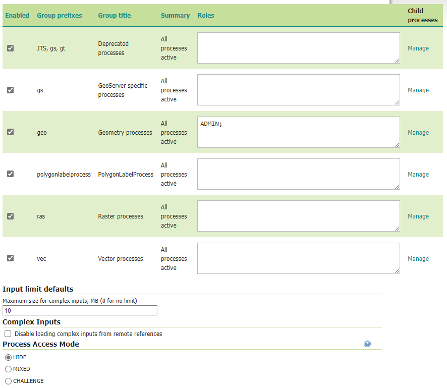
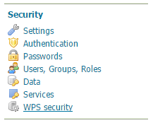
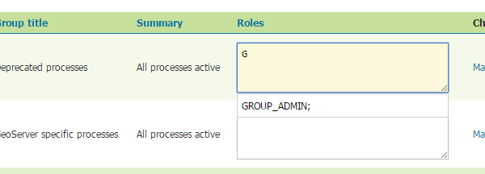
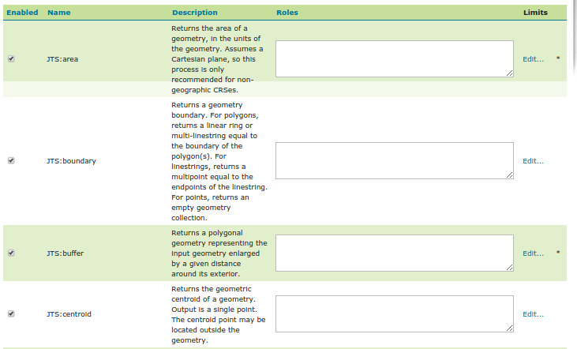
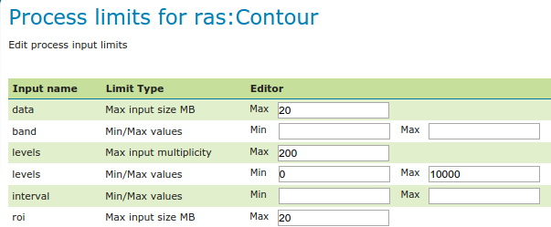

# WPS Security and input limits

GeoServer service security is normally based on the generic [OGC security configuration](../../security/service.md), however, when it comes to WPS there is also a need to **restrict access to individual processes**, in the same way that data security restricts access to layers.

WPS security allows access to be determined by process group or by single process. Each process and process group can be enabled/disabled, or subject to access control based on the user roles.

*The WPS security page*

The WPS security configurations can be changed using the [Web administration interface](../../webadmin/index.md) on the **WPS security** page under **Security**.

*Click to access the WPS security settings*

## Setting access roles

The list of roles attached to each group or process will determine which users can access which processes. If the list is empty the group/process will be available to all users, unless it has been disabled, in which case it won't be available to anyone.

The roles string must be a list of roles separated by semicolons. The role editor provides auto-completion and also allows quick copy and paste of role lists from one process definition to the other:

*Role selector field with auto-complete*

## Access modes

The process access mode configuration specifies how GeoServer will advertise secured processes and behave when a secured process is accessed without the necessary privileges. The parameter can be one of three values:

-   **HIDE** (default): The processes not available to the current user will be hidden from the user (not listed in the capabilities documents). Direct access will result in GeoServer claiming the process does not exist.
-   **CHALLENGE**: All processes will be shown in the capabilities documents, but an authentication request will be raised if a secured process is specifically requested by a user that does not have sufficient access rights
-   **MIXED**: The secured processes will not be shown in the capabilities documents for users not having sufficient access rights, but an authentication request will still be raised if a secured process is requested.

## Complex Inputs

By default, Execute requests support loading complex inputs from references to local files and external servers. This behavior can be restricted in the **Complex Inputs** section. When the flag is checked, an Execute request with an input reference that is not an internal WCS/WFS/WPS request will result in a service exception reporting the error.

## Input limits

The amount of resources used by a process is usually related directly to the inputs of the process itself. With this in mind, administrators can set three different type of limits on each process inputs:

-   The maximum size of complex inputs

-   The range of acceptable values for numeric values

-   The maximum multiplicity of repeatable inputs

    !!! note

        As an example of the last point, think of contour extraction, where the number of levels for the contours can drastically affect the execution time

GeoServer allows the administrator to configure these limits, and fail requests that don't respect them.

The maximum size can be given a global default on the **WPS security** page. It is also possible to define limits on a per-process basis by navigating to the process limits editor in the process list.

!!! note

    Processes having a `*` beside the link have a defined set of limits

*The process selector, with access constraints and links to the limits configuration*

The process limits editor shows all inputs for which a limit can be provided. An empty field means that limits are disabled for that input.

*The process limit page, with input limits configured*

!!! warning

    In order for the limits to be saved: click on **OK** on this **Process limits** page; and then click **OK** on the **Process selection** page; and finally **Save** on the **WPS security** page.
