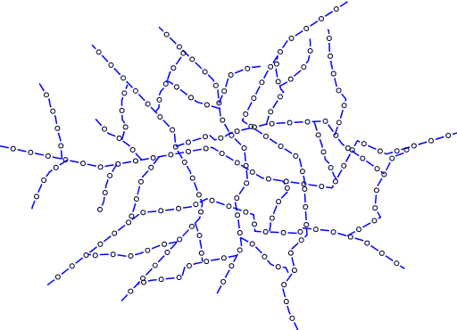
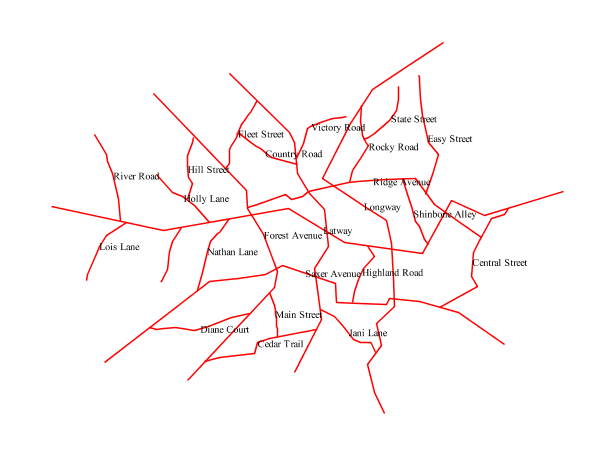
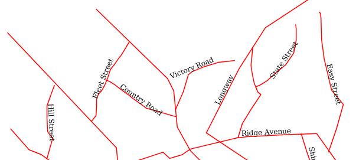
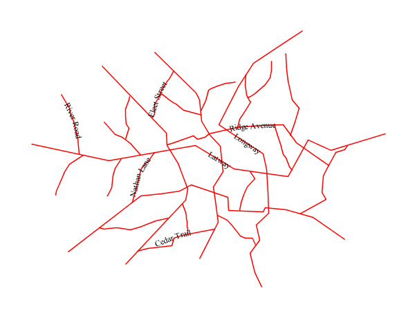
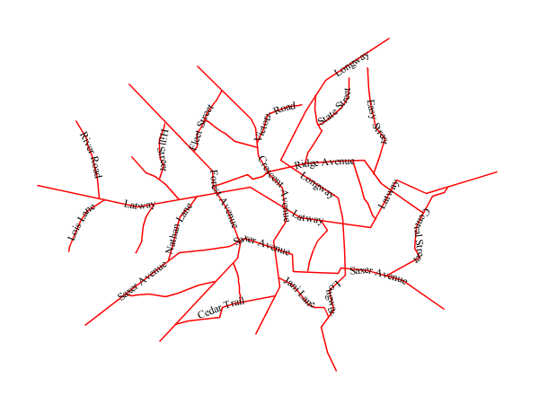
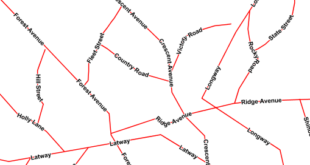
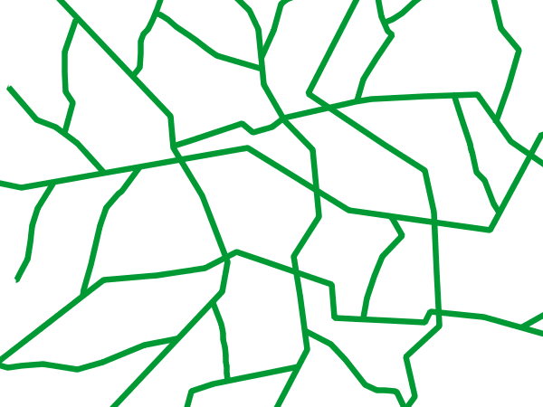

# Lines

While lines can also seem to be simple shapes, having length but no width, there are many options and tricks for making lines display nicely.

## Example lines layer {: #css_cookbook_lines_attributes }

The [lines layer](../../sld/cookbook/artifacts/sld_cookbook_line.zip) used in the examples below contains road information for a fictional country. For reference, the attribute table for the points in this layer is included below.

|                      |                      |                       |
|----------------------|----------------------|-----------------------|
| **fid** (Feature ID) | **name** (Road name) | **type** (Road class) |
| line.1               | Latway               | highway               |
| line.2               | Crescent Avenue      | secondary             |
| line.3               | Forest Avenue        | secondary             |
| line.4               | Longway              | highway               |
| line.5               | Saxer Avenue         | secondary             |
| line.6               | Ridge Avenue         | secondary             |
| line.7               | Holly Lane           | local-road            |
| line.8               | Mulberry Street      | local-road            |
| line.9               | Nathan Lane          | local-road            |
| line.10              | Central Street       | local-road            |
| line.11              | Lois Lane            | local-road            |
| line.12              | Rocky Road           | local-road            |
| line.13              | Fleet Street         | local-road            |
| line.14              | Diane Court          | local-road            |
| line.15              | Cedar Trail          | local-road            |
| line.16              | Victory Road         | local-road            |
| line.17              | Highland Road        | local-road            |
| line.18              | Easy Street          | local-road            |
| line.19              | Hill Street          | local-road            |
| line.20              | Country Road         | local-road            |
| line.21              | Main Street          | local-road            |
| line.22              | Jani Lane            | local-road            |
| line.23              | Shinbone Alley       | local-road            |
| line.24              | State Street         | local-road            |
| line.25              | River Road           | local-road            |

[Download the lines shapefile](../../sld/cookbook/artifacts/sld_cookbook_line.zip)

## Simple line {: #css_cookbook_lines_simpleline }

This example specifies lines be colored black with a thickness of 3 pixels.


*Simple line*

### Code

``` {.css linenos=""}
* { 
  stroke: black;
  stroke-width: 3px;
}
```

### Details

The only rule asks for a black stroke (this attribute is mandatory to get strokes to actually show up), 3 pixels wide.

## Line with border

This example shows how to draw lines with borders (sometimes called "cased lines"). In this case the lines are drawn with a 3 pixel blue center and a 1 pixel wide gray border.


*Line with border*

### Code

``` {.css linenos=""}
* { 
  stroke: #333333, #6699FF;
  stroke-width: 5px, 3px;
  stroke-linecap: round;
  z-index: 0, 1;
}
```

### Details

Lines in CSS have no notion of a "fill", only "stroke". Thus, unlike points or polygons, it is not possible to style the "edge" of the line geometry. It is, however, possible to achieve this effect by drawing each line twice: once with a certain width and again with a slightly smaller width. This gives the illusion of fill and stroke by obscuring the larger lines everywhere except along the edges of the smaller lines.

The style uses the "multi-valued properties" CSS support by specifying two strokes and two stroke-widths. This causes each feature to be painted twice, first with a dark gray (`#333333`) line 5 pixels wide, and then a thinner blue (`#6699FF`) line 3 pixels wide.

Since every line is drawn twice, the order of the rendering is *very* important. Without the z-index indication, each feature would first draw the gray stroke and then the blue one, and then the rendering engine would move to the next feature, and so on. This would result in ugly overlaps when lines do cross. By using the z-index property (**Line 3**) instead, all gray lines will be painted first, and then all blue lines will painted on top, thus making sure the blue lines visually connect.

The "stroke-linecap" property is the only one having a single value, this is because the value is the same for both the gray and blue line.

The result is a 3 pixel blue line with a 1 pixel gray border, since the 5 pixel gray line will display 1 pixel on each side of the 3 pixel blue line.

## Dashed line

This example alters the [Simple line](line.md#css_cookbook_lines_simpleline) to create a dashed line consisting of 5 pixels of drawn line alternating with 2 pixels of blank space.


*Dashed line*

### Code

``` {.css linenos=""}
* { 
  stroke: blue;
  stroke-width: 3px;
  stroke-dasharray: 5 2;
}
```

### Details

In this example the we create a blue line, 3 pixels wide, and specify a dash array with value "5 2", which creates a repeating pattern of 5 pixels of drawn line, followed by 2 pixels of omitted line.

## Railroad (hatching)

This example uses hatching to create a railroad style. Both the line and the hatches are black, with a 2 pixel thickness for the main line and a 1 pixel width for the perpendicular hatches.


*Railroad (hatching)*

### Code

``` {.scss linenos=""}
* { 
  stroke: #333333, symbol("shape://vertline");
  stroke-width: 3px;
  :nth-stroke(2) {
    size: 12;
    stroke: #333333;
    stroke-width: 1px;
  }
}
```

### Details

In this example a multi-valued stroke is used: the fist value makes the renderer paint a dark gray line (3 pixels wide, according to the "stroke-width" attribute), whilst the second value makes the line be painted by repeating the "shape://vertline" symbol over and over, creating the hatching effect.

In order to specify how the symbol itself should be painted, the ":nth-stroke(2)" pseudo-selector is used at **Line 4** to specify the options for the repeated symbol: in particular with are instructing the renderer to create a 12px wide symbol, with a dark gray stroke 1 pixel wide.

## Spaced graphic symbols

This example uses a graphic stroke along with dash arrays to create a "dot and space" line type. Adding the dash array specification allows to control the amount of space between one symbol and the next one. Without using the dash array the lines would be densely populated with dots, each one touching the previous one.


*Spaced symbols along a line*

### Code

``` {.scss linenos=""}
* { 
  stroke: symbol(circle);
  stroke-dasharray: 4 6;
  :stroke {
    size: 4;
    fill: #666666;
    stroke: #333333;
    stroke-width: 1px;
  }
}
```

### Details

This example, like others before, uses `symbol(circle)` to place a graphic symbol along a line.

The symbol details are specified in the nested rule at **Line 4** using the ":stroke" pseudo-selector, creating a gray fill circle, 4 pixels wide, with a dark gray outline.

The spacing between symbols is controlled with the `stroke-dasharray` at **line 3**, which specifies 4 pixels of pen-down (just enough to draw the circle) and 6 pixels of pen-up, to provide the spacing.

## Alternating symbols with dash offsets {: #css_cookbook_lines_dashoffset }

This example shows how to create a complex line style which alternates a dashed line and a graphic symbol. The code builds on features shown in the previous examples:

> -   `stroke-dasharray` controls pen-down/pen-up behavior to generate dashed lines
> -   `symbol(...)` places symbols along a line combining the two allows control of symbol spacing

This also shows the usage of a ``dash offset``, which controls where rendering starts in the dash array. For example, with a dash array of `5 10` and a dash offset of `7` the renderer starts drawing the pattern 7 pixels from the beginning. It skips the 5 pixels pen-down section and 2 pixels of the pen-up section, then draws the remaining 8 pixels of pen-up, then 5 down, 10 up, and so on.

The example shows how to use these features to create two synchronized sequences of dash arrays, one drawing line segments and the other symbols.


*Alternating dash and symbol*

### Code

``` {.scss linenos=""}
* { 
  stroke: blue, symbol(circle);
  stroke-width: 1px;
  stroke-dasharray: 10 10, 5 15;
  stroke-dashoffset: 0, 7.5;
  :nth-stroke(2) {
    stroke: #000033;
    stroke-width: 1px;
    size: 5px;
  }
}
```

### Details

| This example uses again multi-valued properties to create two subsequent strokes applied to the same lines.
| The first stroke is a solid blue line, 1 pixel wide, with a dash array of "10 10".
| The second one instead is a repeated circle, using a dash array of "5 15" and with a dash offset of 7.5. This makes the sequence start with 12.5 pixels of white space, then a circle (which is then centered between the two line segments of the other pattern), then 15 pixels of white space, and so on.

The circle portrayal details are specified using the pseudo selector "nth-stroke(2)" at **line 6**, asking for circles that are 5 pixels wide, not filled, and with a dark blue outline.

## Line with default label {: #css_cookbook_lines_defaultlabel }

This example shows a text label on the simple line. This is how a label will be displayed in the absence of any other customization.


*Line with default label*

### Code

``` {.css linenos=""}
* { 
  stroke: red;
  label: [name];
  font-fill: black;
}
```

### Details

This example paints lines with a red stroke, and then adds horizontal black labels at the center of the line, using the "name" attribute to fill the label.

## Labels along line with perpendicular offset {: #css_cookbook_lines_perpendicularlabel }

This example shows a text label on the simple line, just like the previous example, but will force the label to be parallel to the lines, and will offset them a few pixels away.


*Line with default label*

### Code

``` {.css linenos=""}
* { 
  stroke: red;
  label: [name];
  label-offset: 7px;
  font-fill: black;
}
```

### Details

This example is line by line identical to the previous one, but it add a new attribute "label-offset", which in the case of lines, when having a single value, is interpreted as a perpendicular offset from the line. The label is painted along a straight line, parallel to the line orientation in the center point of the label.

## Label following line {: #css_cookbook_lines_labelfollowingline }

This example renders the text label to follow the contour of the lines.


*Label following line*

### Code

``` {.css linenos=""}
* { 
  stroke: red;
  label: [name];
  font-fill: black;
  label-follow-line: true;
}
```

### Details

As the [Line with default label](line.md#css_cookbook_lines_defaultlabel) example showed, the default label behavior isn't optimal.

This example is similar to the [Line with default label](line.md#css_cookbook_lines_defaultlabel) example with the exception of **line 5** where the "label-follow-line" option is specified, which forces the labels to strickly follow the line.

Not all labels are visible partly because of conflict resolution, and partly because the renderer cannot find a line segment long and "straight" enough to paint the label (labels are not painted over sharp turns by default).

## Optimized label placement {: #css_cookbook_lines_optimizedlabel }

This example optimizes label placement for lines such that the maximum number of labels are displayed.


*Optimized label*

### Code

``` {.css linenos=""}
* { 
  stroke: red;
  label: [name];
  font-fill: black;
  label-follow-line: true;
  label-max-angle-delta: 90;
  label-max-displacement: 400;
  label-repeat: 150;
}
```

### Details

This example is similar to the previous example, [Label following line](line.md#css_cookbook_lines_labelfollowingline). The only differences are contained in **lines 6-8**. **Line 6** sets the maximum angle that the label will follow. This sets the label to never bend more than 90 degrees to prevent the label from becoming illegible due to a pronounced curve or angle. **Line 7** sets the maximum displacement of the label to be 400 pixels. In order to resolve conflicts with overlapping labels, GeoServer will attempt to move the labels such that they are no longer overlapping. This value sets how far the label can be moved relative to its original placement. Finally, **line 8** sets the labels to be repeated every 150 pixels. A feature will typically receive only one label, but this can cause confusion for long lines. Setting the label to repeat ensures that the line is always labeled locally.

## Optimized and styled label {: #css_cookbook_lines_optimizedstyledlabel }

This example improves the style of the labels from the [Optimized label placement](line.md#css_cookbook_lines_optimizedlabel) example.


*Optimized and styled label*

### Code

``` {.css linenos=""}
* { 
  stroke: red;
  label: [name];
  font-family: Arial;
  font-weight: bold;
  font-fill: black;
  font-size: 10;
  halo-color: white;
  halo-radius: 1;
  label-follow-line: true;
  label-max-angle-delta: 90;
  label-max-displacement: 400;
  label-repeat: 150;
}
```

### Details

This example is similar to the [Optimized label placement](line.md#css_cookbook_lines_optimizedlabel). The only differences are:

> -   The font family and weight have been specified
> -   In order to make the labels easier to read, a white "halo" has been added. The halo draws a thin 1 pixel white border around the text, making it stand out from the background.

## Attribute-based line

This example styles the lines differently based on the "type" (Road class) attribute.


*Attribute-based line*

### Code

``` {.css linenos=""}
[type = 'local-road'] {
  stroke: #009933;
  stroke-width: 2;
  z-index: 0;
}

[type = 'secondary'] {
  stroke: #0055CC;
  stroke-width: 3;
  z-index: 1;
}

[type = 'highway'] {
  stroke: #FF0000;
  stroke-width: 6;
  z-index: 2;
}
```

### Details

!!! note

    Refer to the [Example lines layer](line.md#css_cookbook_lines_attributes) to see the attributes for the layer. This example has eschewed labels in order to simplify the style, but you can refer to the example [Optimized and styled label](line.md#css_cookbook_lines_optimizedstyledlabel) to see which attributes correspond to which points.

There are three types of road classes in our fictional country, ranging from back roads to high-speed freeways: "highway", "secondary", and "local-road". In order to make sure the roads are rendered in the proper order of importance, a "z-index" attribute has been placed in each rule.

The three rules are designed as follows:

|                |                      |                   |          |
|----------------|----------------------|-------------------|----------|
| **Rule order** | **Rule name / type** | **Color**         | **Size** |
| 1              | local-road           | `#009933` (green) | 2        |
| 2              | secondary            | `#0055CC` (blue)  | 3        |
| 3              | highway              | `#FF0000` (red)   | 6        |

**Lines 1-5** comprise the first rule, the filter matches all roads that the "type" attribute has a value of "local-road". If this condition is true for a particular line, the rule renders it dark green, 2 pixels wide. All these lines are rendered first, and thus sit at the bottom of the final map.

**Lines 7-11** match the "secondary" roads, painting them dark blue, 3 pixels wide. Given the "z-index" is 1, they are rendered after the local roads, but below the highways.

**Lines 13-17** match the "highway" roads, painting them red 6 pixels wide. These roads are pained last, thus, on top of all others.

## Zoom-based line

This example alters the [Simple line](line.md#css_cookbook_lines_simpleline) style at different zoom levels.


*Zoom-based line: Zoomed in*


*Zoom-based line: Partially zoomed*


*Zoom-based line: Zoomed out*

### Code

``` {.css linenos=""}
* {
  stroke: #009933;
}

[@sd < 180M] {
  stroke-width: 6;
}

[@sd > 180M] [@sd < 360M] {
  stroke-width: 4;
}

[@sd > 360M] {
  stroke-width: 2;
}
```

### Details

It is often desirable to make shapes larger at higher zoom levels when creating a natural-looking map. This example varies the thickness of the lines according to the zoom level (or more accurately, scale denominator). Scale denominators refer to the scale of the map. A scale denominator of 10,000 means the map has a scale of 1:10,000 in the units of the map projection.

!!! note

    Determining the appropriate scale denominators (zoom levels) to use is beyond the scope of this example.

This style contains three rules. The three rules are designed as follows:

|                |               |                                |                |
|----------------|---------------|--------------------------------|----------------|
| **Rule order** | **Rule name** | **Scale denominator**          | **Line width** |
| 1              | Large         | 1:180,000,000 or less          | 6              |
| 2              | Medium        | 1:180,000,000 to 1:360,000,000 | 4              |
| 3              | Small         | Greater than 1:360,000,000     | 2              |

The order of these rules does not matter since the scales denominated in each rule do not overlap.

The first rule provides the stroke color used at all zoom levels, dark gray, while the other three rules cascade over it applying the different stroke widths based on the current zoom level leveraging the "@sd" pseudo attribute. The "@sd" pseudo attribute can only be compared using the "<" and ">" operators, using any other operator will result in errors.

The result of this style is that lines are drawn with larger widths as one zooms in and smaller widths as one zooms out.
