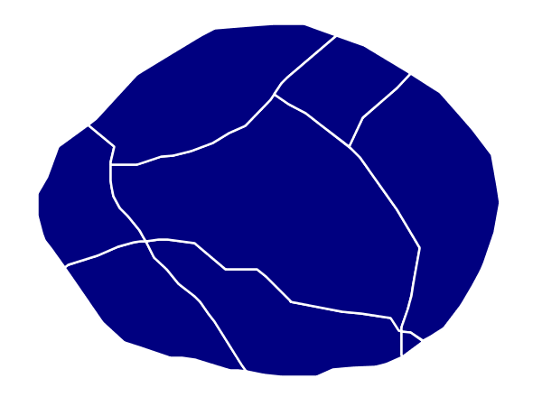
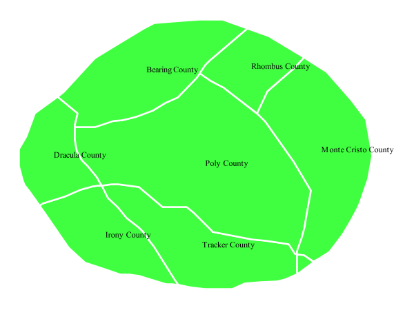
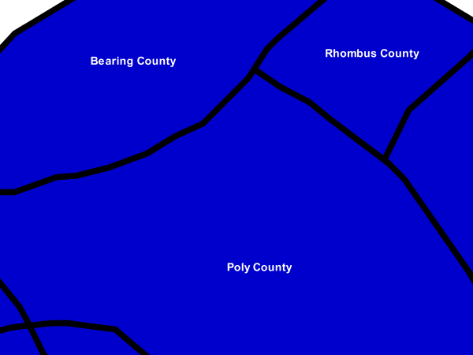

# Polygons

Polygons are two dimensional shapes that contain both an outer edge (or "stroke") and an inside (or "fill"). A polygon can be thought of as an irregularly-shaped point and is styled in similar ways to points.

## Example polygons layer {: #css_cookbook_polygons_attributes }

The [polygons layer](../../sld/cookbook/artifacts/sld_cookbook_polygon.zip) used below contains county information for a fictional country. For reference, the attribute table for the polygons is included below.

|                      |                        |                      |
|----------------------|------------------------|----------------------|
| **fid** (Feature ID) | **name** (County name) | **pop** (Population) |
| polygon.1            | Irony County           | 412234               |
| polygon.2            | Tracker County         | 235421               |
| polygon.3            | Dracula County         | 135022               |
| polygon.4            | Poly County            | 1567879              |
| polygon.5            | Bearing County         | 201989               |
| polygon.6            | Monte Cristo County    | 152734               |
| polygon.7            | Massive County         | 67123                |
| polygon.8            | Rhombus County         | 198029               |

[Download the polygons shapefile](../../sld/cookbook/artifacts/sld_cookbook_polygon.zip)

## Simple polygon {: #css_cookbook_polygons_simplepolygon }

This example shows a polygon filled in blue.


*Simple polygon*

### Code

``` {.css linenos=""}
* { 
  fill: #000080; 
}
```

### Details

This simple rule applies a dark blue (`#000080`) fill to all the polygons in the dataset.

!!! note

    The light-colored borders around the polygons in the figure are artifacts of the renderer caused by the polygons being adjacent. There is no border in this style.

## Simple polygon with stroke {: #css_cookbook_polygons_simplepolygonwithstroke }

This example adds a 2 pixel white stroke to the [Simple polygon](polygon.md#css_cookbook_polygons_simplepolygon) example.


*Simple polygon with stroke*

### Code

``` {.css linenos=""}
* { 
  fill: #000080; 
  stroke: #FFFFFF;
  stroke-width: 2;
}
```

### Details

This example is similar to the [Simple polygon](polygon.md#css_cookbook_polygons_simplepolygon) example above, with the addition of the "stroke" and "stroke-width" attributes, that add a white, 2 pixels wide border around each polygon.

## Transparent polygon

This example builds on the [Simple polygon with stroke](polygon.md#css_cookbook_polygons_simplepolygonwithstroke) example and makes the fill partially transparent by setting the opacity to 50%.


*Transparent polygon*

### Code

``` {.css linenos=""}
* { 
  fill: #000080; 
  fill-opacity: 0.5;
  stroke: #FFFFFF;
  stroke-width: 2;
}
```

### Details

This example is similar to the [Simple polygon with stroke](polygon.md#css_cookbook_polygons_simplepolygonwithstroke) example, save for defining the fill's opacity in **line 3**. The value of 0.5 results in partially transparent fill that is 50% opaque. An opacity value of 1 would draw the fill as 100% opaque, while an opacity value of 0 would result in a completely transparent (0% opaque) fill. In this example, since the background is white, the dark blue looks lighter. Were the points imposed on a dark background, the resulting color would be darker.

## Graphic fill {: #css_cookbook_polygons_graphicfill }

This example fills the polygons with a tiled graphic.


*Graphic fill*

### Code

``` {.css linenos=""}
* { 
  fill: url("colorblocks1.png");
  fill-mime: 'image/png';
}
```

### Details

This style fills the polygon with a tiled graphic. The graphic is selected providing a url for the fill, which in this case is meant to the relative to the `styles` directory contained within the data directory (an absolute path could have been provided, as well as a internet reference). **Line 3** specifies that the image itself is a png (by default the code assumes jpegs are used and will fail to parse the file unless we specify its mime type). The size of the image is not specified, meaning the native size is going to be used. In case a rescale is desired, the "fill-size" attribute can be used to force a different size.


*Graphic used for fill*

## Hatching fill

This example fills the polygons with a hatching pattern.


*Hatching fill*

### Code

``` {.scss linenos=""}
* { 
  fill: symbol("shape://times");
  :fill {
    size: 16;
    stroke: #990099;
    stroke-width: 1px;
  }
}
```

### Details

In this example the fill is specified to be the "shape://times" symbol, which is going to be tiled creating a cross-hatch effect.

The details of the hatch are specified at **line 3***, where the pseudo-selector ":fill" is used to match the contents of the fill, and specify that we want a symbol large 16 pixels (the larger the symbol, the coarser the cross hatch will be), and painted with a 1 pixel wide purple stroke.

## Polygon with default label {: #css_cookbook_polygons_polygonwithdefaultlabel }

This example shows a text label on the polygon. In the absence of any other customization, this is how a label will be displayed.


*Polygon with default label*

### Code

``` {.css linenos=""}
* { 
  fill: #40FF40;
  stroke: white;
  stroke-width: 2;
  label: [name];
  font-fill: black;
}
```

### Details

The single rule in the CSS applies to all feature: first it fills all polygons a light green with white outline, and then applies the "name" attribute as the label, using the default font (Times), with black color and default font size (10 px).

## Label halo

This example alters the look of the [Polygon with default label](polygon.md#css_cookbook_polygons_polygonwithdefaultlabel) by adding a white halo to the label.


*Label halo*

### Code

``` {.css linenos=""}
* { 
  fill: #40FF40;
  stroke: white;
  stroke-width: 2;
  label: [name];
  font-fill: black;
  halo-color: white;
  halo-radius: 3;
}
```

### Details

This example builds on [Polygon with default label](polygon.md#css_cookbook_polygons_polygonwithdefaultlabel), with the addition of a halo around the labels on **lines 7-8**. A halo creates a color buffer around the label to improve label legibility. **Line 9** sets the radius of the halo, extending the halo 3 pixels around the edge of the label, and **line 8** sets the color of the halo to white. Since halos are most useful when set to a sharp contrast relative to the text color, this example uses a white halo around black text to ensure optimum readability.

## Polygon with styled label {: #css_cookbook_polygons_polygonwithstyledlabel }

This example improves the label style from the [Polygon with default label](polygon.md#css_cookbook_polygons_polygonwithdefaultlabel) example by centering the label on the polygon, specifying a different font name and size, and setting additional label placement optimizations.


*Polygon with styled label*

### Code

``` {.css linenos=""}
* { 
  fill: #40FF40;
  stroke: white;
  stroke-width: 2;
  label: [name];
  font-family: Arial;
  font-size: 11px;
  font-style: normal;
  font-weight: bold;
  font-fill: black;
  label-anchor: 0.5 0.5;
  label-auto-wrap: 60;
  label-max-displacement: 150;
}
```

### Details

This example is similar to the [Polygon with default label](polygon.md#css_cookbook_polygons_polygonwithdefaultlabel) example, with additional styling options for the labels.

The font is setup to be Arial, 11 pixels, "normal" (as opposed to "italic") and bold.

The "label-anchor" affects where the label is placed relative to the centroid of the polygon, centering the label by positioning it 50% (or 0.5) of the way horizontally along the centroid of the polygon, as well as vertically in exactly the same way.

Finally, there are two added touches for label placement optimization: The "label-auto-wrap" attribute ensures that long labels are split across multiple lines by setting line wrapping on the labels to 60 pixels, whilst the "label-max-displacement" allows the label to be displaced by up to 150 pixels. This ensures that labels are compacted and less likely to spill over polygon boundaries. Notice little Massive County in the corner, whose label is now displayed.

## Attribute-based polygon

This example styles the polygons differently based on the "pop" (Population) attribute.


*Attribute-based polygon*

### Code

``` {.css linenos=""}
[parseLong(pop) < 200000] {
  fill: #66FF66;
}

[parseLong(pop) >= 200000] [parseLong(pop) < 500000] {
  fill: #33CC33;
}

[parseLong(pop) >= 500000] {
  fill: #009900;
}
```

### Details

!!! note

    Refer to the [Example polygons layer](polygon.md#css_cookbook_polygons_attributes) to see the attributes for the layer. This example has eschewed labels in order to simplify the style, but you can refer to the example [Polygon with styled label](polygon.md#css_cookbook_polygons_polygonwithstyledlabel) to see which attributes correspond to which polygons.

Each polygon in our fictional country has a population that is represented by the population ("pop") attribute. This style contains three rules that alter the fill based on the value of "pop" attribute, with smaller values yielding a lighter color and larger values yielding a darker color.

The three rules are designed as follows:

|                |               |                          |           |
|----------------|---------------|--------------------------|-----------|
| **Rule order** | **Rule name** | **Population** ("pop") | **Color** |
| 1              | SmallPop      | Less than 200,000        | `#66FF66` |
| 2              | MediumPop     | 200,000 to 500,000       | `#33CC33` |
| 3              | LargePop      | Greater than 500,000     | `#009900` |

The order of the rules does not matter in this case, since each shape is only rendered by a single rule.

The first rule fills light green all polygons whose "pop" attribute is below 200,000, the second paints medium green all poygons whose "pop" attribute is between 200,000 and 500,000, while the third rule paints dark green the remaining polygons.

What's interesting in the filters is the use of the "parseLong" filter function: this function is necessary because the "pop" attribute is a string, leaving it as is we would have a string comparison, whilst the function turns it into a number, ensuring proper numeric comparisons instead.

## Zoom-based polygon

This example alters the style of the polygon at different zoom levels.


*Zoom-based polygon: Zoomed in*


*Zoom-based polygon: Partially zoomed*


*Zoom-based polygon: Zoomed out*

### Code

``` {.css linenos=""}
* {
  fill: #0000CC;
  stroke: black;
}

[@sd < 100M] {
   stroke-width: 7;
   label: [name];
   label-anchor: 0.5 0.5;
   font-fill: white;
   font-family: Arial;
   font-size: 14;
   font-weight: bold;
}

[@sd > 100M] [@sd < 200M] {
   stroke-width: 4;
}

[@sd > 200M] {
   stroke-width: 1;
}
```

### Details

It is often desirable to make shapes larger at higher zoom levels when creating a natural-looking map. This example varies the thickness of the lines according to the zoom level. Polygons already do this by nature of being two dimensional, but another way to adjust styling of polygons based on zoom level is to adjust the thickness of the stroke (to be larger as the map is zoomed in) or to limit labels to only certain zoom levels. This is ensures that the size and quantity of strokes and labels remains legible and doesn't overshadow the polygons themselves.

Zoom levels (or more accurately, scale denominators) refer to the scale of the map. A scale denominator of 10,000 means the map has a scale of 1:10,000 in the units of the map projection.

!!! note

    Determining the appropriate scale denominators (zoom levels) to use is beyond the scope of this example.

This style contains three rules, defined as follows:

|                |               |                                |                  |                    |
|----------------|---------------|--------------------------------|------------------|--------------------|
| **Rule order** | **Rule name** | **Scale denominator**          | **Stroke width** | **Label display?** |
| 1              | Large         | 1:100,000,000 or less          | 7                | Yes                |
| 2              | Medium        | 1:100,000,000 to 1:200,000,000 | 4                | No                 |
| 3              | Small         | Greater than 1:200,000,000     | 2                | No                 |

The first rule (**lines 1-4**) defines the attributes that are not scale dependent: dark blue fill, black outline.

The second (**lines 6-14**) rule provides specific overrides for the higher zoom levels, asking for a large stroke (7 pixels) and a label, which is only visible at this zoom level. The label is white, bold, Arial 14 pixels, its contents are coming form the "name" attribute.

The third rule (**lines 16-18**) specifies a stroke width of 4 pixels for medium zoom levels, whilst for low zoom levels the stroke width is set to 1 pixel by the last rule (**lines 20-22**).

The resulting style produces a polygon stroke that gets larger as one zooms in and labels that only display when zoomed in to a sufficient level.
