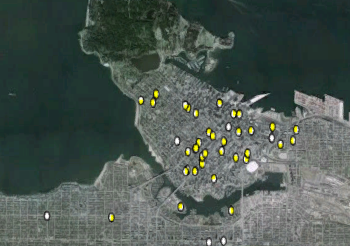
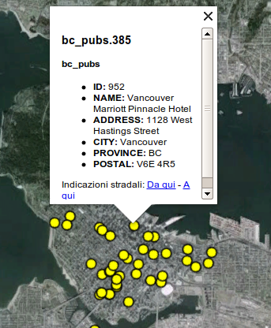
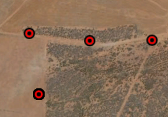
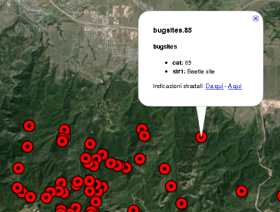

# KML {: #css_example_kml }

## Detecting raster to vector switch in KML

GeoServer 2.4 added a new icon server that KML output uses to make sure the point symbolisers look the same as in a normal WMS call no matter what scale they are looked at.

This may pose some issue when working in the default KML generation mode, where the map is a ground overlay up to a certain scale, and switches to a vector, clickable representation once the number of features in the visualization fall below a certain scale (as controlled by the `KMSCORE` parameter): the end user is not informed "visually" that the switch happened.

There is however a custom environment variable, set by the KML generator, that styles can leverage to know whether the KML generation is happening in ground overlay or vector mode.

The following example leverages this function to show a larger point symbol when points become clickable:

``` css
* { 
  mark: symbol("circle");
}

:mark [env('kmlOutputMode') = 'vector'] {
  size: 8;
}

:mark {
  size: 4;
  fill: yellow;
  stroke: black;
}
```

This will result in the following output:


*Raster output, points are not yet clickable*


*Vector output, points are clickable and painted as larger icons*

One important bit about the above CSS is that the order of the rules is important. The CSS to SLD translator uses specificity to decide which rule overrides which other one, and the specificity is driven, at the time of writing, only by scale rules and access to attributes. The filter using the `kmlOutputMode` filter is not actually using any feature attribute, so it has the same specificity as the catch all `:mark` rule. Putting it first ensures that it overrides the catch all rule anyways, while putting it second would result in the output size being always 4.

## Getting KML marks similar to the old KML encoder

The old KML generator (prior to GeoServer 2.4) was not able to truly respect the marks own shape, and as a result, was simply applying the mark color to a fixed bull's eye like icon, for example:



Starting with GeoServer 2.4 the KML engine has been rewritten, and among other things, it can produce an exact representation of the marks, respecting not only color, but also shape and stroking. However, what if one want to reproduce the old output look?

The solution is to leverage the ability to respect marks appearance to the letter, and combine two superimposed marks to generate the desired output:

``` css
* { 
  mark: symbol('circle'), symbol('circle');
  mark-size: 12, 4;
}

:nth-mark(1) {
  fill: red;
  stroke: black; 
  stroke-width: 2;
}

:nth-mark(2) {
  fill: black;
}
```

Which results in the following Google Earth output:


