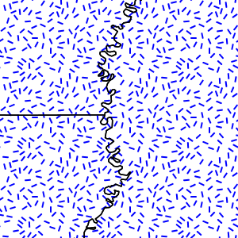

# Fills with randomized symbols

It is possible to generate fills by randomly repeating a symbol in the polygons to be filled. Please refer to the [equivalent SLD chapter](../../sld/extensions/randomized.md) for details on the meaning of the various options.

## Simple random distribution

Here is an example distributing up to 50 small "slash" symbols in a 100x100 pixel tile (in case of conflicts the symbol will be skipped), enabling random symbol rotation), and setting the seed to "5" to get a distribution different than the default one:

``` scss
* {
  fill: symbol("shape://slash");
  :fill {
    size: 8;
    stroke: blue;
    stroke-width: 4;
    stroke-linecap: round;
  };
  stroke: black;
  fill-random: grid;
  fill-random-seed: 5;
  fill-random-rotation: free;
  fill-random-symbol-count: 50;
  fill-random-tile-size: 100;
}
```


*Random distribution of a diagonal line*

## Thematic map using point density

Randomized distributions can also be used for thematic mapping, for example, here is the SLD for a version of topp:states that displays the number of inhabitantìs varying the density of a random point distribution:

``` scss
* { 
  fill: symbol("circle");
  stroke: black;
  fill-random: grid; 
  fill-random-tile-size: 100;

  :fill {
    size: 2;
    fill: darkgray;
  };
  /* @title low */
  [PERSONS < 2000000] {
    fill-random-symbol-count: 50;
  };
  /* @title mid */
  [PERSONS >= 2000000] [PERSONS < 4000000] {
    fill-random-symbol-count: 150;
  };
  /* @title high */
  [PERSONS >= 4000000] {
    fill-random-symbol-count: 500;
  }
}
```


*Thematic map via point density approach*
