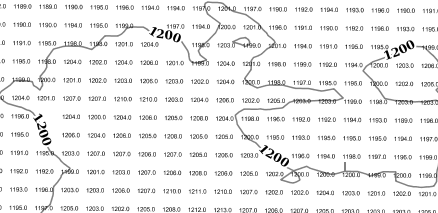

# Rendering transformations in CSS {: #css_transform }

Starting with GeoServer 2.10 the CSS modules supports rendering transformations via the `transform` property.

The property is a function call with a special key/value pair syntax, using the following template:

``` scss
transformationName(key1:value1,key2:v21 v22 ... v2M,...,keyN:vN)
```

The values can be simple ones, or can be a space separated list. The parameter representing the input layer can be omitted, the engine will automatically recognize input parameters of type feature collection or grid coverage.

The transformation function is subject to cascading like all other properties, but cascading acts at the whole z-level, so if multiple transformations are needed, they need to be associated with two different z-levels.

This is an example of a CSS style extracting contour lines from a DEM, and also showing the single values when a suitable zoom level is reached:

``` scss
/* @title Levels */
* {
  transform: ras:Contour(levels: 1100 1200 1300 1400 1500 1600 1700);
  z-index: 0;
  stroke: gray;
  label: [numberFormat('#', value)];
  font-size: 12;
  font-fill: black;
  font-weight: bold;
  halo-color: white;
  halo-radius: 2;
  label-follow-line: true;
  label-repeat: 200;
  label-max-angle-delta: 45;
  label-priority: 2000;
}

/* @title Values */
[@sd < 12000] {
  transform: ras:RasterAsPointCollection(scale: 0.5);
  z-index: 1;
  label: [GRAY_INDEX];
  label-anchor: 0.5 0.5;
  font-family: Arial;
  font-fill: black;
  font-size: 6;
  label-priority: 1000;
}
```


*The two transformations in action against a DEM layer*
