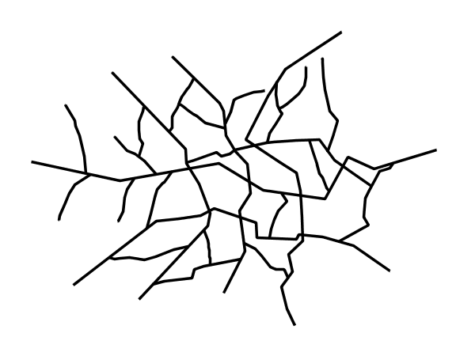

# Lines {: #mbstyle_cookbook.lines }

While lines can also seem to be simple shapes, having length but no width, there are many options and tricks for making lines display nicely.

## Example lines layer {: #mbstyle_cookbook_lines_attributes }

The [lines layer](artifacts/mbstyle_cookbook_line.zip) used in the examples below contains road information for a fictional country. For reference, the attribute table for the points in this layer is included below.

  ------------------------------------------------------------------------
  `fid` (Feature ID)    `name` (Road name)           `type` (Road class)
  --------------------- ---------------------------- ---------------------
  line.1                Latway                       highway

  line.2                Crescent Avenue              secondary

  line.3                Forest Avenue                secondary

  line.4                Longway                      highway

  line.5                Saxer Avenue                 secondary

  line.6                Ridge Avenue                 secondary

  line.7                Holly Lane                   local-road

  line.8                Mulberry Street              local-road

  line.9                Nathan Lane                  local-road

  line.10               Central Street               local-road

  line.11               Lois Lane                    local-road

  line.12               Rocky Road                   local-road

  line.13               Fleet Street                 local-road

  line.14               Diane Court                  local-road

  line.15               Cedar Trail                  local-road

  line.16               Victory Road                 local-road

  line.17               Highland Road                local-road

  line.18               Easy Street                  local-road

  line.19               Hill Street                  local-road

  line.20               Country Road                 local-road

  line.21               Main Street                  local-road

  line.22               Jani Lane                    local-road

  line.23               Shinbone Alley               local-road

  line.24               State Street                 local-road

  line.25               River Road                   local-road
  ------------------------------------------------------------------------

[Download the lines shapefile](artifacts/mbstyle_cookbook_line.zip)

## Simple line {: #mbstyle_cookbook_lines_simpleline }

This example specifies lines be colored black with a thickness of 3 pixels.


*Simple line*

### Code

[Download the "Simple line" MBStyle](artifacts/mbstyle_line_simpleline.json)

``` {.json linenos=""}
{
  "version": 8,
  "name": "simple-line",
  "layers": [
    {
      "id": "simple-line",
      "type": "line",
      "paint": {
        "line-color": "#000000",
        "line-width": 3
      }
    }
  ]
}
```

### Details

There is one layer style for this MBStyle, which is the simplest possible situation. Styling lines is accomplished using the line layer. **Line 9** specifies the color of the line to be black (`"#000000"`), while **line 10** specifies the width of the lines to be 3 pixels.

## Line with border

This example shows how to draw lines with borders (sometimes called "cased lines"). In this case the lines are drawn with a 3 pixel blue center and a 1 pixel wide gray border.


*Line with border*

### Code

[Download the "Line with border" MBStyle](artifacts/mbstyle_line_borderedline.json)

``` {.json linenos=""}
{
  "version": 8,
  "name": "simple-borderedline",
  "layers": [
    {
      "id": "simple-borderedline",
      "type": "line",
      "layout": {
        "line-cap": "round"
      },
      "paint": {
        "line-color": "#333333",
        "line-width": 5
      }
    },
    {
      "id": "simple-line",
      "type": "line",
      "layout": {
        "line-cap": "round"
      },
      "paint": {
        "line-color": "#6699FF",
        "line-width": 3
      }
    }
  ]
}
```

### Details

In this example we are drawing the lines twice to achieve the appearance of a line with a border. Since every line is drawn twice, the order of the rendering is *very* important. GeoServer renders `layers` in the order that they are presented in the MBStyle. In this style, the gray border lines are drawn first via the first layer style, followed by the blue center lines in a second layer style. This ensures that the blue lines are not obscured by the gray lines, and also ensures proper rendering at intersections, so that the blue lines "connect".

In this example, **lines 5-15** comprise the first layer style, which is the outer line (or "stroke"). **Line 12** specifies the color of the line to be dark gray (`"#333333"`), **line 13** specifies the width of this line to be 5 pixels, and in the `layout` **line 9** a `line-cap` parameter of `round` renders the ends of the line as rounded instead of flat. (When working with bordered lines using a round line cap ensures that the border connects properly at the ends of the lines.)

**Lines 16-26** comprise the second `layer`, which is the inner line (or "fill"). **Line 23** specifies the color of the line to be a medium blue (`"#6699FF"`), **line 24** specifies the width of this line to be 3 pixels, and in the `layout` **line 20** again renders the edges of the line to be rounded instead of flat.

The result is a 3 pixel blue line with a 1 pixel gray border, since the 5 pixel gray line will display 1 pixel on each side of the 3 pixel blue line.

## Dashed line

This example alters the [Simple line](lines.md#mbstyle_cookbook_lines_simpleline) to create a dashed line consisting of 5 pixels of drawn line alternating with 2 pixels of blank space.


*Dashed line*

### Code

[Download the "Dashed line" MBStyle](artifacts/mbstyle_line_dashedline.json)

``` {.json linenos=""}
{
  "version": 8,
  "name": "simple-dashedline",
  "layers": [
    {
      "id": "simple-dashedline",
      "type": "line",
      "paint": {
        "line-color": "#0000FF",
        "line-width": 3,
        "line-dasharray": [5, 2]
      }
    }
  ]
}
```

### Details

In this example, **line 9** sets the color of the lines to be blue (`"#0000FF"`) and **line 10** sets the width of the lines to be 3 pixels. **Line 11** determines the composition of the line dashes. The value of `[5, 2]` creates a repeating pattern of 5 pixels of drawn line, followed by 2 pixels of omitted line.

## Offset line

This example alters the [Simple line](lines.md#mbstyle_cookbook_lines_simpleline) to add a perpendicular offset line on the left side of the line, at five pixels distance.


*Dashed line*

### Code

[Download the "Offset line" MBStlye](artifacts/mbstyle_line_offsetline.json)

``` {.json linenos=""}
{
  "version": 8,
  "name": "simple-offsetline",
  "layers": [
    {
      "id": "simple-line",
      "type": "line",
      "paint": {
        "line-color": "#000000",
        "line-width": 1
      }
    },
    {
      "id": "simple-offsetline",
      "type": "line",
      "paint": {
        "line-color": "#FF0000",
        "line-width": 1,
        "line-dasharray": [5, 2],
        "line-offset": 5
      }
    }
  ]
}
```

### Details

In this example, **lines 5-11** draw a simple black line like in the Simple line example. **Lines 13-21** draw a red dashed line like in the above Dashed line example. **Line 20** modifies the dashed line with a 5 pixel offset from the line geometry.
